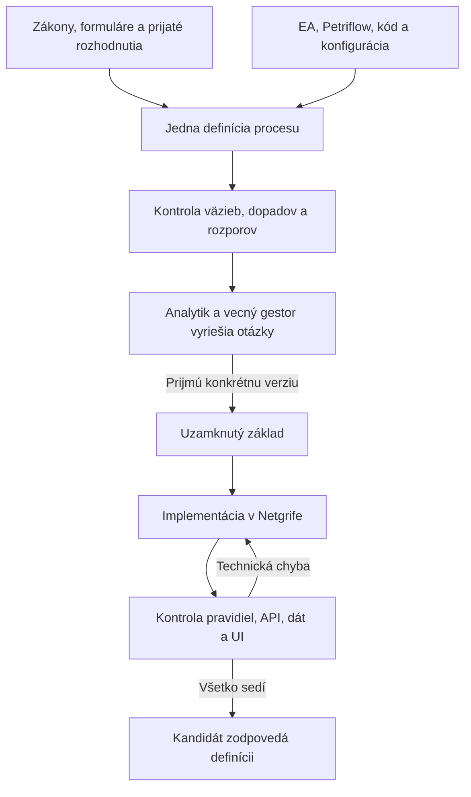

# Štandard definície procesov MUDU

**Jeden katalógový proces MUDU = jeden presný a verzovaný súbor Markdown.**

Tento repozitár určuje, ako opísať každý proces MUDU tak, aby rovnakému
výsledku rozumel vecný gestor, analytik, vývojár aj automatické nástroje.
Cieľom je odstrániť nejasný rozsah procesu, tiché zmeny a rozpory medzi
legislatívou, dohodnutým postupom a tým, čo dnes robí systém.

## Čo tu nájdete

| Súbor | Obsah |
| --- | --- |
| [`STANDARD.md`](STANDARD.md) | Povinný formát jednej procesnej definície |
| [`SKILL.md`](SKILL.md) | Postup, podľa ktorého môže ľubovoľný schopný LLM definíciu vytvoriť alebo skontrolovať |
| [`examples/`](examples/) | Štyri rozpracované procesy MUDU-060 až MUDU-063 a ich jednoduché diagramy |

### Spracované procesy

| Proces | Rýchle pochopenie | Úplná definícia |
| --- | --- | --- |
| MUDU-060 — Predbežné pridelenie registrovej značky | [Diagram](examples/MUDU-060/graph.md) | [Definícia](examples/MUDU-060/definition.md) |
| MUDU-061 — Zápis lietadla do registra | [Diagram](examples/MUDU-061/graph.md) | [Definícia](examples/MUDU-061/definition.md) |
| MUDU-062 — Zmena údajov v registri | [Diagram](examples/MUDU-062/graph.md) | [Definícia](examples/MUDU-062/definition.md) |
| MUDU-063 — Výmaz lietadla z registra | [Diagram](examples/MUDU-063/graph.md) | [Definícia](examples/MUDU-063/definition.md) |

Repozitár zámerne neobsahuje interné dokumenty, zdrojový kód ani pracovné dáta
projektu. Verejné právne predpisy a formuláre sú prepojené priamo. Interné
zdroje sú iba pomenované, aby bolo zrejmé, z čoho tvrdenie vzniklo.

Pri internom zdroji znamená `CONFIRMED`, že autor návrhu daný podklad priamo
skontroloval. Neznamená to, že verejný čitateľ môže kontrolu nezávisle zopakovať
alebo že tvrdenie schválilo ministerstvo. Také tvrdenie zostáva označené vrstvou
`CURRENT_IMPLEMENTATION` a celý príklad zostáva `DRAFT / UNCONFIRMED`.

## Ako začať

Ak chcete procesu rýchlo porozumieť:

1. otvorte jeho `graph.md` — ukazuje iba skutočný priebeh procesu;
2. v `definition.md` si prečítajte **Rýchly prehľad**;
3. sekcie 2 až 15 opisujú vecnú definíciu;
4. sekcia 16 ukazuje, čo dnes robí EA, Petriflow, konfigurácia a kód;
5. sekcia 17 uvádza konflikty a otázky, ktoré ešte musí niekto rozhodnúť.

Diagram je orientačná mapa, nie náhrada úplnej definície ani formálny Petriho
model. Otvorené otázky a možné dopady sú vždy uvedené osobitne, aby nevyzerali
ako kroky procesu.

## Čo musí jedna definícia vysvetliť

- čo proces spúšťa a kde sa končí;
- kto môže podať žiadosť a kto rozhoduje;
- ktoré údaje a dokumenty sú povinné, voliteľné alebo podmienené;
- aký poplatok a lehota platia a od ktorej udalosti sa lehota počíta;
- aké sú rozhodovacie pravidlá, výstupy a právne účinky;
- ktoré systémy a tretie strany proces používa;
- ktoré ďalšie procesy a spoločné údaje môže zmena ovplyvniť;
- čo dnes robí implementácia a kde sa líši od práva alebo dohodnutého postupu;
- ktorý konkrétny zdroj podkladá každé potvrdené tvrdenie.

Každé tvrdenie má stabilný identifikátor, napríklad `REQ-063-001`,
`STEP-063-004` alebo `GAP-063-005`. Pri zmene sa preto dá presne povedať,
ktoré pravidlo sa mení a čo treba znovu preveriť.

## Stav dokumentov

| Stav | Význam |
| --- | --- |
| `DRAFT / UNCONFIRMED` | Pracovný návrh; ministerstvo ani vecný gestor ho ešte neschválili |
| `ACCEPTED` | Oprávnený človek prijal konkrétnu verziu definície |
| `FROZEN` | Táto prijatá verzia je záväzný základ pre implementáciu a overovanie |
| `NONCONFORMANT` | V sekcii 16 alebo 17 je doložený konkrétny nesúlad implementácie |
| `NOT_RUN` | Formálne overenie tejto verzie ešte neprebehlo |

Veľké anglické slová sú stabilné strojové hodnoty. Slovenský text vedľa nich
je určený ľuďom. `SELECTED` pri zdrojoch neznamená schválenie procesu; znamená
iba, že autor návrhu určil zdroje použité pri spracovaní.

## Jazykové pravidlo

- **Slovenčina vyjadruje význam procesu:** názvy, účel, aktérov, pravidlá,
  kroky, výstupy, otázky a diagramy.
- **Angličtina označuje systémovú syntax:** YAML kľúče, stabilné ID, povolené
  stavy ako `DRAFT`, `LAW` alebo `CONFLICT` a pokyny v `SKILL.md`.
- Strojové metadáta sú na začiatku zdrojového súboru v neviditeľnom komentári,
  takže GitHub zobrazí najprv názov a ľudský prehľad, nie technickú tabuľku.
- Presné názvy súborov, polí, prechodov a hodnôt kódu zostávajú nezmenené a
  zapisujú sa ako kód, napríklad `vehicle.xml` alebo `reason_delete`.
- Angličtina sama neurčuje autoritu tvrdenia. Tú vždy určuje výslovná vrstva,
  stav a zdroj.

Procesná veta preto nemá miešať slovenský text s výrazmi ako „exact delta“
alebo „stale-base conflict“. Taký význam sa napíše po slovensky; iba presný
technický identifikátor zostane v pôvodnom tvare.

## Problém, ktorý tento formát rieši

Informácie o MUDU sú rozdelené medzi zákony, formuláre, rozhodnutia analytikov,
Enterprise Architect, Petriflow, kód, konfiguráciu a výstupné šablóny. Bez
spoločnej definície môže:

- vývojár zmeniť spoločný údaj bez poznania všetkých dotknutých procesov;
- analytik požadovať správanie, ktoré platforma nevie vykonať;
- ministerstvo pripomienkovať inú verziu, než akú tím práve implementuje;
- test prejsť, hoci overil iba technický krok a nie právny účinok procesu.

Príklad: entitu registrovej značky používajú MUDU-060, 061, 062, 063 a 091.
Zmena jej významu alebo životného cyklu musí vyvolať kontrolu všetkých piatich
procesov. Interný graf nájde kandidátov na dopad; procesné definície vysvetlia,
či a prečo je konkrétny dopad skutočný. Graf nikdy neschvaľuje vecný význam.

## Pracovný postup

1. LLM spolu s analytikom pripraví návrh z presne určených zdrojov.
2. Analytik a vecný gestor vyriešia otvorené otázky nad konkrétnou verziou.
3. Oprávnený človek prijme a uzamkne túto verziu ako základ.
4. Netgrif implementuje iba schválenú zmenu v Petriflow, kóde a konfigurácii.
5. Automatické kontroly pravidiel, API, dát a používateľského rozhrania overia
   tú istú verziu.
6. Technická chyba sa vráti vývojárovi. Nevyriešená vecná otázka sa vráti
   analytikovi a gestorovi.

## Pridanie ďalšieho procesu

1. LLM dostane [`SKILL.md`](SKILL.md) a [`STANDARD.md`](STANDARD.md).
2. Vytvorí `examples/MUDU-NNN/definition.md` a malý `graph.md`.
3. Skontroluje priame väzby aj spoločné údaje, ktoré môže proces ovplyvniť.
4. Znovu preverí už spracované súvisiace procesy.
5. Definícia zostane `DRAFT / UNCONFIRMED`, kým ju neprijme oprávnený človek.
