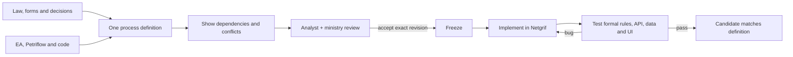

# MUDU Process Definition Standard

**One official MUDU process = one precise, versioned Markdown file.**

**Slovensky:** Tento repozitár štandardizuje spôsob,akým sa každý proces MUDU
presne definuje,zdrojuje,verzionuje,prepája a pripravuje na realizáciu v
Petriflow/Netgrif. Cieľom je odstrániť nejasný scope,tiché zmeny a rozpory medzi
legislatívou,analýzou,modelom a implementáciou.

## What is in one process file

Every definition answers the same concrete questions:

- What exactly starts the process and where does it end?
- Who may request it and who decides it?
- Which data and documents are required, optional or conditional?
- What fee and deadline applies, and what event starts the deadline?
- What are the decision rules and invariants?
- What are the exact steps, outcomes and legal effects?
- Which systems and third parties are used?
- Which other MUDU processes and shared data can be affected?
- What does the current EA/Petriflow/code implementation actually do?
- Where do law, forms, project intent and implementation disagree?
- Which exact source supports every confirmed statement?

The format has 19 fixed sections and stable IDs such as `REQ-063-001`,
`STEP-063-004` and `GAP-063-005`. A later change can therefore point to the
exact rule it changes instead of rewriting an ambiguous Word document.

## Status

| Item | Meaning |
| --- | --- |
| Standard `MuduProcessDefinition/v1` | The required format and review rules |
| Example marked `DRAFT / UNCONFIRMED` | Reviewed proposal, not ministry approval |
| `CROSS_PROCESS_REVIEWED` | Connected definitions were checked for contradictions |
| `FROZEN` | An authorized person accepted that exact Git revision |
| Validator `PASS` | Structure is valid; semantics and implementation are not proved |

The separation matters: a versioned standard can be stable while individual
process definitions continue through analyst/ministry review.

## The concrete problem it prevents

MUDU process information is split across law, official forms, analyst decisions,
Enterprise Architect, Petriflow, code, configuration and output templates. A
developer can change a shared field without knowing that several processes use
it. An analyst can ask for behavior the platform cannot implement. A ministry
review can refer to a different revision than the one being built.

Example: `RegistrationMark` is shared by MUDU-060, 061, 062, 063 and 091. A
change to its meaning or lifetime must trigger review of all five. The graph
finds that candidate set; the definitions explain the exact impact.

## How the team uses it

1. An LLM working with an analyst prepares one source-backed DRAFT.
2. Analyst and ministry review the exact file and resolve its open questions.
3. They accept and freeze one exact Git revision.
4. Netgrif implements only the accepted delta in Petriflow/code.
5. Formal checks, API/data assertions and Playwright exercise the implementation.
6. Failures return to implementation; real business ambiguity returns to the
   analyst. A passing candidate is linked to the exact frozen definition.

The graph coordinates evidence and impact. It never approves business meaning.

## Repository contents

| Path | Purpose |
| --- | --- |
| [`STANDARD.md`](STANDARD.md) | Normative 19-section Markdown contract |
| [`SKILL.md`](SKILL.md) | Model-neutral LLM authoring and review procedure |
| [`examples/`](examples/) | Four source-clean DRAFT definitions and one graph per process |

Private project evidence and proprietary implementation source are not copied
into this public repository. Public examples retain exact public-law and
official-form references; private evidence is described as not redistributed.

Each definition's section 16 maps its stable business records to the relevant
EA, Petriflow, code, configuration and output artifacts. The private Petriflow
XML is not copied here; the definition states exactly what must be mapped and
verified in the authorized implementation repository.

## Add the next process

1. Give the LLM [`SKILL.md`](SKILL.md) and [`STANDARD.md`](STANDARD.md).
2. Add `examples/MUDU-NNN/definition.md` and its small `graph.md`.
3. Account for every direct dependency and inspect shared resources that may be affected.
4. Recheck already-authored connected processes and version affected drafts.
5. Keep it `DRAFT`/`UNCONFIRMED` until an authorized reviewer accepts the exact
   Git revision.
