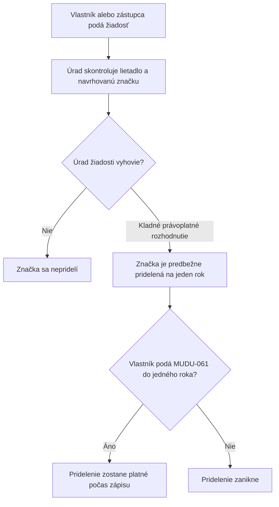

<!-- mudu-process-review-metadata
schema: mudu-process-review/v1
process_id: MUDU-060
catalogue_id: "060"
review_version: 0.1.0
status: DRAFT
authority: UNCONFIRMED
language: sk
-->

# MUDU-060 — Predbežné pridelenie registrovej značky lietadlu

> `DRAFT / UNCONFIRMED` — návrh na vecnú kontrolu.

## 1. Čo podľa zdrojov proces robí

Vlastník pred zápisom lietadla požiada Dopravný úrad o predbežné pridelenie
konkrétnej registrovej značky. Kladné rozhodnutie platí jeden rok od
právoplatnosti; ak vlastník počas tejto lehoty podá MUDU-061, predbežné
pridelenie zostane platné počas zápisu.

## 2. Hranice procesu

| Patrí do procesu | Nepatrí do procesu |
| --- | --- |
| Žiadosť vlastníka alebo preukázaného zástupcu | Samotný zápis lietadla — MUDU-061 |
| Kontrola údajov lietadla a navrhovanej značky | Zmena už zapísanej značky — MUDU-062 |
| Rozhodnutie o predbežnom pridelení | Výmaz lietadla — MUDU-063 |
| Platnosť a zánik predbežného pridelenia | Pridelenie Mode S alebo ELT — MUDU-091 |

## 3. Navrhovaný priebeh

## 4. Pravidlá, ktoré treba potvrdiť

| ID | Navrhované pravidlo | Podklad |
| --- | --- | --- |
| R1 | Žiadateľom je vlastník; konať môže aj riadne preukázaný zástupca. | Letecký zákon a formulár F469 |
| R2 | Značka musí zodpovedať kategórii lietadla a nesmie byť súčasne pridelená inému lietadlu. | Vyhláška č. 274/2024 Z. z. |
| R3 | Rozhodnutie platí jeden rok od právoplatnosti. | § 26 leteckého zákona |
| R4 | Včasná žiadosť MUDU-061 zachová platnosť predbežného pridelenia. | § 26 leteckého zákona |
| R5 | Predbežné pridelenie samo nevytvára zápis ani štátnu príslušnosť lietadla. | Hranica MUDU-060/061 |

## 5. Rozpory a otázky

| ID | Čo sme našli | Otázka pre gestora |
| --- | --- | --- |
| Q1 | Zákon pozná aj špeciálnu značku na skúšobný let. | Patrí táto vetva do MUDU-060 alebo má byť samostatná? |
| Q2 | Formulár a dnešná konfigurácia požadujú viac príloh než aktuálna vyhláška výslovne uvádza. | Ktoré dodatočné prílohy majú zostať povinné a z akého dôvodu? |
| Q3 | Dnešná konfigurácia spúšťa lustráciu, ale zákon viaže kontrolu SIS na zápis a zmenu údajov. | Má sa pri MUDU-060 vykonávať nejaká lustrácia? |
| Q4 | Nie je preukázaná ochrana proti dvom súbežným žiadostiam o rovnakú značku. | V ktorom okamihu sa značka rezervuje a kedy sa uvoľní? |

## 6. Čo potrebujeme potvrdiť

- [ ] Účel a hranice MUDU-060 sú správne.
- [ ] Navrhovaný priebeh zodpovedá očakávanému procesu.
- [ ] Pravidlá R1 až R5 sú správne.
- [ ] Otázky Q1 až Q4 majú odpoveď alebo určeného rozhodovateľa.
- [ ] V procese nechýba ďalší podstatný krok alebo výsledok.

## Zdroje

- [Zákon č. 143/1998 Z. z.](https://static.slov-lex.sk/pdf/SK/ZZ/1998/143/ZZ_1998_143_20260101.pdf), najmä § 26.
- [Vyhláška č. 274/2024 Z. z.](https://static.slov-lex.sk/static/SK/ZZ/2024/274/20241115.html), najmä § 4, § 6 a § 7.
- [Formulár Dopravného úradu F469](https://letectvo.nsat.sk/wp-content/uploads/sites/2/2023/03/F469_B_v1_PRIDELENIE-POZN%C3%81VACEJ-ZNA%C4%8CKY_FINAL.pdf).
- Katalóg služieb, aktuálna konfigurácia MUDU a existujúce Petriflow modely — interné podklady, nezverejnené v tomto repozitári.
