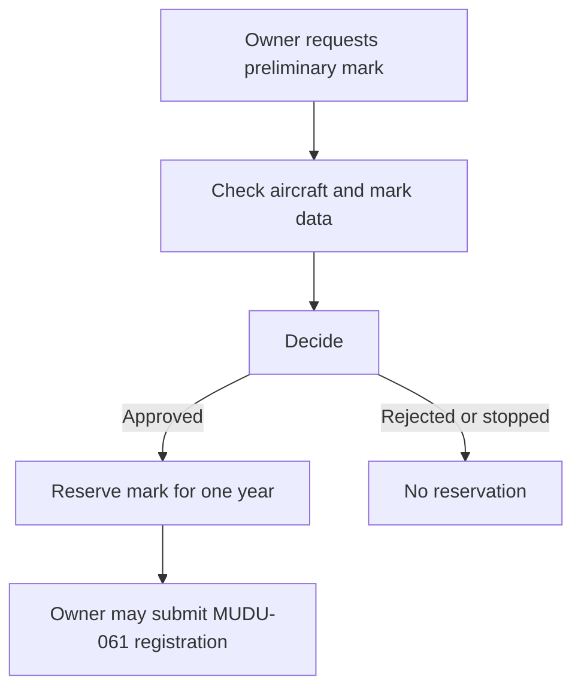

# MUDU-060 graph — preliminary aircraft registration mark

`DRAFT / UNCONFIRMED`. This graph is a reading aid,not authority.

Connected processes:`MUDU-061` registration,`MUDU-062` later change,
`MUDU-063` deregistration and `MUDU-091` Mode S/ELT impact.

## Open issues — not part of the process flow

- `GAP-060-005`:define how two simultaneous requests are prevented from reserving the same mark.
- `GAP-060-002`:reconcile the current form and attachment configuration with current law.
