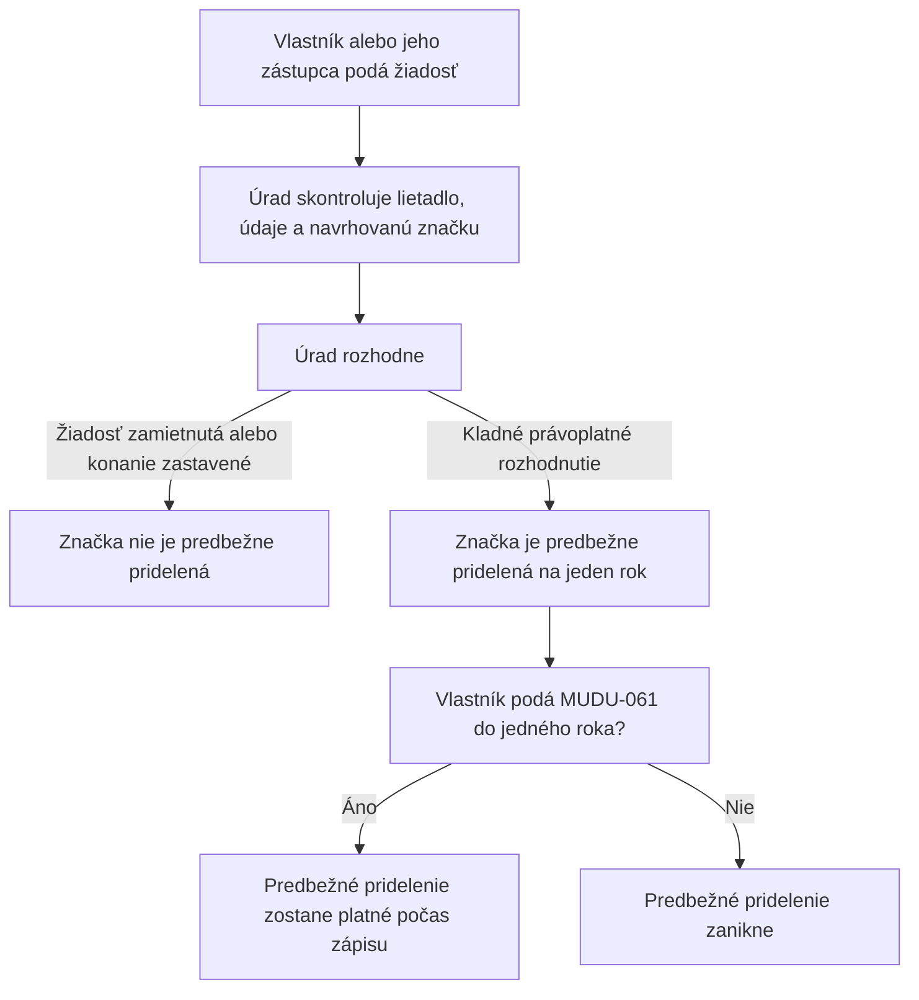

# MUDU-060 — predbežné pridelenie registrovej značky

`DRAFT / UNCONFIRMED` — pracovný návrh bez schválenia vecným gestorom.

Diagram ukazuje iba zjednodušený priebeh. Úplné pravidlá sú v
[`definition.md`](definition.md), najmä v sekciách 10 a 17.

**Priame pokračovanie:** MUDU-061 — zápis lietadla. MUDU-062, MUDU-063 a
MUDU-091 používajú neskôr rovnaké lietadlo alebo značku, ale nie sú krokmi
MUDU-060.

## Najdôležitejšie otvorené otázky — nie sú súčasťou toku

- `GAP-060-002`: ktoré prílohy sú naozaj oprávnené podľa aktuálneho práva;
- `Q-060-001`: či osobitná značka pre skúšobný let patrí do MUDU-060;
- `GAP-060-005`: ako zabrániť tomu, aby dve súbežné žiadosti dostali rovnakú značku.

Úplný zoznam je v sekcii 17 súboru [`definition.md`](definition.md).
