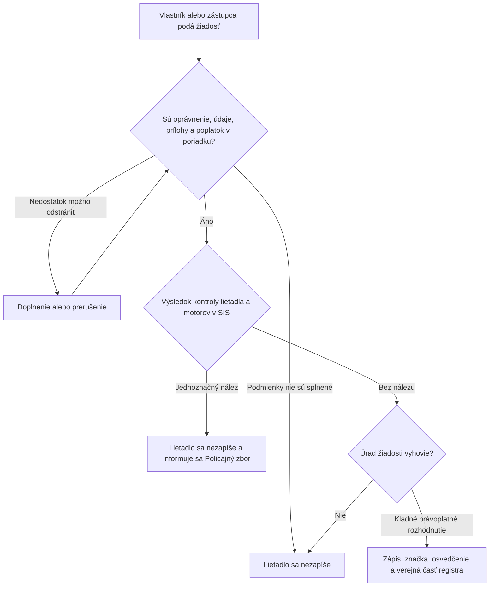

<!-- mudu-process-review-metadata
schema: mudu-process-review/v1
process_id: MUDU-061
catalogue_id: "061"
review_version: 0.1.0
status: DRAFT
authority: UNCONFIRMED
language: sk
-->

# MUDU-061 — Zápis lietadla do registra lietadiel

> `DRAFT / UNCONFIRMED` — návrh na vecnú kontrolu.

## 1. Čo podľa zdrojov proces robí

Vlastník požiada Dopravný úrad o zápis lietadla do registra. Pri úspešnom
výsledku úrad zapíše lietadlo, pridelí registrovú značku, vydá osvedčenie,
zverejní zákonnú verejnú časť údajov a lietadlu vznikne štátna príslušnosť SR.

## 2. Hranice procesu

| Patrí do procesu | Nepatrí do procesu |
| --- | --- |
| Posúdenie oprávnenia, údajov, príloh a poplatku | Predbežné pridelenie značky — MUDU-060 |
| Povinná kontrola lietadla a motorov v SIS | Neskoršia zmena údajov — MUDU-062 |
| Rozhodnutie, zápis, značka a osvedčenie | Výmaz — MUDU-063 |
| Verejná a neverejná časť registra | Letová spôsobilosť a Mode S/ELT |

## 3. Navrhovaný priebeh

## 4. Pravidlá, ktoré treba potvrdiť

| ID | Navrhované pravidlo | Podklad |
| --- | --- | --- |
| R1 | Žiadosť podáva vlastník alebo jeho preukázaný zástupca. | Letecký zákon a postup DÚ |
| R2 | Lietadlo musí spĺňať zákonné podmienky zápisu a nesmie zostať zapísané v cudzom registri. | § 25 a § 26 leteckého zákona |
| R3 | Pred zápisom sa kontroluje lietadlo a každý motor v SIS. | § 26 leteckého zákona |
| R4 | Jednoznačný nález v SIS blokuje zápis a oznamuje sa Policajnému zboru. | § 26 leteckého zákona |
| R5 | Verejne sa zverejní iba zákonom povolený rozsah údajov. | § 26 leteckého zákona |

## 5. Rozpory a otázky

| ID | Čo sme našli | Otázka pre gestora |
| --- | --- | --- |
| Q1 | Verejný formulár a konfigurácia príloh nezodpovedajú presne aktuálnej vyhláške. | Ktorá matica údajov a príloh je záväzná? |
| Q2 | Dnešná vetva CLK/SIS nepreukazuje skutočné odoslanie a odpoveď. | Aký výsledok SIS musí systém uložiť, aby mohol zápis pokračovať? |
| Q3 | Právny text poplatku nepokrýva jednoznačne MTOW presne 5 701 kg. | Aká sadzba sa má použiť pre 5 701 kg? |
| Q4 | Šablóny prerušenia a zastavenia opisujú iný proces. | Ktoré procesovo správne výstupy má MUDU-061 používať? |
| Q5 | Nie je presne zviazané doručenie, rozklad, právoplatnosť, zápis a vydanie osvedčenia. | V akom poradí nastávajú právne a registerové účinky? |
| Q6 | Nie je preukázaná ochrana pred dvom zápismi rovnakého lietadla alebo značky. | Kedy vzniká rezervácia a ako sa rieši súbeh? |

## 6. Čo potrebujeme potvrdiť

- [ ] Účel a hranice MUDU-061 sú správne.
- [ ] Navrhovaný priebeh zodpovedá očakávanému zápisu.
- [ ] Pravidlá R1 až R5 sú správne.
- [ ] Otázky Q1 až Q6 majú odpoveď alebo určeného rozhodovateľa.
- [ ] V procese nechýba ďalší podstatný krok alebo výsledok.

## Zdroje

- [Zákon č. 143/1998 Z. z.](https://static.slov-lex.sk/pdf/SK/ZZ/1998/143/ZZ_1998_143_20260101.pdf), najmä § 25, § 26 a § 55.
- [Vyhláška č. 274/2024 Z. z.](https://static.slov-lex.sk/static/SK/ZZ/2024/274/20241115.html), najmä § 1 a § 5 až § 7.
- [Formulár Dopravného úradu F468](https://letectvo.nsat.sk/wp-content/uploads/sites/2/2023/03/F468_B_v1_Z%C3%81PIS-LIETADLA-DO-RL_FINAL.pdf).
- Katalóg služieb, EA, konfigurácia, výstupné šablóny a existujúce Petriflow modely — interné podklady, nezverejnené v tomto repozitári.
