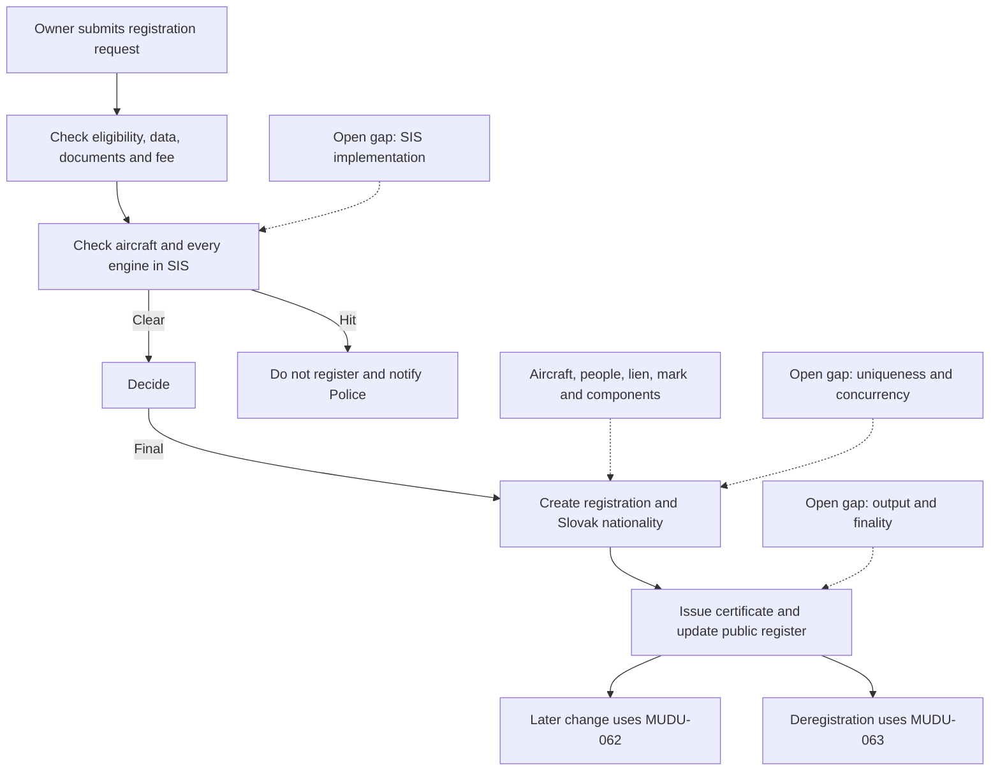

# MUDU-061 graph — aircraft registration

`DRAFT / UNCONFIRMED`. This graph is a reading aid,not authority.

```mermaid
graph TD
    A["Owner submits registration request"] --> B["Check eligibility, data, documents and fee"]
    B --> C["Check aircraft and every engine in SIS"]
    C -->|Clear| D["Decide"]
    C -->|Hit| X["Do not register and notify Police"]
    D -->|Final| E["Create registration and Slovak nationality"]
    E --> F["Issue certificate and update public register"]
    F --> G["Later change uses MUDU-062"]
    F --> H["Deregistration uses MUDU-063"]
    M["Aircraft, people, lien, mark and components"] -.-> E
    G1["Open gap: SIS implementation"] -.-> C
    G2["Open gap: uniqueness and concurrency"] -.-> E
    G3["Open gap: output and finality"] -.-> F
```
