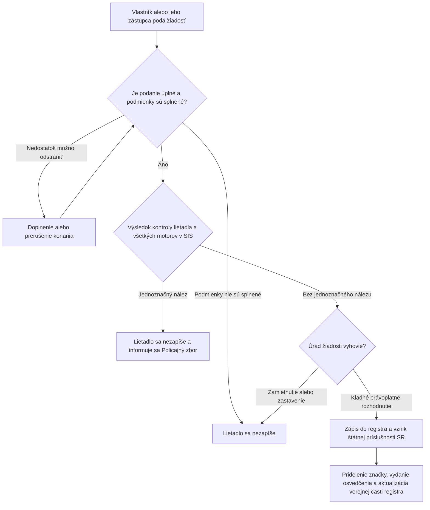

# MUDU-061 — zápis lietadla do registra

`DRAFT / UNCONFIRMED` — pracovný návrh bez schválenia vecným gestorom.

Diagram ukazuje iba zjednodušený priebeh. Úplné pravidlá sú v
[`definition.md`](definition.md), najmä v sekciách 10 a 17.

**Voliteľný predchodca:** MUDU-060 — predbežné pridelenie značky.
**Samostatné neskoršie procesy:** MUDU-062 — zmena údajov a MUDU-063 — výmaz.
MUDU-091 používa spoločné údaje, ale nie je krokom zápisu.

## Najdôležitejšie otvorené otázky — nie sú súčasťou toku

- `GAP-061-005`: chýba preukázateľné volanie SIS, výsledok a vetva pre nález;
- `GAP-061-008`: treba presne zviazať doručenie, rozklad, právoplatnosť, zápis a osvedčenie;
- `GAP-061-011`: treba dokázať jedinečnosť lietadla a značky pri súbežných žiadostiach.

Úplný zoznam je v sekcii 17 súboru [`definition.md`](definition.md).
