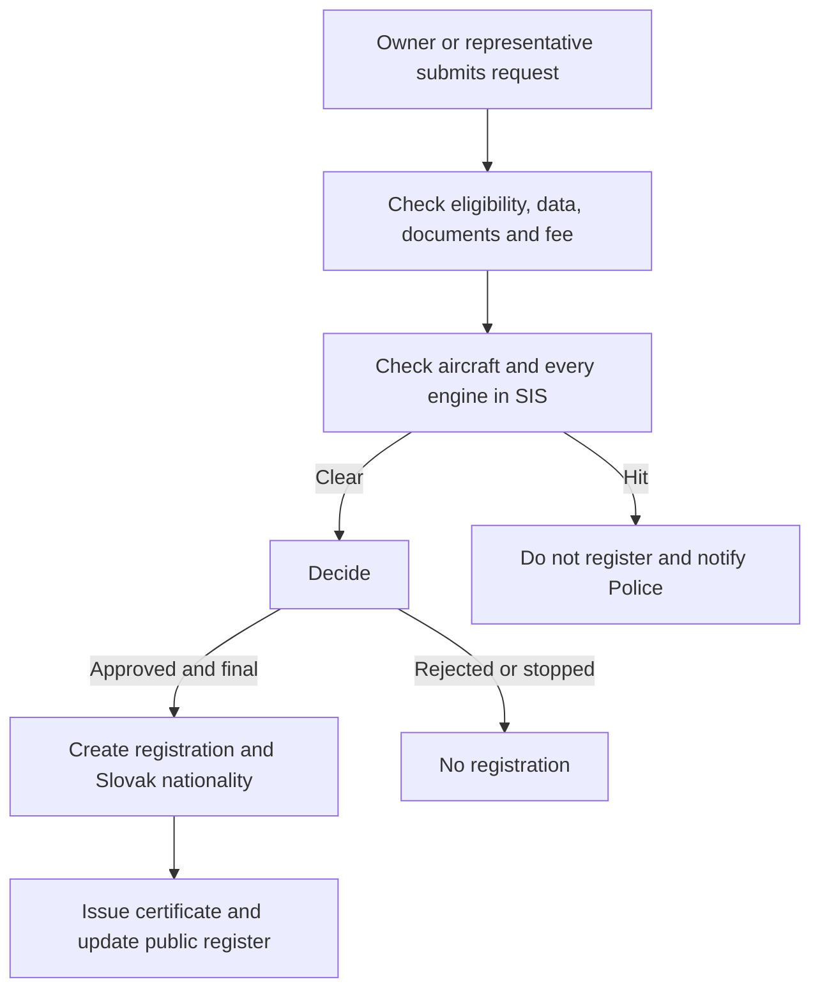

# MUDU-061 graph — aircraft registration

`DRAFT / UNCONFIRMED`. This graph is a reading aid,not authority.

Optional predecessor:`MUDU-060` preliminary mark. Separate downstream
processes:`MUDU-062` change and `MUDU-063` deregistration. Portfolio impact
only:`MUDU-091` Mode S/ELT.

## Open issues — not part of the process flow

- `GAP-061-005`:complete the real SIS request/result/hit integration.
- `GAP-061-011`:prove aircraft and registration-mark uniqueness under concurrent requests.
- `GAP-061-008`:bind delivery,appeal,finality,register update and certificate issuance precisely.
