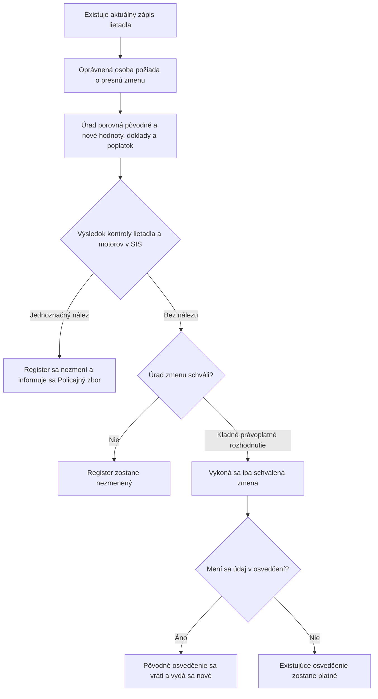

<!-- mudu-process-review-metadata
schema: mudu-process-review/v1
process_id: MUDU-062
catalogue_id: "062"
review_version: 0.1.0
status: DRAFT
authority: UNCONFIRMED
language: sk
-->

# MUDU-062 — Zmena údajov zapísaných v registri lietadiel

> `DRAFT / UNCONFIRMED` — návrh na vecnú kontrolu.

## 1. Čo podľa zdrojov proces robí

Vlastník alebo jeho zástupca požiada o zmenu konkrétnych údajov už zapísaného
lietadla. Úrad overí dôvod a doklady, vykoná povinnú kontrolu SIS a po kladnom
výsledku zmení iba schválené údaje; nové osvedčenie vydá iba vtedy, ak sa mení
údaj uvedený v osvedčení.

## 2. Hranice procesu

| Patrí do procesu | Nepatrí do procesu |
| --- | --- |
| Zmena preukázaného údaja existujúceho zápisu | Prvý zápis — MUDU-061 |
| Obmedzená žiadosť záložného veriteľa o záložné údaje | Výmaz — MUDU-063 |
| Kontrola lietadla a motorov v SIS | Predbežné pridelenie značky — MUDU-060 |
| Podmienená výmena osvedčenia | Samostatné schválenie technickej alebo letovej spôsobilosti |

## 3. Navrhovaný priebeh

## 4. Pravidlá, ktoré treba potvrdiť

| ID | Navrhované pravidlo | Podklad |
| --- | --- | --- |
| R1 | Vlastník oznámi a preukáže zmenu najneskôr do 30 dní od jej vzniku. | § 26 leteckého zákona |
| R2 | Záložný veriteľ môže žiadať iba zmenu záložných údajov. | § 26 leteckého zákona |
| R3 | Pri každej zmene sa kontroluje lietadlo a každý aktuálny motor v SIS. | § 26 leteckého zákona |
| R4 | Mení sa iba konkrétny schválený údaj a predchádzajúca hodnota zostáva v histórii. | Účel registra |
| R5 | Nové osvedčenie sa vydá iba pri zmene údaja uvedeného v osvedčení. | § 26 leteckého zákona |
| R6 | Poplatok sa odvodzuje od skutočne meneného dokladu alebo účinku. | Zákon o správnych poplatkoch |

## 5. Rozpory a otázky

| ID | Čo sme našli | Otázka pre gestora |
| --- | --- | --- |
| Q1 | Verejné formuláre F470/F471 a konfigurácia vyžadujú širšie údaje a prílohy než aktuálna vyhláška. | Ktoré polia a doklady sú povinné pre jednotlivé typy zmeny? |
| Q2 | Dnešných sedem technických volieb nepokrýva jednoznačne všetky možné zmeny. | Aký úplný zoznam typov zmeny má proces podporovať? |
| Q3 | Kontrola SIS je nakonfigurovaná ako voliteľná a nie je úplne implementovaná. | Aký presný výsledok SIS odomyká vykonanie zmeny? |
| Q4 | Implementácia vyberá poplatok najmä podľa MTOW, hoci zákon ho viaže na menený doklad. | Ako sa každý typ zmeny mapuje na poplatkovú položku? |
| Q5 | Zákon umožňuje opravu nesprávneho údaja z vlastného podnetu úradu, ale cesta nie je definovaná. | Je to vetva MUDU-062 alebo samostatný interný proces? |
| Q6 | Nie je určený jednotný okamih účinku ani ochrana pred súbežnými zmenami. | Kedy zmena nadobúda účinok a čo sa stane pri zmene východiskového zápisu? |

## 6. Čo potrebujeme potvrdiť

- [ ] Účel a hranice MUDU-062 sú správne.
- [ ] Navrhovaný priebeh zodpovedá očakávanej zmene registra.
- [ ] Pravidlá R1 až R6 sú správne.
- [ ] Otázky Q1 až Q6 majú odpoveď alebo určeného rozhodovateľa.
- [ ] V procese nechýba ďalší podstatný typ zmeny alebo výsledok.

## Zdroje

- [Zákon č. 143/1998 Z. z.](https://static.slov-lex.sk/pdf/SK/ZZ/1998/143/ZZ_1998_143_20260101.pdf), najmä § 26.
- [Vyhláška č. 274/2024 Z. z.](https://static.slov-lex.sk/static/SK/ZZ/2024/274/20241115.html), najmä § 2 a § 5 až § 7.
- [Formulár Dopravného úradu F470](https://letectvo.nsat.sk/wp-content/uploads/sites/2/2023/03/F470_B_v1_ZMENA-Z%C3%81PISU-DO-RL_FINAL.pdf).
- [Formulár Dopravného úradu F471](https://letectvo.nsat.sk/wp-content/uploads/sites/2/2023/03/F471_B_v1_ZMENA-V-TECHNICK%C3%9DCH-PARAMETROCH_FINAL.pdf).
- Katalóg služieb, EA, konfigurácia, výstupné šablóny a existujúce Petriflow modely — interné podklady, nezverejnené v tomto repozitári.
