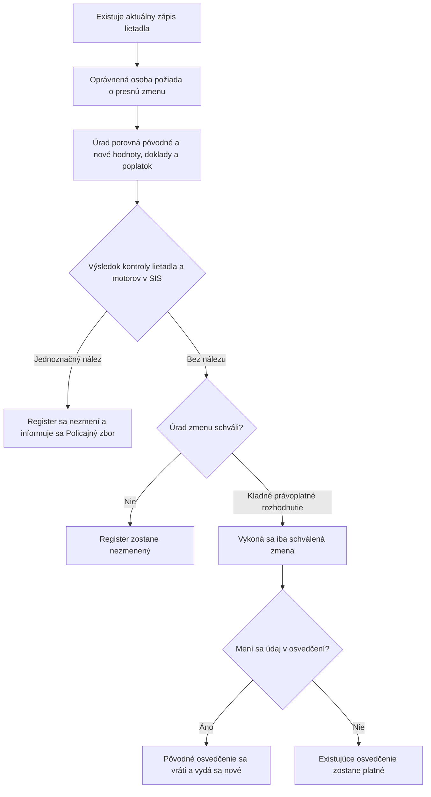

<!-- mudu-process-definition-metadata
schema: mudu-process-definition/v1
process_id: MUDU-062
catalogue_id: "062"
definition_version: 0.2.0
status: DRAFT
authority: UNCONFIRMED
language: sk
related_processes: [MUDU-060, MUDU-061, MUDU-063, MUDU-091]
-->

# MUDU-062 — Zmena údajov zapísaných v registri lietadiel

> `DRAFT / UNCONFIRMED` — návrh na vecnú kontrolu.

## 1. Čo podľa zdrojov proces robí

Vlastník alebo jeho zástupca požiada o zmenu konkrétnych údajov už zapísaného
lietadla. Úrad overí dôvod a doklady, vykoná povinnú kontrolu SIS a po kladnom
výsledku zmení iba schválené údaje; nové osvedčenie vydá iba vtedy, ak sa mení
údaj uvedený v osvedčení.

## 2. Hranice procesu

| Patrí do procesu | Nepatrí do procesu |
| --- | --- |
| Zmena preukázaného údaja existujúceho zápisu | Prvý zápis — MUDU-061 |
| Obmedzená žiadosť záložného veriteľa o záložné údaje | Výmaz — MUDU-063 |
| Kontrola lietadla a motorov v SIS | Predbežné pridelenie značky — MUDU-060 |
| Podmienená výmena osvedčenia | Samostatné schválenie technickej alebo letovej spôsobilosti |

## 3. Navrhovaný priebeh

## 4. Pravidlá, ktoré treba potvrdiť

| ID | Navrhované pravidlo | Podklad |
| --- | --- | --- |
| REQ-062-001 | Vlastník oznámi a preukáže zmenu najneskôr do 30 dní od jej vzniku. | § 26 leteckého zákona |
| RULE-062-002 | Záložný veriteľ môže žiadať iba zmenu záložných údajov. | § 26 leteckého zákona |
| RULE-062-003 | Pri každej zmene sa kontroluje lietadlo a každý aktuálny motor v SIS. | § 26 leteckého zákona |
| RULE-062-008, RULE-062-012 | Mení sa iba konkrétny schválený údaj a predchádzajúca hodnota zostáva v histórii. | Účel registra |
| RULE-062-005 | Nové osvedčenie sa vydá iba pri zmene údaja uvedeného v osvedčení. | § 26 leteckého zákona |
| RULE-062-011 | Poplatok sa odvodzuje od skutočne meneného dokladu alebo účinku. | Zákon o správnych poplatkoch |

## 5. Rozpory a otázky

| ID | Čo sme našli | Otázka pre gestora |
| --- | --- | --- |
| GAP-062-001 | Verejné formuláre F470/F471 a konfigurácia vyžadujú širšie údaje a prílohy než aktuálna vyhláška. | Ktoré polia a doklady sú povinné pre jednotlivé typy zmeny? |
| GAP-062-004 | Dnešných sedem technických volieb nepokrýva jednoznačne všetky možné zmeny. | Aký úplný zoznam typov zmeny má proces podporovať? |
| GAP-062-005 | Kontrola SIS je nakonfigurovaná ako voliteľná a nie je úplne implementovaná. | Aký presný výsledok SIS odomyká vykonanie zmeny? |
| GAP-062-006 | Implementácia vyberá poplatok najmä podľa MTOW, hoci zákon ho viaže na menený doklad. | Ako sa každý typ zmeny mapuje na poplatkovú položku? |
| GAP-062-012 | Zákon umožňuje opravu nesprávneho údaja z vlastného podnetu úradu, ale cesta nie je definovaná. | Je to vetva MUDU-062 alebo samostatný interný proces? |
| Q-062-001, GAP-062-013 | Nie je určený jednotný okamih účinku ani ochrana pred súbežnými zmenami. | Kedy zmena nadobúda účinok a čo sa stane pri zmene východiskového zápisu? |

## 6. Čo potrebujeme potvrdiť

- [ ] Účel a hranice MUDU-062 sú správne.
- [ ] Navrhovaný priebeh zodpovedá očakávanej zmene registra.
- [ ] Uvedené pravidlá sú správne.
- [ ] Uvedené otázky majú odpoveď alebo určeného rozhodovateľa.
- [ ] V procese nechýba ďalší podstatný typ zmeny alebo výsledok.

## 7. Zdroje použité pre návrh

- [Zákon č. 143/1998 Z. z.](https://static.slov-lex.sk/pdf/SK/ZZ/1998/143/ZZ_1998_143_20260101.pdf), najmä § 26.
- [Vyhláška č. 274/2024 Z. z.](https://static.slov-lex.sk/static/SK/ZZ/2024/274/20241115.html), najmä § 2 a § 5 až § 7.
- [Formulár Dopravného úradu F470](https://letectvo.nsat.sk/wp-content/uploads/sites/2/2023/03/F470_B_v1_ZMENA-Z%C3%81PISU-DO-RL_FINAL.pdf).
- [Formulár Dopravného úradu F471](https://letectvo.nsat.sk/wp-content/uploads/sites/2/2023/03/F471_B_v1_ZMENA-V-TECHNICK%C3%9DCH-PARAMETROCH_FINAL.pdf).
- Katalóg služieb, EA, konfigurácia, výstupné šablóny a existujúce Petriflow modely — interné podklady, nezverejnené v tomto repozitári.

## 8. Detailná štruktúrovaná vrstva

Otvoriť úplnú vrstvu pre LLM, Petriflow, dopadovú analýzu a testy

> Túto vrstvu generuje a udržiava LLM z dostupných zdrojov. Ľudská kontrolná
> vrstva vyššie určuje prijatý vecný význam; detailná vrstva ho nesmie potichu
> meniť a každá zmena významu sa musí premietnuť späť do otázok a prijatia.

### D1. Identita a stav

| Pole | Hodnota |
| --- | --- |
| Katalógové ID | 062 |
| Katalógový názov | Žiadosť o zmenu zápisu do registra lietadiel |
| Kanonický názov | Zmena údajov zapísaných v registri lietadiel Slovenskej republiky |
| Vecný gestor | Dopravný úrad, Divízia civilného letectva, register lietadiel |
| Typ procesu | REGISTRY_MUTATION |
| Definičný stav | DRAFT |
| Autorita | UNCONFIRMED |
| Jazyk | sk |

### D2. Účel, spúšťač a hranice

| ID | Typ | Tvrdenie | Vrstva | Stav | Zdroje |
| --- | --- | --- | --- | --- | --- |
| SCP-062-001 | PURPOSE | Zmeniť iba preukázané údaje existujúceho lietadla zapísané v registri a zachovať auditovateľnú predchádzajúcu hodnotu. | LAW | CONFIRMED | SRC-062-001 |
| SCP-062-002 | TRIGGER | Vlastník lietadla požiada o zmenu najneskôr do 30 dní odo dňa, keď sa zmena stala. | LAW | CONFIRMED | SRC-062-001 |
| SCP-062-003 | TRIGGER | Záložný veriteľ môže podať žiadosť iba o zápis alebo zmenu údajov záložného práva, veriteľa a zabezpečenej pohľadávky. | LAW | CONFIRMED | SRC-062-001 |
| SCP-062-004 | IN_SCOPE | Identifikácia existujúceho zápisu, presný predmet a dôvod zmeny, dotknuté údaje a doklady, povinná kontrola lietadla a motorov v SIS, rozhodnutie a zmena verejnej alebo neverejnej projekcie. | LAW | CONFIRMED | SRC-062-001, SRC-062-002 |
| SCP-062-005 | IN_SCOPE | Zmena vlastníka, prevádzkovateľa, záložných údajov, registrovej značky, výnimočného zápisu, technických údajov alebo iného konkrétneho údaja podľa § 26 ods. 5 zostáva variantom jedného MUDU-062, nie novou službou. | LAW | CONFIRMED | SRC-062-001, SRC-062-002, SRC-062-009 |
| SCP-062-006 | OUT_OF_SCOPE | Oprava preukázane nesprávnych údajov z vlastného podnetu podľa § 26 ods. 9 je interná zákonná vetva bez žiadosti a nie je preukázané, že ju elektronická služba MUDU-062 realizuje. | LAW | CONFIRMED | SRC-062-001 |
| SCP-062-007 | OUT_OF_SCOPE | Predbežné pridelenie značky je MUDU-060, prvý zápis a vznik štátnej príslušnosti je MUDU-061 a výmaz lietadla je MUDU-063. | LAW | CONFIRMED | SRC-062-001, SRC-062-009 |
| SCP-062-008 | OUT_OF_SCOPE | Zmena údajov registra sama neschvaľuje technickú alebo letovú spôsobilosť, údržbový program ani zmenu konštrukcie; dotknuté samostatné procesy sa musia posúdiť podľa konkrétnej technickej zmeny. | LAW | CONFIRMED | SRC-062-001, SRC-062-031 |
| SCP-062-009 | OUT_OF_SCOPE | Pridelenie alebo zmena kódu módu S alebo ELT je samostatný MUDU-091; zdieľané lietadlo a značka nie sú automatickým účinkom MUDU-062. | OBSERVATION | CONFIRMED | SRC-062-009, SRC-062-031 |
| SCP-062-010 | IN_SCOPE | Verejne prepojený formulár F471 „Zmena v technických parametroch“ sa vedie ako formulárový variant MUDU-062, pretože katalóg nemá samostatnú identitu; jeho presná portálová väzba zostáva otvorená. | OFFICIAL_PROCEDURE | CONFLICT | SRC-062-006, SRC-062-008, SRC-062-009 |

### D3. Autorita a právny základ

| ID | Modalita | Normatívne pravidlo | Vrstva | Stav | Zdroje |
| --- | --- | --- | --- | --- | --- |
| REQ-062-001 | MUST | Vlastník požiada o zmenu zapísaných údajov a doloží doklady preukazujúce zmenu najneskôr do 30 dní od jej vzniku. | LAW | CONFIRMED | SRC-062-001 |
| REQ-062-002 | MAY | Záložný veriteľ môže žiadať iba zápis alebo zmenu údajov podľa § 26 ods. 5 písm. e). | LAW | CONFIRMED | SRC-062-001 |
| REQ-062-003 | MAY | Dopravný úrad môže z vlastného podnetu zmeniť údaj, ak je preukázané, že údaj registra nezodpovedá skutočnosti; tým nezaniká povinnosť vlastníka podľa REQ-062-001. | LAW | CONFIRMED | SRC-062-001 |
| REQ-062-004 | MUST | Žiadosť obsahuje údaje a prílohy podľa § 2 a formu podľa § 5 vyhlášky č. 274/2024 Z. z. | LAW | CONFIRMED | SRC-062-002 |
| REQ-062-005 | MUST | Pred každou zmenou Dopravný úrad preverí v SIS lietadlo aj motor lietadla podľa nariadenia EÚ 2018/1862. | LAW | CONFIRMED | SRC-062-001 |
| REQ-062-006 | MUST_NOT | Pri jednoznačnom a nepochybnom pátraní v SIS Dopravný úrad zmenu nevykoná a bezodkladne informuje Policajný zbor. | LAW | CONFIRMED | SRC-062-001 |
| REQ-062-007 | MUST | Ak zmena zasahuje údaj uvedený v osvedčení o zápise, Dopravný úrad vydá nové osvedčenie, ktoré nahrádza pôvodné. | LAW | CONFIRMED | SRC-062-001 |
| REQ-062-008 | MUST | Vlastník odovzdá pôvodné osvedčenie najneskôr v deň vydania nového osvedčenia. | LAW | CONFIRMED | SRC-062-001 |
| REQ-062-009 | MUST_NOT | Zápis alebo zmena údajov záložného práva v registri sama nevytvára ani nemení záložné právo. | LAW | CONFIRMED | SRC-062-001 |
| REQ-062-010 | MUST | Verejná časť sa aktualizuje iba v rozsahu § 26 ods. 6; údaje neverejnej časti sa nesmú zverejniť. | LAW | CONFIRMED | SRC-062-001 |
| REQ-062-011 | MUST | Na konanie sa vzťahuje správny poriadok a proti rozhodnutiu možno podať rozklad, o ktorom rozhoduje predseda Dopravného úradu na návrh osobitnej komisie. | LAW | CONFIRMED | SRC-062-001, SRC-062-004 |
| REQ-062-012 | MUST | Poplatok sa určuje ako 25 % príslušnej sadzby položky 92 písm. a), c), e) alebo f) podľa dokladu a účinku, ktorý sa mení. | LAW | CONFIRMED | SRC-062-003 |

### D4. Aktéri a oprávnenia

| ID | Aktér | Typ | Oprávnenie a zodpovednosť | Vrstva | Stav | Zdroje |
| --- | --- | --- | --- | --- | --- | --- |
| ACT-062-001 | Vlastník lietadla | Externý žiadateľ | Podáva všeobecnú žiadosť o zmenu, dodrží 30-dňovú povinnosť, preukáže zmenu a vráti nahrádzané osvedčenie. | LAW | CONFIRMED | SRC-062-001, SRC-062-002 |
| ACT-062-002 | Spoluvlastníci | Externé dotknuté osoby | Ich údaje alebo podiely sa menia len na základe právne preukázanej zmeny a oprávneného konania za vlastníka. | LAW | CONFIRMED | SRC-062-001, SRC-062-002, SRC-062-004 |
| ACT-062-003 | Prevádzkovateľ | Externá dotknutá osoba | Jeho údaje a prevádzkové oprávnenie sú predmetom zmeny, ale zákon ho neurčuje ako všeobecného žiadateľa namiesto vlastníka. | LAW | CONFIRMED | SRC-062-001, SRC-062-002 |
| ACT-062-004 | Splnomocnený zástupca vlastníka | Externý zástupca | Podáva a podpisuje v rozsahu platného splnomocnenia; verejná stránka DÚ pripúšťa iba vlastníka alebo jeho splnomocnenú osobu. | OFFICIAL_PROCEDURE | CONFIRMED | SRC-062-004, SRC-062-006, SRC-062-007 |
| ACT-062-005 | Záložný veriteľ | Obmedzený externý žiadateľ | Môže iniciovať iba zmenu záložných údajov podľa REQ-062-002. | LAW | CONFIRMED | SRC-062-001 |
| ACT-062-006 | Dopravný úrad | Orgán verejnej moci | Vedie register, overuje zmenu a doklady, vykonáva kontrolu SIS, rozhoduje, aktualizuje register a podmienene vydáva osvedčenie. | LAW | CONFIRMED | SRC-062-001 |
| ACT-062-007 | Policajný zbor | Iný orgán verejnej moci | Prijíma bezodkladné oznámenie pri jednoznačnom a nepochybnom SIS hite. | LAW | CONFIRMED | SRC-062-001 |
| ACT-062-008 | Ministerstvo dopravy SR | Iný orgán verejnej moci | Jeho rozhodnutie a dátum sa zapisujú alebo menia pri výnimočnom zápise podľa § 25 ods. 4; nejde o voľné zaškrtnutie bez rozhodnutia. | LAW | CONFIRMED | SRC-062-001, SRC-062-002 |
| ACT-062-009 | Referent registra lietadiel | Interná rola | Aktuálne spracúva podanie a vyberá jeden z konfigurovaných výstupov; presné rozhodovacie a podpisové oprávnenia nie sú prijato definované. | CURRENT_IMPLEMENTATION | UNKNOWN | SRC-062-010, SRC-062-011 |
| ACT-062-010 | Predseda Dopravného úradu a osobitná komisia | Odvolací orgán | Predseda rozhoduje o rozklade na návrh komisie. | LAW | CONFIRMED | SRC-062-001 |

### D5. Vstupy a predpoklady

| ID | Podmienka alebo vstup | Povinnosť | Vrstva | Stav | Zdroje |
| --- | --- | --- | --- | --- | --- |
| PRE-062-001 | Existujúci aktuálny zápis lietadla MUDU-061 identifikovaný registrovou značkou a identitou lietadla. | REQUIRED | LAW | CONFIRMED | SRC-062-001, SRC-062-002 |
| PRE-062-002 | Presne určený predmet a dôvod zmeny a dvojica predchádzajúca/požadovaná hodnota pre každý dotknutý údaj. | REQUIRED | LAW | CONFIRMED | SRC-062-002 |
| PRE-062-003 | Doklad preukazujúci dôvod zmeny a iba dotknuté registračné podklady podľa DOC-062-001 a DOC-062-002. | REQUIRED | LAW | CONFIRMED | SRC-062-002 |
| PRE-062-004 | Oprávnenie žiadateľa: vlastník alebo jeho zástupca; záložný veriteľ iba pre záložné údaje. | REQUIRED | LAW | CONFIRMED | SRC-062-001, SRC-062-004, SRC-062-006 |
| PRE-062-005 | Údaje lietadla a každého motora umožňujúce preukázateľnú SIS kontrolu. | REQUIRED | LAW | CONFIRMED | SRC-062-001 |
| PRE-062-006 | Správny poplatok určený podľa skutočného meneného dokladu je zaplatený pred vykonaním úkonu v lehote po výzve. | REQUIRED | LAW | CONFIRMED | SRC-062-003 |
| PRE-062-007 | Pri zmene údaja osvedčenia je pôvodné osvedčenie dostupné na vrátenie najneskôr v deň vydania nového. | CONDITIONAL | LAW | CONFIRMED | SRC-062-001 |
| PRE-062-008 | Pri elektronickom podaní je podanie autorizované a prílohy spĺňajú elektronickú formu alebo zaručenú konverziu podľa § 5 ods. 2. | CONDITIONAL | LAW | CONFIRMED | SRC-062-002 |
| PRE-062-009 | Pri portálovej ceste sa načíta presný existujúci graf entít `Vehicle` a `Aircraft` vrátane vlastníka, prevádzkovateľa, záložných vzťahov, motorov, vrtúľ a značky. | REQUIRED | CURRENT_IMPLEMENTATION | CONFIRMED | SRC-062-013, SRC-062-014, SRC-062-016 |
| PRE-062-010 | Základná verzia zápisu sa od okamihu zobrazenia do rozhodnutia nezmenila alebo sa konflikt explicitne znovu zosúladil. | REQUIRED | PROPOSAL | PROPOSED | SRC-062-012, SRC-062-031 |

### D6. Údaje formulára

| ID | Údaj | Typ | Kardinalita | Zdroj/hodnota | Validácia | Vrstva | Stav | Zdroje |
| --- | --- | --- | --- | --- | --- | --- | --- | --- |
| FLD-062-001 | Vlastník alebo spoluvlastníci | Štruktúrovaná identita | 1..* | Rozsah § 26 ods. 5 písm. a) | Povinná identifikácia aktuálneho vlastníka; nové údaje len pri zmene vlastníka | LAW | CONFIRMED | SRC-062-001, SRC-062-002 |
| FLD-062-002 | Prevádzkovateľ | Štruktúrovaná identita | 1 | Rozsah § 26 ods. 5 písm. a) | Aktuálna identita; nový právny titul pri zmene prevádzkovateľa | LAW | CONFIRMED | SRC-062-001, SRC-062-002 |
| FLD-062-003 | Záložný veriteľ, záložné právo a zabezpečená pohľadávka | Štruktúrované údaje | 0..* | Iba ak je lietadlo, motor alebo vrtuľa zaťažená alebo sa mení záložný údaj | Oddeliť pridanie, zmenu a ukončenie; RULE-062-006 | LAW | CONFIRMED | SRC-062-001, SRC-062-002 |
| FLD-062-004 | Typ a výrobné číslo motora | Opakovateľná štruktúra | 0..* | Každý motor, ak je súčasťou lietadla | Každý aktuálny motor musí vstúpiť do kontroly SIS bez ohľadu na predmet zmeny | LAW | CONFIRMED | SRC-062-001, SRC-062-002 |
| FLD-062-005 | Typ a výrobné číslo vrtule | Opakovateľná štruktúra | 0..* | Každá vrtuľa, ak je súčasťou lietadla | Samostatná identita a preukázaná zmena | LAW | CONFIRMED | SRC-062-001, SRC-062-002 |
| FLD-062-006 | Registrová značka existujúceho lietadla | Text alebo referencia | 1 | Aktuálna značka | Jednoznačne identifikuje cieľový zápis; pri zmene značky sa zachová predchodca a časová história | LAW | CONFIRMED | SRC-062-001, SRC-062-002 |
| FLD-062-007 | Predmet zmeny | Výber typu plus presný opis zmeny | 1 | Ľubovoľný dotknutý údaj podľa § 26 ods. 5 | Nesmie sa obmedziť na technické voľby bez možnosti presne opísať inú zmenu | LAW | CONFIRMED | SRC-062-001, SRC-062-002 |
| FLD-062-008 | Dátum a miesto vyhotovenia žiadosti | Dátum a text | 1 | Žiadateľ | Platný dátum a neprázdne miesto | LAW | CONFIRMED | SRC-062-002 |
| FLD-062-009 | Podpis žiadateľa | Podpis alebo elektronická autorizácia | 1 | Listinný podpis alebo autorizované elektronické podanie | Listinný podpis je výslovne povinný; elektronicky podľa § 5 ods. 2 | LAW | CONFIRMED | SRC-062-002 |
| FLD-062-010 | Dátum vzniku zmeny | Dátum | 1 | Skutočná udalosť | Určuje 30-dňovú lehotu TIM-062-001; aktuálny F470 ho samostatne nezachytáva | LAW | CONFLICT | SRC-062-001, SRC-062-007 |
| FLD-062-011 | Sedem hodnôt `enum_change_subject` | Výber z možností | 1 | `owner`, `operator`, `new_lien`, `delete_lien`, `registration_mark`, `exceptional_entry`, `other` | Všetky sú varianty MUDU-062; `other` musí niesť presný dôvod a opis zmeny | CURRENT_IMPLEMENTATION | CONFIRMED | SRC-062-013 |
| FLD-062-012 | Typ, model, rok, výrobca, výrobné číslo, MTOW, počet osôb a umiestnenie | Technické údaje | 0..* | F470, F471 a `aircraft.xml` časť 1 | Povinné iba podľa predmetu zmeny a dôkazu; plošná editácia nesmie vytvoriť nechcené zmeny | OFFICIAL_PROCEDURE | CONFLICT | SRC-062-007, SRC-062-008, SRC-062-014 |
| FLD-062-013 | Výrobca a rok motorov a vrtúľ | Technické údaje súčastí | 0..* | F470/F471 a podformuláre | Vyhláška § 2 výslovne uvádza typ a výrobné číslo; ďalšie údaje potrebujú prijatý účel | OFFICIAL_PROCEDURE | CONFLICT | SRC-062-002, SRC-062-007, SRC-062-008 |
| FLD-062-014 | Číslo a dátum rozhodnutia ministerstva o výnimočnom zápise | Text a dátum | 0..1 | Iba pri zmene vetvy `exceptional_entry` | Typy musia zostať text a dátum; vyžaduje existujúce rozhodnutie ministerstva | LAW | CONFIRMED | SRC-062-001, SRC-062-002 |
| FLD-062-015 | Predchádzajúca a nová hodnota každého meneného údaja | Auditovaná zmena | 1..* | Existujúci register oproti žiadosti | Nezmenené polia sa nesmú zapísať ako zmena | PROPOSAL | PROPOSED | SRC-062-012, SRC-062-031 |
| FLD-062-016 | Verejnosť údaja | `PUBLIC` alebo `NONPUBLIC` | 1 | Odvodené z § 26 ods. 6 až 8 | Riadi aktualizáciu verejnej projekcie bez úniku neverejných údajov | LAW | CONFIRMED | SRC-062-001 |

### D7. Dokumenty a prílohy

| ID | Dokument/príloha | Povinnosť | Forma | Vrstva | Stav | Zdroje |
| --- | --- | --- | --- | --- | --- | --- |
| DOC-062-001 | Doklad preukazujúci dôvod zmeny | REQUIRED | Listinne originál alebo úradne osvedčená kópia; elektronicky podľa § 5 ods. 2; pri inom jazyku úradný preklad okrem češtiny | LAW | CONFIRMED | SRC-062-002 |
| DOC-062-002 | Doklady podľa § 1 ods. 2 dotknuté zmenou | CONDITIONAL | Povinnosť, forma a preklad podľa konkrétnej dotknutej prílohy | LAW | CONFIRMED | SRC-062-002 |
| DOC-062-003 | Palubný denník alebo náhradný doklad | CONDITIONAL | Originál; iba ak bol vydaný v listinnej podobe | LAW | CONFIRMED | SRC-062-002 |
| DOC-062-004 | Lietadlová kniha | CONDITIONAL | Originál; iba ak bola vydaná v listinnej podobe | LAW | CONFIRMED | SRC-062-002 |
| DOC-062-005 | Pôvodné osvedčenie o zápise | CONDITIONAL | Originál odovzdaný najneskôr v deň vydania nového; iba ak sa mení údaj osvedčenia | LAW | CONFIRMED | SRC-062-001 |
| DOC-062-006 | Plná moc | CONDITIONAL | Forma preukazujúca rozsah zastúpenia | OFFICIAL_PROCEDURE | CONFIRMED | SRC-062-004, SRC-062-006, SRC-062-007 |
| DOC-062-007 | Doklad o poistení, dohoda o prevádzkovaní a príslušný registračný doklad | CONDITIONAL | Iba ak sú konkrétnou zmenou dotknuté | LAW | CONFIRMED | SRC-062-002 |
| DOC-062-008 | Vyhlásenie o súkromnom používaní, fotografie výrobných štítkov a doklad o zaplatení | CONDITIONAL | F470, F471 a konfigurácia ich vyžadujú širšie než § 2 | OFFICIAL_PROCEDURE | CONFLICT | SRC-062-002, SRC-062-007, SRC-062-008, SRC-062-019 |
| DOC-062-009 | Osem nakonfigurovaných príloh ID 62 | CONDITIONAL | Elektronicky, poštou alebo osobne podľa konfigurácie | CURRENT_IMPLEMENTATION | CONFLICT | SRC-062-002, SRC-062-019 |
| DOC-062-010 | Výpis z obchodného, živnostenského alebo registra združení | NOT_APPLICABLE | Verejná stránka DÚ uvádza, že ho netreba prikladať | OFFICIAL_PROCEDURE | CONFIRMED | SRC-062-006 |

### D8. Poplatky, lehoty a časové pravidlá

| ID | Typ pravidla | Hodnota | Spúšťač/začiatok | Vrstva | Stav | Zdroje |
| --- | --- | --- | --- | --- | --- | --- |
| TIM-062-001 | Oznamovacia lehota vlastníka | Najneskôr 30 dní | Deň, keď zmena nastala | LAW | CONFIRMED | SRC-062-001 |
| TIM-062-002 | Vrátenie pôvodného osvedčenia | Najneskôr v deň vydania nového osvedčenia | Zmena údaja uvedeného v osvedčení | LAW | CONFIRMED | SRC-062-001 |
| TIM-062-003 | Rozhodnutie správneho orgánu | Bezodkladne v jednoduchej veci, inak 30 dní; vo zvlášť zložitej veci 60 dní, ak osobitný predpis neurčí inak | Úplné a rozhodnuteľné podanie; lehoty neplynú počas zákonného prerušenia | LAW | CONFIRMED | SRC-062-004 |
| TIM-062-004 | Rozklad | 15 dní | Oznámenie rozhodnutia | LAW | CONFIRMED | SRC-062-001, SRC-062-004 |
| FEE-062-001 | Základ poplatku | 25 % príslušnej sadzby položky 92 písm. a), c), e) alebo f) podľa meneného dokladu | Určenie presného predmetu zmeny | LAW | CONFIRMED | SRC-062-003 |
| FEE-062-002 | Zmena registračného dokladu podľa MTOW | 25 EUR do 2 750 kg; 125 EUR od 2 751 do 5 700 kg; 250 EUR pri použiteľnej 1 000 EUR základnej sadzbe | Ak je príslušným základom položka 92 písm. a) | LAW | CONFIRMED | SRC-062-003 |
| FEE-062-003 | Zmena registrovej značky alebo lietadlovej knihy | 10 EUR | Ak je príslušným základom položka 92 písm. e) alebo f) | LAW | CONFIRMED | SRC-062-003 |
| FEE-062-004 | Presných 5 701 kg | Výsledok nie je jednoznačný, pretože základná sadzba písm. a) nepokrýva presne 5 701 kg, ale kód používa horné pásmo od 5 701 kg | MTOW presne 5 701 kg a základ písm. a) | LAW | CONFLICT | SRC-062-003, SRC-062-014 |
| FEE-062-005 | Elektronické zníženie | 50 % vypočítaného poplatku, najviac o 50 EUR; iba ak sú prílohy elektronické | Elektronické podanie spĺňajúce § 6 ods. 2 | LAW | CONFIRMED | SRC-062-003 |
| TIM-062-005 | Splatnosť percentuálneho poplatku | Do 15 dní od doručenia písomnej výzvy a pred vykonaním úkonu | Doručenie výzvy | LAW | CONFIRMED | SRC-062-003 |
| TIM-062-006 | Aktuálne správoplatnenie | Konfigurácia používa 15-dňový výstup, automatická úloha je vypnutá a dokončenie je manuálne | Spracovanie výstupu vo Fabasofte a module Backoffice | CURRENT_IMPLEMENTATION | CONFLICT | SRC-062-011, SRC-062-020, SRC-062-022 |

### D9. Rozhodovacie pravidlá a invarianty

| ID | Modalita | Pravidlo/invariant | Vrstva | Stav | Zdroje |
| --- | --- | --- | --- | --- | --- |
| RULE-062-001 | MUST | Cieľom zmeny je presne jeden existujúci aktuálny zápis; MUDU-062 nesmie vytvoriť druhé lietadlo ani nový prvotný zápis. | LAW | CONFIRMED | SRC-062-001 |
| RULE-062-002 | MUST | Oprávnenie žiadateľa závisí od predmetu zmeny: vlastník všeobecne, záložný veriteľ iba pre § 26 ods. 5 písm. e). | LAW | CONFIRMED | SRC-062-001 |
| RULE-062-003 | MUST | SIS kontrola zahŕňa lietadlo aj každý aktuálny motor pri každom predmete zmeny; označenie CLK ako „MOŽNÁ“ alebo stav „odoslaná“ bez volania zákonnú povinnosť neplní. | LAW | CONFIRMED | SRC-062-001, SRC-062-015, SRC-062-017, SRC-062-021 |
| RULE-062-004 | MUST_NOT | Pri jednoznačnom SIS hite sa nesmie zmeniť žiadny údaj a musí sa bezodkladne informovať Policajný zbor. | LAW | CONFIRMED | SRC-062-001 |
| RULE-062-005 | MUST | Nové osvedčenie vzniká iba vtedy, ak sa mení údaj osvedčenia; samotná iná zmena nesmie automaticky vydať duplikát. | LAW | CONFIRMED | SRC-062-001 |
| RULE-062-006 | MUST_NOT | Zmena záložných údajov nesmie predstierať vznik, zmenu ani zánik záložného práva bez hmotnoprávneho dokumentu. | LAW | CONFIRMED | SRC-062-001 |
| RULE-062-007 | DESCRIPTIVE | Sedem hodnôt technickej voľby zostáva vetvami jedného procesu a vetva `other` potrebuje konkrétny predmet, dôvod a dôkaz. | CURRENT_IMPLEMENTATION | CONFIRMED | SRC-062-013 |
| RULE-062-008 | MUST | Časová história vlastníka, prevádzkovateľa, záložného práva a značky musí zachovať predchodcu a novú hodnotu bez prekrývajúcich sa aktuálnych vzťahov. | LAW | CONFIRMED | SRC-062-001 |
| RULE-062-009 | MUST_NOT | Predvolený dátum „včera“ nesmie byť prijatý ako právny účinok bez väzby na skutočný dátum zmeny a právoplatnosť rozhodnutia. | PROPOSAL | PROPOSED | SRC-062-013, SRC-062-012 |
| RULE-062-010 | MUST | Technická zmena sa musí posúdiť voči všetkým procesom používajúcim entity `Aircraft`, `Engine` alebo `Propeller`; zmena registra sama nepovoľuje technickú prevádzku. | PROPOSAL | PROPOSED | SRC-062-001, SRC-062-012, SRC-062-031 |
| RULE-062-011 | MUST | Poplatkový základ sa vyberá podľa meneného dokladu/účinku, nie iba podľa MTOW. | LAW | CONFIRMED | SRC-062-003 |
| RULE-062-012 | MUST_NOT | Nezmenené polia, zdieľané podformuláre ani staré vzorové hodnoty sa nesmú zapísať ako schválená zmena. | PROPOSAL | PROPOSED | SRC-062-013, SRC-062-014, SRC-062-022 |
| RULE-062-013 | MUST | Verejná a neverejná projekcia sa aktualizujú podľa klasifikácie konkrétneho údaja a nikdy nie kopírovaním celého formulára do verejnej časti. | LAW | CONFIRMED | SRC-062-001 |

### D10. Procesný tok

| ID | Poradie | Stav pred | Činnosť | Aktér | Podmienka | Stav po | Vrstva | Stav | Zdroje |
| --- | --- | --- | --- | --- | --- | --- | --- | --- | --- |
| STEP-062-001 | 1 | Existuje aktuálny zápis | Vlastník, zástupca alebo v obmedzenej vetve záložný veriteľ podá žiadosť s presným opisom zmeny. | ACT-062-001, ACT-062-004 alebo ACT-062-005 | PRE-062-001 až PRE-062-004 | Konanie začaté | LAW | CONFIRMED | SRC-062-001, SRC-062-002, SRC-062-004 |
| STEP-062-002 | 2 | Konanie začaté | Úrad overí žiadateľa, 30-dňovú povinnosť, predmet zmeny, úplnosť a formu dokladov. | ACT-062-006 | RULE-062-002 | Podanie úplné alebo vyžaduje doplnenie | LAW | CONFIRMED | SRC-062-001, SRC-062-002, SRC-062-004 |
| STEP-062-003 | 3 | Predmet zmeny známy | Úrad určí správny poplatkový základ podľa meneného dokladu, vyzve na úhradu a overí platbu. | ACT-062-006 | RULE-062-011 | Poplatok splnený alebo čaká na úhradu | LAW | CONFIRMED | SRC-062-003 |
| STEP-062-004 | 4 | Podanie úplné | Úrad načíta a uzamkne presnú východiskovú verziu existujúceho zápisu a vypočíta navrhované zmeny. | ACT-062-006 | PRE-062-001, PRE-062-010 | Návrh zmeny pripravený | PROPOSAL | PROPOSED | SRC-062-012, SRC-062-031 |
| STEP-062-005 | 5 | Návrh zmeny pripravený | Dopravný úrad vykoná a preukázateľne vyhodnotí kontrolu lietadla a všetkých aktuálnych motorov v SIS. | ACT-062-006 | PRE-062-005 | Bez jednoznačného nálezu alebo jednoznačný nález v SIS | LAW | CONFIRMED | SRC-062-001 |
| STEP-062-006 | 6 | Bez jednoznačného nálezu v SIS | Úrad posúdi dôvod, doklady, oprávnenie a dopad na osvedčenie, verejnú časť a súvisiace procesy. | ACT-062-006 | RULE-062-005 až RULE-062-013 | Vec pripravená na rozhodnutie | LAW | CONFIRMED | SRC-062-001, SRC-062-002 |
| STEP-062-007 | 7 | Vec pripravená | Úrad vydá rozhodnutie o presne určenej zmene alebo negatívne rozhodnutie. | ACT-062-006 | Výsledok dokazovania | Rozhodnutie oznámené | LAW | CONFIRMED | SRC-062-001, SRC-062-004 |
| STEP-062-008 | 8 | Rozhodnutie je právoplatné a východisková verzia sa nezmenila | Úrad zapíše iba schválené zmeny, zachová predchádzajúce hodnoty a aktualizuje príslušnú verejnú alebo neverejnú projekciu. | ACT-062-006 | RULE-062-008, RULE-062-012, RULE-062-013 | Register zmenený | PROPOSAL | PROPOSED | SRC-062-001, SRC-062-012 |
| STEP-062-009 | 9 | Register zmenený | Ak sa zmenil údaj osvedčenia, úrad prevezme pôvodné a vydá nové osvedčenie; inak osvedčenie nevymieňa. | ACT-062-006 | RULE-062-005 | Osvedčenie nahradené alebo nezmenené | LAW | CONFIRMED | SRC-062-001 |
| STEP-062-010 | A1 | Jednoznačný nález v SIS | Úrad zmenu nevykoná a bezodkladne oznámi nález Policajnému zboru. | ACT-062-006 | RULE-062-004 | Nezmenené a oznámené Policajnému zboru | LAW | CONFIRMED | SRC-062-001 |
| STEP-062-011 | A2 | Rozhodnutie oznámené | Oprávnená osoba môže podať rozklad a register sa nesmie prezentovať ako definitívne zmenený iba podľa času vytvorenia dokumentu. | ACT-062-001 alebo ACT-062-004 | TIM-062-004 | Rozkladové konanie alebo právoplatnosť | LAW | CONFIRMED | SRC-062-001, SRC-062-004 |
| STEP-062-012 | I1 | Elektronické podanie | Portál načíta existujúce entity, vyplní XML a odošle ho s prílohami cez ÚPVS/Fabasoft do modulu Backoffice. | Systém CRDÚ a Fabasoft | Portálový kanál | Podanie v module Backoffice s klonovanými návrhmi | CURRENT_IMPLEMENTATION | CONFIRMED | SRC-062-011, SRC-062-016 |
| STEP-062-013 | I2 | Používateľ mení `enum_change_subject` | Groovy ukončuje staré vzťahy `owner`, `operator` a `lien` predchádzajúcim dňom, vytvára nové, prepína značku, výnimočný zápis alebo komentár. | Systém CRDÚ | Jedna zo siedmich vetiev | Navrhované entity zmenené | CURRENT_IMPLEMENTATION | CONFLICT | SRC-062-013 |
| STEP-062-014 | I3 | Podanie v module Backoffice | Modul Backoffice vytvorí CLK iba pre motory a iba pri vetve `other`; všeobecná vetva SIS nemá volanie, ale nastaví stav odoslania. | Systém CRDÚ | Aktuálny kód | Neúplná alebo falošne odoslaná lustrácia | CURRENT_IMPLEMENTATION | CONFLICT | SRC-062-015, SRC-062-017 |
| STEP-062-015 | I4 | Referent vyberie výstup | Modul Backoffice vytvorí jednu zo šiestich šablón a cez Fabasoft riadi prerušenie, zastavenie alebo manuálne správoplatnenie. | ACT-062-009 a systém CRDÚ | Konfigurovaný výstup | Aktuálny technický koncový stav | CURRENT_IMPLEMENTATION | CONFLICT | SRC-062-011, SRC-062-022 až SRC-062-028 |

### D11. Výstupy, právne účinky a koncové stavy

| ID | Typ | Výstup/účinok | Právoplatnosť/platnosť | Vrstva | Stav | Zdroje |
| --- | --- | --- | --- | --- | --- | --- |
| OUT-062-001 | Rozhodnutie | Rozhodnutie viažuce presný predmet, predchádzajúcu a novú hodnotu zmeny. | Podľa právoplatnosti a prijatého pravidla účinku | LAW | CONFIRMED | SRC-062-001, SRC-062-004 |
| OUT-062-002 | Zmena registra | Aktualizácia iba schválených údajov so zachovaním histórie. | Presný okamih účinku musí zodpovedať rozhodnutiu, nie predvolenej technickej hodnote | LAW | CONFIRMED | SRC-062-001 |
| OUT-062-003 | Verejná projekcia | Aktualizácia verejných údajov podľa § 26 ods. 6. | Spolu s účinnou zmenou; nikdy širší rozsah | LAW | CONFIRMED | SRC-062-001 |
| OUT-062-004 | Nové osvedčenie | Nové osvedčenie nahrádzajúce pôvodné. | Iba ak sa mení údaj osvedčenia a pôvodné je vrátené | LAW | CONFIRMED | SRC-062-001 |
| OUT-062-005 | Bez nového osvedčenia | Register sa zmení bez automatického vydania osvedčenia. | Ak zmena nezasahuje údaje osvedčenia | LAW | CONFIRMED | SRC-062-001 |
| OUT-062-006 | Záložné údaje | Zápis, zmena alebo ukončenie registračných údajov záložného práva. | Deklaratórny účinok; právo nevzniká zápisom | LAW | CONFIRMED | SRC-062-001 |
| OUT-062-007 | Prerušenie | Rozhodnutie o prerušení bez zmeny registra. | Lehoty neplynú počas zákonného prerušenia | LAW | CONFIRMED | SRC-062-004 |
| OUT-062-008 | Zastavenie | Rozhodnutie o zastavení bez zmeny registra. | Podľa dôvodu a správneho poriadku alebo zákona o poplatkoch | LAW | CONFIRMED | SRC-062-003, SRC-062-004 |
| OUT-062-009 | Negatívny výsledok | Register zostáva nezmenený pri nepreukázanej zmene, neoprávnenom žiadateľovi alebo jednoznačnom náleze v SIS. | Bez účinku na aktuálne údaje | LAW | CONFIRMED | SRC-062-001 |
| OUT-062-010 | Zakázaný účinok | Žiadna zmena štátnej príslušnosti, prvotný zápis, výmaz, schválenie letovej spôsobilosti ani automatická zmena Mode S/ELT. | N/A | LAW | CONFIRMED | SRC-062-001, SRC-062-009 |
| OUT-062-011 | Aktuálne výstupy | Osvedčenie, prerušenie, zastavenie a tri koncové rozhodnutia pre všeobecnú zmenu, zmenu prevádzkovateľa a zmenu vlastníka s prevádzkovateľom. | Obsahovo nepokrývajú všetkých sedem vetiev a obsahujú vzorové konštanty | CURRENT_IMPLEMENTATION | CONFLICT | SRC-062-022 až SRC-062-028 |

### D12. Integrácie a notifikácie

| ID | Typ | Systém/príjemca | Účel/obsah | Kritickosť | Vrstva | Stav | Zdroje |
| --- | --- | --- | --- | --- | --- | --- | --- |
| INT-062-001 | INTEGRATION | Portál DÚ a ÚPVS | Výber existujúceho lietadla, vyplnenie a autorizácia zmeny, XML a príloh. | HIGH | CURRENT_IMPLEMENTATION | CONFIRMED | SRC-062-009, SRC-062-011, SRC-062-016 |
| INT-062-002 | INTEGRATION | Fabasoft a integračná platforma | Registratúrny záznam, spis, riešiteľ, dokumenty a spracovanie výstupov. | HIGH | CURRENT_IMPLEMENTATION | CONFIRMED | SRC-062-011 |
| INT-062-003 | INTEGRATION | Platobný modul a PEP | Výber kódu, predpis a úhrada poplatku. | HIGH | CURRENT_IMPLEMENTATION | CONFLICT | SRC-062-003, SRC-062-014, SRC-062-018 |
| INT-062-004 | INTEGRATION | SIS cez CLK | Povinná kontrola lietadla a všetkých motorov pri každej zmene. | CRITICAL | CURRENT_IMPLEMENTATION | CONFLICT | SRC-062-001, SRC-062-015, SRC-062-017, SRC-062-021 |
| NOT-062-001 | NOTIFICATION | Policajný zbor | Bezodkladné oznámenie jednoznačného SIS hitu. | CRITICAL | LAW | CONFIRMED | SRC-062-001 |
| INT-062-005 | INTEGRATION | Register lietadiel a verejný portál | Zápis presne schválenej zmeny a aktualizácia verejnej projekcie. | CRITICAL | CURRENT_IMPLEMENTATION | UNKNOWN | SRC-062-001, SRC-062-010, SRC-062-011 |
| INT-062-006 | INTEGRATION | Generovanie dokumentov | Podmienené osvedčenie a rozhodnutia pre konkrétnu zmenu, prerušenie a zastavenie. | HIGH | CURRENT_IMPLEMENTATION | CONFLICT | SRC-062-022 až SRC-062-028 |
| NOT-062-002 | NOTIFICATION | Žiadateľ | Výzva na doplnenie, výzva na percentuálny poplatok, rozhodnutie a podmienené nové osvedčenie. | HIGH | OFFICIAL_PROCEDURE | UNKNOWN | SRC-062-003, SRC-062-004, SRC-062-011 |

### D13. Alternatívne, chybové a opravné scenáre

| ID | Spúšťač | Očakávané správanie | Koncový stav | Vrstva | Stav | Zdroje |
| --- | --- | --- | --- | --- | --- | --- |
| ALT-062-001 | Žiadosť je neúplná alebo zmena nie je preukázaná. | Úrad vyzve na odstránenie nedostatkov, prípadne konanie preruší a pri neodstránení zastaví. | Doplnené, prerušené alebo zastavené | LAW | CONFIRMED | SRC-062-004 |
| ALT-062-002 | Vlastník podá žiadosť po 30 dňoch. | Porušenie lehoty sa zaznamená, ale aktuálne zdroje nepreukazujú, že oneskorenie oprávňuje ponechať register vedome nesprávny. | Konanie pokračuje; ďalší následok UNKNOWN | LAW | UNKNOWN | SRC-062-001 |
| ALT-062-003 | Záložný veriteľ žiada zmenu mimo § 26 ods. 5 písm. e). | Úrad nevykoná neoprávnenú zmenu a vyžiada žiadosť vlastníka. | Nezmenené | LAW | CONFIRMED | SRC-062-001 |
| ALT-062-004 | Percentuálny poplatok nie je zaplatený po výzve. | Úrad úkon nevykoná a konanie zastaví; proti zastaveniu pre nezaplatenie sa nemožno odvolať. | Zastavené pre nezaplatenie | LAW | CONFIRMED | SRC-062-003 |
| ALT-062-005 | SIS potvrdí pátranie po lietadle alebo motore. | Úrad zmenu nevykoná a bezodkladne informuje Policajný zbor. | Nezmenené a oznámené PZ | LAW | CONFIRMED | SRC-062-001 |
| ALT-062-006 | SIS/CLK nie je dostupné alebo chýba dôkaz volania a odpovede. | Žiadna zmena sa nesmie zapísať; opakovanie, eskalácia a používateľský stav vyžadujú prijatý návrh. | Blokované pred zmenou | LAW | CONFIRMED | SRC-062-001, SRC-062-017 |
| ALT-062-007 | Mení sa údaj osvedčenia, ale pôvodné osvedčenie nie je vrátené. | Nové osvedčenie sa nevydá bez splnenia REQ-062-008; register nesmie vytvoriť dve súčasne platné osvedčenia. | Čaká na vrátenie | LAW | CONFIRMED | SRC-062-001 |
| ALT-062-008 | Mení sa značka. | Musí sa zachovať časová história starej značky, overiť nová značka a použiť poplatkový základ písm. e), nie automaticky MTOW. | Značka zmenená alebo riadený konflikt | LAW | CONFIRMED | SRC-062-002, SRC-062-003 |
| ALT-062-009 | Menia sa technické parametre formulárom F471. | Zmena sa vedie pod MUDU-062 a musí sa posúdiť voči zdieľaným technickým procesom; chýbajúca presná väzba na portál zostane konfliktom. | Návrh technickej zmeny alebo blokované | OFFICIAL_PROCEDURE | CONFLICT | SRC-062-006, SRC-062-008, SRC-062-031 |
| ALT-062-010 | MTOW je presne 5 701 kg a základom je písm. a). | Systém nesmie skryť konflikt základnej sadzby a implementačnej hranice. | Konflikt poplatku | LAW | CONFLICT | SRC-062-003, SRC-062-014 |
| ALT-062-011 | Počas spracovania sa zmení východiskový register rovnakého lietadla. | Návrh sa nesmie použiť; vykoná sa nové zosúladenie a kontrola dopadov. | Konflikt zastaranej východiskovej verzie | PROPOSAL | PROPOSED | SRC-062-012, SRC-062-031 |
| ALT-062-012 | Vybraný výstup nezodpovedá predmetu zmeny alebo obsahuje vzorový poplatok, dátum, číslo či nesprávny proces. | Dokument sa pred odoslaním zablokuje; nesmie sa ručne použiť ako dôkaz správnej zmeny. | Výstup blokovaný | CURRENT_IMPLEMENTATION | CONFLICT | SRC-062-024 až SRC-062-028 |
| ALT-062-013 | Dopravný úrad preukáže nesprávnosť registra bez žiadosti. | Vykoná samostatnú internú vetvu s dôkazom, poučením a auditom; elektronická cesta MUDU-062 sa nepredstiera ako žiadosť. | Oprava z vlastného podnetu alebo otvorená interná medzera | LAW | UNKNOWN | SRC-062-001 |
| ALT-062-014 | Podaný rozklad v lehote. | Register a nové osvedčenie sa nesmú prezentovať ako nezvratne účinné iba podľa vytvorenia výstupu. | Rozkladové konanie | LAW | CONFIRMED | SRC-062-001, SRC-062-004 |

### D14. Väzby na iné procesy a dopad zmien

| ID | Smer | Proces/artefakt | Typ väzby | Dopad | Vrstva | Stav | Zdroje |
| --- | --- | --- | --- | --- | --- | --- | --- |
| DEP-062-001 | IN | MUDU-061 | PREDECESSOR | MUDU-062 vyžaduje aktuálny zápis a nikdy nezakladá novú štátnu príslušnosť; zmena musí zachovať identitu predchodcu. | LAW | CONFIRMED | SRC-062-001, SRC-062-031 |
| DEP-062-002 | OUT | MUDU-063 | SUCCESSOR | Výmaz ukončuje celý zápis a nesmie sa modelovať ako hodnota `other` v MUDU-062. | LAW | CONFIRMED | SRC-062-001, SRC-062-002, SRC-062-009 |
| DEP-062-003 | BOTH | MUDU-060 | OUT_OF_SCOPE | Post-registračná zmena značky patrí MUDU-062; predbežné pridelenie pred prvým zápisom patrí MUDU-060. | LAW | CONFIRMED | SRC-062-001, SRC-062-002 |
| DEP-062-004 | BOTH | MUDU-091 | OUT_OF_SCOPE | Mód S/ELT používa spoločné lietadlo a značku, ale MUDU-062 ho automaticky neprerozdeľuje. | OBSERVATION | CONFIRMED | SRC-062-009, SRC-062-031 |
| DEP-062-005 | BOTH | MUDU-059 | SHARED_OUTPUT | Lietadlová kniha môže byť vráteným dokladom a položka 92 písm. f) poplatkovým základom; jej vydanie zostáva samostatný proces. | LAW | CONFIRMED | SRC-062-002, SRC-062-003, SRC-062-009 |
| DEP-062-006 | BOTH | EA `Vehicle` 9482 a `Aircraft` 9923 | SHARED_ENTITY | Zmena identifikátora, technických údajov alebo registračného stavu vyžaduje kontrolu dopadov na MUDU-051 až MUDU-063, MUDU-065, MUDU-066 a MUDU-091 podľa konkrétneho atribútu. | CURRENT_IMPLEMENTATION | CONFIRMED | SRC-062-012, SRC-062-031 |
| DEP-062-007 | BOTH | EA `Engine` 9925 a `Propeller` 9929 | SHARED_ENTITY | Zmena súčastí ovplyvňuje registračné, SIS, záložné, technické a údržbové väzby; MUDU-062 vykonáva iba schválené zmeny registra. | CURRENT_IMPLEMENTATION | CONFIRMED | SRC-062-012, SRC-062-031 |
| DEP-062-008 | BOTH | EA `Owner` 13387, `Operator` 13406 a `Lien` 16820 | SHARED_ENTITY | Časové roly zdieľajú MUDU-060/061/062/063 a nesmú sa zlúčiť; predchádzajúca a nová relácia musia zostať auditovateľné. | CURRENT_IMPLEMENTATION | CONFIRMED | SRC-062-001, SRC-062-012, SRC-062-031 |
| DEP-062-009 | BOTH | EA `RegistrationMark` 20919 a `RegistrationMarkInTime` 20926 | SHARED_ENTITY | Zmena značky musí uzavrieť starú časovú reláciu a vytvoriť novú bez použitia MUDU-060. | CURRENT_IMPLEMENTATION | CONFLICT | SRC-062-012, SRC-062-031 |
| DEP-062-010 | BOTH | CLK/SIS | SHARED_INTEGRATION | Rovnaká zákonná kontrola patrí MUDU-061 a MUDU-062; implementácia MUDU-062 má ešte užší a neúplný rozsah. | LAW | CONFIRMED | SRC-062-001, SRC-062-015, SRC-062-017 |
| DEP-062-011 | BOTH | Šesť výstupov ID 62 | SHARED_OUTPUT | Výstup musí zodpovedať presnej zmene a podmienenej výmene osvedčenia; tri koncové šablóny nepokrývajú všetkých sedem vetiev. | CURRENT_IMPLEMENTATION | CONFLICT | SRC-062-022 až SRC-062-028 |
| DEP-062-012 | IN | Formulár F471 — zmena technických parametrov | DEPENDS_ON | Verejný formulár je relevantný variant, ale bez samostatného katalógového ID a bez presnej implementačnej väzby. | OFFICIAL_PROCEDURE | CONFLICT | SRC-062-006, SRC-062-008, SRC-062-009 |

### D15. Akceptačné scenáre

| ID | Given | When | Then | Pokrýva | Stav |
| --- | --- | --- | --- | --- | --- |
| AC-062-001 | Vlastník do 30 dní preukáže zmenu prevádzkovateľa, úhradu a čistú SIS kontrolu. | Úrad rozhodne a rozhodnutie nadobudne právoplatnosť. | Zmení sa iba prevádzkovateľ a auditovaná časová relácia; nové osvedčenie vznikne iba ak obsahuje tento údaj. | REQ-062-001, REQ-062-005, REQ-062-007, RULE-062-008 | DRAFT |
| AC-062-002 | Záložný veriteľ preukáže vznik alebo zmenu zabezpečenej pohľadávky. | Podá žiadosť bez vlastníka. | Zmenia sa iba záložné údaje a zápis nevytvorí záložné právo. | REQ-062-002, REQ-062-009, RULE-062-002 | DRAFT |
| AC-062-003 | Záložný veriteľ žiada zmenu vlastníka alebo technického údaja. | Úrad overí oprávnenie. | Neoprávnená zmena sa nevykoná. | ALT-062-003, RULE-062-002 | DRAFT |
| AC-062-004 | Mení sa údaj, ktorý nie je uvedený v osvedčení. | Register sa právoplatne zmení. | Nevydá sa automaticky nové osvedčenie. | REQ-062-007, RULE-062-005, OUT-062-005 | DRAFT |
| AC-062-005 | Mení sa údaj osvedčenia a pôvodné osvedčenie je vrátené. | Zmena je právoplatná. | Vydá sa nové osvedčenie a existuje najviac jedno aktuálne. | REQ-062-007, REQ-062-008, OUT-062-004 | DRAFT |
| AC-062-006 | Lietadlo alebo ktorýkoľvek aktuálny motor má jednoznačný nález v SIS. | Úrad vyhodnotí kontrolu. | Žiadna zmena sa nevykoná a Policajný zbor je bezodkladne informovaný. | REQ-062-005, REQ-062-006, RULE-062-004 | DRAFT |
| AC-062-007 | CLK je `MOŽNÁ`, voľba nie je `other` alebo technický stav iba hovorí `odoslaná`. | Systém sa pokúsi dokončiť zmenu. | Dokončenie je zablokované, pretože zákonná kontrola lietadla a motorov nie je preukázaná. | RULE-062-003, ALT-062-006, INT-062-004 | DRAFT |
| AC-062-008 | Predmetom je zmena registrovej značky. | Určuje sa poplatok a presný obsah zmeny. | Použije sa 25 % sadzby písm. e), zachová sa časová história značky a MUDU-060 sa nespustí. | FEE-062-003, ALT-062-008, DEP-062-003 | DRAFT |
| AC-062-009 | Predmetom je registračný doklad s MTOW 2 750, 2 751 alebo 5 700 kg. | Určuje sa poplatok podľa písm. a). | Základný výsledok je 25, 125 alebo 125 EUR pred elektronickým znížením. | FEE-062-002, FEE-062-005 | DRAFT |
| AC-062-010 | MTOW je presne 5 701 kg a relevantný základ je písm. a). | Určuje sa poplatok. | Vznikne výslovný konflikt, nie tiché použitie kódu 3039. | FEE-062-004, ALT-062-010 | DRAFT |
| AC-062-011 | Žiadateľ mení technické parametre cez F471. | Podanie sa mapuje na portál. | Ide o variant MUDU-062 s presne opísanou technickou zmenou; chýbajúca väzba na portál a dopad na zdieľané procesy sa musia vyriešiť. | SCP-062-010, RULE-062-010, DEP-062-012 | DRAFT |
| AC-062-012 | Medzi načítaním a použitím sa zmení vlastník, motor alebo značka. | Návrh sa dokončuje. | Návrh zo zastaranej verzie sa nepoužije a vyžaduje nové zosúladenie. | PRE-062-010, ALT-062-011, RULE-062-012 | DRAFT |
| AC-062-013 | Vyberie sa šablóna pre všeobecnú zmenu, prevádzkovateľa alebo vlastníka s prevádzkovateľom, ale predmet je iný. | Dokument sa kontroluje pred odoslaním. | Nesprávny výstup alebo výstup s pevnými vzorovými hodnotami sa zablokuje. | ALT-062-012, DEP-062-011 | DRAFT |
| AC-062-014 | Úrad preukáže nesprávny údaj bez žiadosti. | Spustí opravu z vlastného podnetu. | Oprava má osobitnú auditnú stopu a nepredstiera externé podanie MUDU-062. | REQ-062-003, SCP-062-006, ALT-062-013 | DRAFT |
| AC-062-015 | Po zmene sa žiada výmaz alebo zmena Mode S/ELT. | Používateľ pokračuje. | Použije MUDU-063 alebo MUDU-091; MUDU-062 sa nerozširuje na iný právny účinok. | DEP-062-002, DEP-062-004 | DRAFT |

### D16. Mapovanie na EA, Petriflow a kód

| ID | Vrstva implementácie | Artefakt | Presná väzba | Stav | Zdroje |
| --- | --- | --- | --- | --- | --- |
| MAP-062-001 | Katalóg | `katalog_sluzieb.csv`, ID 62 | `portal_aircraft_change_data_aircraft_complete_form`, XML `vehicle`, elektronická aktívna služba pre existujúce lietadlo. | CONFIRMED | SRC-062-009 |
| MAP-062-002 | Petriflow | `enum_change_subject` | Sedem možností: `owner`, `operator`, `new_lien`, `delete_lien`, `registration_mark`, `exceptional_entry`, `other`. | CONFIRMED | SRC-062-013 |
| MAP-062-003 | Petriflow/Groovy | Prechod zmeny v `vehicle.xml` | Podľa zvolenej vetvy ukončuje staré časové vzťahy, vytvára nové, prepína značku, výnimočný zápis alebo komentár. | CONFLICT | SRC-062-013 |
| MAP-062-004 | Petriflow | `aircraft.xml` časť 1 | Editovateľné polia `type`, `model`, `year`, `MTOW`, `passengers`, `serial`, `actual placement`; poplatkové kódy 3037 až 3039 podľa MTOW. | CONFLICT | SRC-062-014 |
| MAP-062-005 | Petriflow | `aircraft.xml` časť 2 | Editovateľné motory, vrtule a polia rozhodnutia o výnimočnom zápise. | CONFIRMED | SRC-062-014 |
| MAP-062-006 | Poplatková konfigurácia | `portal_spravne_poplatky.csv` | ID 62 je viazané na kódy 3037, 3038 a 3039; ID 61 na kódy 3034, 200 a 3036, čo odporuje kódu 3035 v XML. | CONFLICT | SRC-062-018 |
| MAP-062-007 | Konfigurácia | `katalog_workflow.csv`, ID 62 | Pracovný postup `Poplatok + Lustrácie`. | CONFIRMED | SRC-062-020 |
| MAP-062-008 | Konfigurácia | `lustracie_a_sluzby.csv`, ID 62 | Lustrácia `MOŽNÁ`, CLK `X`, hoci zákon vyžaduje kontrolu pri každej zmene. | CONFLICT | SRC-062-001, SRC-062-021 |
| MAP-062-009 | Backoffice/Petriflow | `backoffice_workflow_submission.xml` | Prípady CLK sa vytvoria iba pre motory a iba pri voľbe `other`; prípad pre lietadlo chýba. | CONFLICT | SRC-062-015 |
| MAP-062-010 | Petriflow | `lustration.xml` | Vetva SIS má iba komentár o chýbajúcej integrácii, ale spoločný koniec nastaví čas a stav `odoslana`. | CONFLICT | SRC-062-017 |
| MAP-062-011 | Konfigurácia | `prilohy_formularov.csv`, ID 62 | Osem riadkov plošne vyžaduje dôkaz zmeny, poistenie, vyhlásenie, denníky, lietadlovú knihu, fotografie a osvedčenie; iba dohoda o prevádzkovaní je označená ako podmienená. | CONFLICT | SRC-062-019 |
| MAP-062-012 | EA | `Vehicle` 9482 a `Aircraft` 9923 | `Vehicle` nesie dátumy registra, identifikátor, číslo, záložné údaje a dočasnú značku; `Aircraft` nesie technické údaje, výnimočný zápis, poistenie a umiestnenie. | CONFIRMED | SRC-062-012 |
| MAP-062-013 | EA | `Owner` 13387, `Operator` 13406, `Lien` 16820, `RegistrationMark` 20919/20926 | Samostatné časové role a značka v čase; kardinality EA nevytvárajú právnu autoritu. | CONFIRMED | SRC-062-012 |
| MAP-062-014 | EA/CLK | `Engine` 9925, `Propeller` 9929, `AircraftEngineResult` 40113 | Súčasti majú vlastnú platnosť a výsledok SIS; existencia modelu neznamená vykonanú kontrolu. | CONFLICT | SRC-062-012, SRC-062-017 |
| MAP-062-015 | Výstupná konfigurácia | `word_templates.json`, ID 62 | Šesť výstupov: osvedčenie, prerušenie, zastavenie a tri koncové rozhodnutia o zmene. | CONFIRMED | SRC-062-022 |
| MAP-062-016 | Výstupná šablóna | `Osvedcenie_o_zapise_do_RLSR.docx` | Zdieľaná registračná šablóna; má sa vydať iba pri zmene údajov osvedčenia. | CONFLICT | SRC-062-001, SRC-062-023 |
| MAP-062-017 | Výstupná šablóna | `Prerusenie_konania_DCL_zmena_udajov.docx` | Obsahuje neúplnú vetu, pevne zadaný záznam 43110, poplatok 20 EUR a zastaraný limit zníženia 70 EUR. | CONFLICT | SRC-062-024 |
| MAP-062-018 | Výstupná šablóna | `Zastavenie_konania_DCL_zmena_udajov.docx` | Výrok sa týka zmeny, odôvodnenie však hovorí o pridelení značky a podpisuje ho vedúci OLNS; obsahuje aj neoverené pravidlo vrátenia poplatku. | CONFLICT | SRC-062-025 |
| MAP-062-019 | Výstupná šablóna | `Rozhodnutie_zmena_sidla_prevadzkovatela.docx` | Text mení prevádzkovateľa, opakuje referenčné číslo a obsahuje pevné číslo osvedčenia 1105/04, poplatok 45 EUR a dátum 06.10.2023. | CONFLICT | SRC-062-026 |
| MAP-062-020 | Výstupná šablóna | `Rozhodnutie_zmena_sidla_vlastnika_a_prevadzkovatela.docx` | Text mení sídlo vlastníka a prevádzkovateľa a obsahuje pevné číslo osvedčenia 1114/05, poplatok 45 EUR a dátum 25.09.2023. | CONFLICT | SRC-062-027 |
| MAP-062-021 | Výstupná šablóna | `Rozhodnutie_zmena_udajov.docx` | Všeobecný výstup v skutočnosti mení prevádzkovateľa a obsahuje pevný poplatok 45 EUR a dátum 06.10.2023. | CONFLICT | SRC-062-028 |
| MAP-062-022 | Oficiálny formulár | F471 — zmena technických parametrov | Jednostranový formulár pre technické údaje lietadla, motorov a vrtúľ a pre fotografie; nemá samostatné katalógové ID ani presnú väzbu na portál. | CONFLICT | SRC-062-006, SRC-062-008, SRC-062-009 |
| MAP-062-023 | Odovzdanie znalostí | Tok portál → ÚPVS → Fabasoft → Backoffice → výstup a právoplatnosť | Elektronické a fyzické podanie, obnovenie stromu entít, prílohy, výstupy a manuálne správoplatnenie. | CONFIRMED | SRC-062-011 |
| MAP-062-024 | SharePoint | Historický formulár zmeny a zošit rozšírených údajov | Starší vstup plošne vyžaduje širšie prílohy; zošit definuje polia, nie aktuálne riadky registra. | CONFIRMED | SRC-062-029, SRC-062-030 |
| MAP-062-025 | Inventár testov a náhrad tretích strán | Zachytená kópia 17 repozitárov | Nenašli sa testy špecifické pre MUDU-062 ani sedem technických volieb; v `mudu-integrations` sa nenašli moduly alebo náhrady SIS/CLK. | UNKNOWN | SRC-062-032 |

### D17. Medzery, konflikty a otvorené rozhodnutia

| ID | Typ | Otázka/konflikt | Potrebné rozhodnutie | Vlastník | Stav | Zdroje |
| --- | --- | --- | --- | --- | --- | --- |
| GAP-062-001 | SOURCE_CONFLICT | F470, F471, historický formulár zo SharePointu a osem riadkov príloh plošne vyžadujú technické údaje a dokumenty, ktoré § 2 viaže iba na konkrétnu zmenu alebo vôbec neuvádza. | Prijať jednu maticu predmetov zmeny, polí, dokladov, formy a prekladov podľa aktuálneho práva. | Vecný gestor + legislatíva | CONFLICT | SRC-062-002, SRC-062-007, SRC-062-008, SRC-062-019, SRC-062-029 |
| GAP-062-002 | SOURCE_CONFLICT | Stránka DÚ uvádza vyhlášku 274/2004 namiesto 274/2024 a plošná požiadavka na originál alebo overenú kópiu nezodpovedá § 5. | Opraviť obe verejné inštrukcie. | Dopravný úrad + legislatíva | CONFLICT | SRC-062-002, SRC-062-005, SRC-062-006 |
| GAP-062-003 | INTENT_QUESTION | F471 je verejný samostatný formulár, ale nemá samostatné katalógové ID ani preukázanú väzbu na portál. | Potvrdiť, že je variant MUDU-062, a zviazať presnú technickú voľbu, polia a prílohy bez vytvorenia 257. procesu. | Vecný gestor + Netgrif | UNKNOWN | SRC-062-006, SRC-062-008, SRC-062-009 |
| GAP-062-004 | IMPLEMENTATION_GAP | Sedem technických volieb výslovne nepokrýva všetky údaje § 26 ods. 5 a `other` nemá strojovo typovaný opis zmeny. | Zaviesť presnú zmluvu zmeny s pôvodnou a novou hodnotou, dôvodom, dôkazom a zoznamom dotknutých konzumentov. | Vecný gestor + Netgrif | UNKNOWN | SRC-062-001, SRC-062-013 |
| GAP-062-005 | IMPLEMENTATION_GAP | Zákon vyžaduje SIS pri každej zmene, ale konfigurácia hovorí `MOŽNÁ`, Backoffice vytvára pri `other` iba prípady pre motory, kontrola lietadla chýba a volanie SIS nie je implementované. | Pre každú vetvu realizovať povinnú žiadosť a výsledok kontroly lietadla aj všetkých motorov, vetvu pre nález a oznámenie Policajnému zboru; pri zlyhaní zmenu nevykonať. | Netgrif + vecný gestor | CONFLICT | SRC-062-001, SRC-062-015, SRC-062-017, SRC-062-021 |
| GAP-062-006 | IMPLEMENTATION_GAP | Poplatok závisí od meneného dokladu, ale kód vyberá 3037 až 3039 iba podľa MTOW a nerieši základ pre značku alebo lietadlovú knihu; presných 5 701 kg zostáva nejasných. | Zviazať predmet zmeny s položkou 92 písm. a), c), e) alebo f), výpočtom, elektronickým znížením a testami. | Legislatíva + vecný gestor + Netgrif | CONFLICT | SRC-062-003, SRC-062-014, SRC-062-018 |
| GAP-062-007 | IMPLEMENTATION_GAP | MUDU-061 v `aircraft.xml` používa kód 3035 pre stredné pásmo, ale CSV portálu viaže ID 61 na kód 200. | Oprávnená osoba musí určiť správny kód PEP a zosúladiť zdroje bez tichej náhrady. | Netgrif + prevádzkovateľ PEP | CONFLICT | SRC-062-014, SRC-062-018 |
| GAP-062-008 | IMPLEMENTATION_GAP | Konfigurácia výstupov nemá presný výstup pre všetky zmeny vlastníka, prevádzkovateľa, záložného práva, značky, výnimočného zápisu, technických údajov a vetvy `other`; všeobecný výstup opisuje iba zmenu prevádzkovateľa. | Definovať pokrytie výstupov podľa presnej zmeny a obsahovú kontrolu. | Vecný gestor + Netgrif | CONFLICT | SRC-062-022, SRC-062-026, SRC-062-027, SRC-062-028 |
| GAP-062-009 | IMPLEMENTATION_GAP | Šablóny prerušenia, zastavenia a koncových rozhodnutí obsahujú poškodený text, nesprávny proces alebo rolu, pevné čísla osvedčení, poplatok 45 EUR, dátumy z roku 2023 a zastaraný strop zníženia 70 EUR. | Nahradiť vzorové konštanty a procesovo nesprávny text presnou väzbou na údaje prípadu. | Netgrif + vecný gestor | CONFLICT | SRC-062-024 až SRC-062-028 |
| GAP-062-010 | IMPLEMENTATION_GAP | Osvedčenie je vždy dostupný výstup, ale zákon ho vyžaduje iba pri zmene údajov osvedčenia. | Zaviesť jednoznačné pravidlo, či zmena zasahuje osvedčenie, a podmienku vrátenia pôvodného osvedčenia. | Vecný gestor + Netgrif | CONFLICT | SRC-062-001, SRC-062-022, SRC-062-023 |
| GAP-062-011 | IMPLEMENTATION_GAP | Koncové dátumy vlastníka, prevádzkovateľa a záložného vzťahu sa predvolia na predchádzajúci deň a nulovanie dátumu a čísla výnimočného zápisu používa logické hodnoty. | Zviazať účinnosť s prijatým dátumom právoplatnosti alebo inej účinnej udalosti a opraviť typy dátumu a textu. | Vecný gestor + Netgrif | CONFLICT | SRC-062-013 |
| GAP-062-012 | INTENT_QUESTION | Oprava z vlastného podnetu podľa § 26 ods. 9 nemá presnú internú cestu, oprávnenia, auditný postup ani jasné zaradenie v katalógu. | Navrhnúť osobitnú internú vetvu bez predstierania externej žiadosti. | Vecný gestor + Netgrif | UNKNOWN | SRC-062-001, SRC-062-009 |
| GAP-062-013 | IMPLEMENTATION_GAP | Nebola preukázaná atómová kontrola zastaranej východiskovej verzie ani súbežných zmien vlastníka, prevádzkovateľa, značky alebo technických údajov. | Definovať verziu predchodcu, pravidlo konfliktu, transakciu, návrat zmien a auditnú stopu. | Vecný gestor + Netgrif | UNKNOWN | SRC-062-012, SRC-062-031 |
| GAP-062-014 | EVIDENCE_GAP | V zachytených repozitároch neexistuje procesný test MUDU-062, testovacie údaje ani náhrada alebo modul SIS/CLK. | Po prijatí definície vytvoriť deterministické testovacie údaje, náhrady tretích strán, formálne invarianty a testy API, dát a Playwrightu. | Netgrif | UNKNOWN | SRC-062-032 |
| GAP-062-015 | EVIDENCE_GAP | Nebol preukázaný úplný beh MUDU-062 cez všetkých sedem variantov zmeny, platbu, SIS, výstup, právoplatnosť, register, podmienku osvedčenia a verejnú projekciu. | Overiť každý variant proti presne tejto definícii; bežná chyba testu nie je formálny protipríklad. | Netgrif + analytik | UNKNOWN | SRC-062-010, SRC-062-011, SRC-062-032 |
| Q-062-001 | INTENT_QUESTION | Aký je autoritatívny okamih účinku pri jednotlivých typoch zmeny: skutočná udalosť, právoplatnosť rozhodnutia alebo iný dátum? | Prijať pravidlo účinného dátumu pre každý typ zmeny a invariant časovej histórie. | Vecný gestor + legislatíva | UNKNOWN | SRC-062-001, SRC-062-013, SRC-062-022 |
| Q-062-002 | EVIDENCE_GAP | Vyriešené vo verzii 0.1.1: MUDU-063 je manuálne definované a recipročná kontrola potvrdila, že výmaz nie je variant `other`, nevyžaduje SIS a musí zachovať históriu pri časovom uzavretí aktuálneho zápisu. | Bez ďalšieho rozhodnutia; obnoviť kontrolu pri zmene MUDU-060 až MUDU-063. | Sémantický autor | CONFIRMED | SRC-062-033 |

### D18. Schválenie a história zmien

| Verzia | Dátum | Zmena | Autorita | Stav |
| --- | --- | --- | --- | --- |
| 0.1.0 | 2026-09-01 | Prvý manuálny zdrojovo uzavretý návrh MUDU-062; zosúladil zákonnú povinnosť zmeny, oprávnenia žiadateľov, SIS, podmienené osvedčenie, poplatok podľa dokladu, sedem volieb rozhrania, F470/F471, SharePoint, EA, Petriflow, výstupy a testy; hranice MUDU-060/061/063/091 sú výslovné. | UNCONFIRMED | DRAFT |
| 0.1.1 | 2026-09-01 | Kontrola s MUDU-063 vytvorila prvý vzájomne konzistentný stav štyroch procesov; výmaz nie je zmena, nevyžaduje SIS a spoločné časové účinky zostávajú otvorené. | UNCONFIRMED | DRAFT |
| 0.1.2 | 2026-09-01 | Doplnený ľudský rýchly prehľad a jazykové spresnenia bez zmeny vecných pravidiel procesu. | UNCONFIRMED | DRAFT |
| 0.1.3 | 2026-09-01 | Strojové metadáta presunuté do neviditeľného komentára, aby sa pri otvorení dokumentu zobrazil najprv ľudský obsah; vecné pravidlá sa nezmenili. | UNCONFIRMED | DRAFT |

| 0.2.0 | 2026-09-01 | Ľudská kontrolná vrstva a úplná štruktúrovaná vrstva zlúčené do jedného Markdown súboru; vecné tvrdenia zostávajú DRAFT/UNCONFIRMED. | UNCONFIRMED | DRAFT |

### D19. Register zdrojov

| ID | Typ | Názov/verzia | Lokátor | Ustanovenie/rozsah | Účinnosť/pozorovanie |
| --- | --- | --- | --- | --- | --- |
| SRC-062-001 | LAW | Zákon č. 143/1998 Z. z., časová verzia | https://static.slov-lex.sk/pdf/SK/ZZ/1998/143/ZZ_1998_143_20260101.pdf | § 26 ods. 5 až 14; § 55 | účinné od 2026-01-01 |
| SRC-062-002 | LAW | Vyhláška č. 274/2024 Z. z. | https://static.slov-lex.sk/static/SK/ZZ/2024/274/20241115.html | § 2; § 5 až 7; úplný text § 1 až 8 | účinné od 2024-11-15; zachytené 2026-08-31 |
| SRC-062-003 | LAW | Zákon č. 145/1995 Z. z., časová verzia | https://static.slov-lex.sk/static/SK/ZZ/1995/145/20260901.html | § 6 ods. 2; § 8 až 9; sadzobník, položka 92 písm. a), c), e), f), g) | účinné od 2026-09-01; text HTML zachytený 2026-09-01 |
| SRC-062-004 | LAW | Zákon č. 71/1967 Zb., časová verzia | https://static.slov-lex.sk/pdf/SK/ZZ/1967/71/ZZ_1967_71_20180901.pdf | § 16 až 19; § 27 až 30; § 46 až 49; § 54 až 61 | účinné od 2018-09-01; história skontrolovaná 2026-08-31 |
| SRC-062-005 | OFFICIAL_PROCEDURE | DÚ — Register lietadiel SR | https://letectvo.nsat.sk/letova-sposobilost/register-lietadiel-slovenskej-republiky/ | verejný opis registra a legislatívy | pozorované 2026-08-31 |
| SRC-062-006 | OFFICIAL_PROCEDURE | DÚ — Formuláre registra lietadiel | https://letectvo.nsat.sk/letova-sposobilost/register-lietadiel-slovenskej-republiky/formulare/ | žiadateľ, pravidlá príloh a odkazy na F470/F471 | pozorované 2026-08-31 |
| SRC-062-007 | OFFICIAL_FORM | DÚ F470-B/v1/OSL | https://letectvo.nsat.sk/wp-content/uploads/sites/2/2023/03/F470_B_v1_ZMENA-Z%C3%81PISU-DO-RL_FINAL.pdf | všetkých 8 strán | aktuálne prepojené DÚ; dokument 2023; prečítané 2026-09-01 |
| SRC-062-008 | OFFICIAL_FORM | DÚ F471-B/v1/OSL | https://letectvo.nsat.sk/wp-content/uploads/sites/2/2023/03/F471_B_v1_ZMENA-V-TECHNICK%C3%9DCH-PARAMETROCH_FINAL.pdf | celý jednostranový formulár | aktuálne prepojené DÚ; zachytené a prečítané 2026-09-01 |
| SRC-062-009 | CONFIGURATION | Katalóg služieb IS CRDÚ | nezverejnené v tomto repozitári | ID 62 a susedné ID 60/61/63/91; žiadna samostatná identita F471 | zachytená lokálna revízia |
| SRC-062-010 | CONFIGURATION | Kontext registra lietadiel v EA a kóde v2 | nezverejnené v tomto repozitári | ID 60 až 63, EA, CSV, XML, SharePoint, výstupy a CLK | zachytené 2026-08-31 |
| SRC-062-011 | KNOWLEDGE_TRANSFER | Odovzdanie znalostí MUDU | nezverejnené v tomto repozitári | kanály podania, obnova stromu entít, prílohy, výstupy, právoplatnosť a CLK | lokálny zdroj prečítaný 2026-09-01 |
| SRC-062-012 | EA | Objekty, atribúty a vzťahy EA pre MUDU-062 | nezverejnené v tomto repozitári | 14 objektov, 108 atribútov, 13 vzťahov | offline snímka 2026-08-20; výber 2026-09-01 |
| SRC-062-013 | PETRIFLOW | `vehicle.xml` | nezverejnené v tomto repozitári | prechod ID 62, `enum_change_subject` a vetvy Groovy | zachytená lokálna revízia |
| SRC-062-014 | PETRIFLOW | `aircraft.xml` | nezverejnené v tomto repozitári | polia ID 62 v častiach 1 a 2, motory, vrtule a poplatkové kódy 3037 až 3039 | zachytená lokálna revízia |
| SRC-062-015 | PETRIFLOW | `backoffice_workflow_submission.xml` | nezverejnené v tomto repozitári | vetva vytvorenia lustrácie pre službu 62 | zachytená lokálna revízia |
| SRC-062-016 | PETRIFLOW | `ziadost_sluzby.xml` | nezverejnené v tomto repozitári | portálové obnovenie a kompozícia ID 62 | zachytená lokálna revízia |
| SRC-062-017 | PETRIFLOW | `lustration.xml` | nezverejnené v tomto repozitári | vetvy odoslania SIS a spoločný koniec nastavujúci stav odoslania | zachytená lokálna revízia |
| SRC-062-018 | CONFIGURATION | `portal_spravne_poplatky.csv` | nezverejnené v tomto repozitári | poplatkové riadky ID 61 a 62; kódy 3034/200/3036 oproti 3037/3038/3039 | zachytená lokálna revízia |
| SRC-062-019 | CONFIGURATION | `prilohy_formularov.csv` | nezverejnené v tomto repozitári | osem riadkov ID 62 | zachytená lokálna revízia |
| SRC-062-020 | CONFIGURATION | `katalog_workflow.csv` | nezverejnené v tomto repozitári | ID 62, `Poplatok + Lustrácie` | zachytená lokálna revízia |
| SRC-062-021 | CONFIGURATION | `lustracie_a_sluzby.csv` | nezverejnené v tomto repozitári | ID 62, lustrácia `MOŽNÁ`, CLK `X` | zachytená lokálna revízia |
| SRC-062-022 | CONFIGURATION | `word_templates.json` | nezverejnené v tomto repozitári | šesť výstupov ID 62 | zachytená lokálna revízia |
| SRC-062-023 | OUTPUT_TEMPLATE | Osvedcenie_o_zapise_do_RLSR.docx | nezverejnené v tomto repozitári | celý dokument | zachytená lokálna revízia |
| SRC-062-024 | OUTPUT_TEMPLATE | `Prerusenie_konania_DCL_zmena_udajov.docx` | nezverejnené v tomto repozitári | celý dokument, hlavička a päta | zachytená lokálna revízia |
| SRC-062-025 | OUTPUT_TEMPLATE | `Zastavenie_konania_DCL_zmena_udajov.docx` | nezverejnené v tomto repozitári | celý dokument, hlavička a päta | zachytená lokálna revízia |
| SRC-062-026 | OUTPUT_TEMPLATE | `Rozhodnutie_zmena_sidla_prevadzkovatela.docx` | nezverejnené v tomto repozitári | celý dokument, hlavička a päta | zachytená lokálna revízia |
| SRC-062-027 | OUTPUT_TEMPLATE | `Rozhodnutie_zmena_sidla_vlastnika_a_prevadzkovatela.docx` | nezverejnené v tomto repozitári | celý dokument, hlavička a päta | zachytená lokálna revízia |
| SRC-062-028 | OUTPUT_TEMPLATE | `Rozhodnutie_zmena_udajov.docx` | nezverejnené v tomto repozitári | celý dokument, hlavička a päta | zachytená lokálna revízia |
| SRC-062-029 | SHAREPOINT | Historická žiadosť o zmenu zápisu | nezverejnené v tomto repozitári | celý jednostranový vstup | zachytené 2026-08-31; historický vstup |
| SRC-062-030 | SHAREPOINT | `Rozšírenie registra lietadiel.xlsx` | nezverejnené v tomto repozitári | Hárok 1, bunky A1:BF2 | zachytené 2026-08-31; vstup pre definíciu polí |
| SRC-062-031 | SOURCE_DRAFT | Prehľad grafového okolia MUDU-062 | nezverejnené v tomto repozitári | 57 priamych vzťahov a spätných konzumentov; navigácia, nie autorita | vytvorené a manuálne skontrolované 2026-09-01 |
| SRC-062-032 | SOURCE_DRAFT | Inventár testov a náhrad pre MUDU-062 | nezverejnené v tomto repozitári | hľadanie presnej úlohy a technickej voľby v repozitároch a moduly `mudu-integrations` | zachytená kópia repozitárov; skontrolované 2026-09-01 |
| SRC-062-033 | SOURCE_DRAFT | Definícia procesu MUDU-063 vo verzii 0.1.0 | nezverejnené v tomto repozitári | všetkých 19 sekcií; hranica medzi zmenou a výmazom | manuálne skontrolované 2026-09-01; `UNCONFIRMED` |

