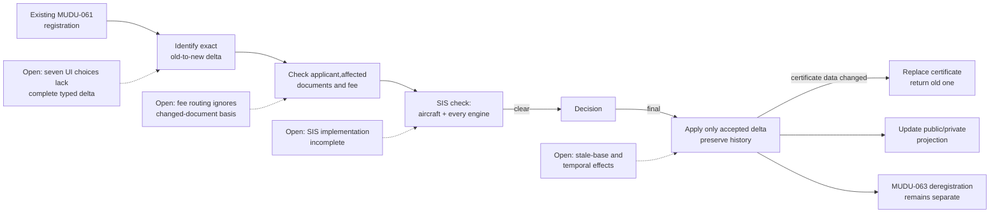

# MUDU-062 graph — change of aircraft-register data

`DRAFT / UNCONFIRMED`. This graph is a reading aid,not authority.

```mermaid
flowchart LR
    A[Existing MUDU-061<br/>registration] --> B[Identify exact<br/>old-to-new delta]
    B --> C[Check applicant,affected<br/>documents and fee]
    C --> D[SIS check:<br/>aircraft + every engine]
    D -->|clear| E[Decision]
    E -->|final| F[Apply only accepted delta<br/>preserve history]
    F -->|certificate data changed| G[Replace certificate<br/>return old one]
    F --> H[Update public/private<br/>projection]
    F --> I[MUDU-063 deregistration<br/>remains separate]

    G1[Open: seven UI choices lack<br/>complete typed delta] -.-> B
    G2[Open: fee routing ignores<br/>changed-document basis] -.-> C
    G3[Open: SIS implementation<br/>incomplete] -.-> D
    G4[Open: stale-base and<br/>temporal effects] -.-> F
```
