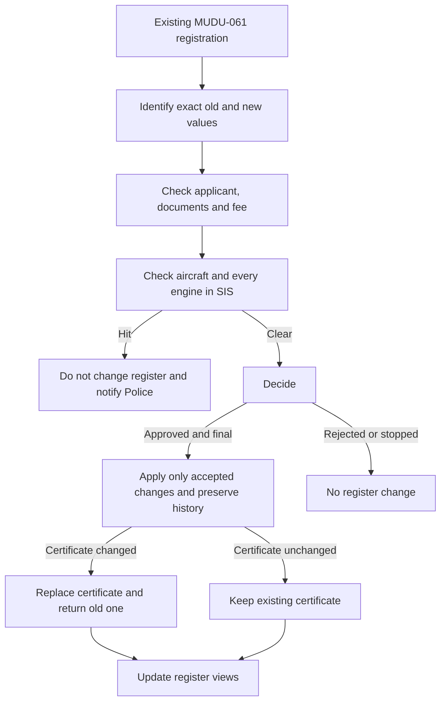

# MUDU-062 graph — change of aircraft-register data

`DRAFT / UNCONFIRMED`. This graph is a reading aid,not authority.

Related processes:`MUDU-061` registration predecessor,`MUDU-063`
deregistration and `MUDU-091` Mode S/ELT impact.

## Open issues — not part of the process flow

- `GAP-062-004`:replace the seven loose UI choices with one complete typed old-to-new change.
- `GAP-062-006`:calculate the fee from the document actually changed.
- `GAP-062-005`:complete the real SIS integration.
- `GAP-062-013` and `Q-062-001`:define stale-data detection,effective dates and concurrent-change handling.
