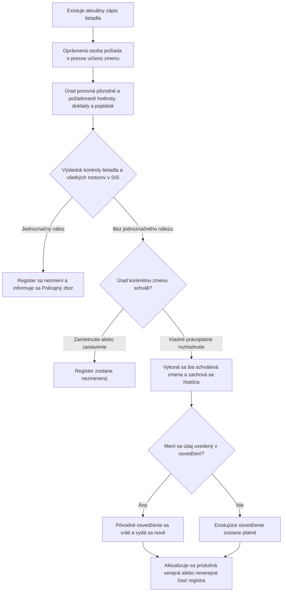

# MUDU-062 — zmena údajov v registri lietadiel

`DRAFT / UNCONFIRMED` — pracovný návrh bez schválenia vecným gestorom.

Diagram zobrazuje žiadosť vlastníka alebo oprávneného zástupcu. Osobitná oprava
z vlastného podnetu úradu ešte nemá dohodnutý postup. Úplné pravidlá sú v
[`definition.md`](definition.md), najmä v sekciách 10 a 17.

**Predchodca:** MUDU-061 — aktuálny zápis. **Samostatný neskorší proces:**
MUDU-063 — výmaz. MUDU-091 používa spoločné údaje, ale nie je krokom zmeny.

## Najdôležitejšie otvorené otázky — nie sú súčasťou toku

- `GAP-062-004`: sedem dnešných volieb treba nahradiť presným opisom pôvodnej a novej hodnoty;
- `GAP-062-005`: chýba povinná kontrola lietadla a všetkých motorov v SIS;
- `GAP-062-006`: poplatok sa musí odvodiť od skutočne meneného dokladu;
- `GAP-062-012`: treba definovať osobitnú opravu z vlastného podnetu úradu;
- `GAP-062-013` a `Q-062-001`: treba určiť ochranu pred súbežnou zmenou a presný okamih účinku.

Úplný zoznam je v sekcii 17 súboru [`definition.md`](definition.md).
