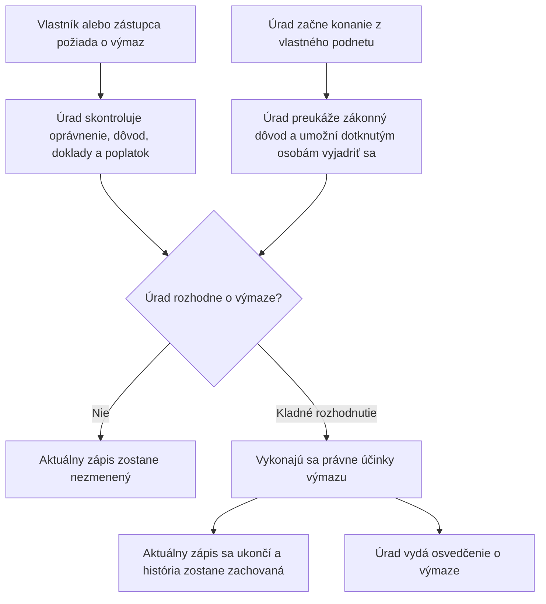

<!-- mudu-process-review-metadata
schema: mudu-process-review/v1
process_id: MUDU-063
catalogue_id: "063"
review_version: 0.1.0
status: DRAFT
authority: UNCONFIRMED
language: sk
-->

# MUDU-063 — Výmaz lietadla z registra lietadiel

> `DRAFT / UNCONFIRMED` — návrh na vecnú kontrolu.

## 1. Čo podľa zdrojov proces robí

Na žiadosť vlastníka alebo zo zákonného vlastného podnetu Dopravného úradu sa
ukončí aktuálny zápis lietadla. História registra zostane zachovaná a úrad vydá
osvedčenie o výmaze. Zákon pri výmaze nevyžaduje kontrolu SIS.

## 2. Hranice procesu

| Patrí do procesu | Nepatrí do procesu |
| --- | --- |
| Žiadosť vlastníka alebo preukázaného zástupcu | Zmena údajov pred výmazom — MUDU-062 |
| Výmaz z vlastného podnetu zo zákonného dôvodu | Prvý zápis — MUDU-061 |
| Ukončenie aktuálneho zápisu a zachovanie histórie | Predbežná značka — MUDU-060 |
| Osvedčenie o výmaze | Zmena Mode S alebo ELT — MUDU-091 |

## 3. Navrhovaný priebeh

## 4. Pravidlá, ktoré treba potvrdiť

| ID | Navrhované pravidlo | Podklad |
| --- | --- | --- |
| R1 | Žiadosť môže podať vlastník alebo jeho preukázaný zástupca. | Letecký zákon a postup DÚ |
| R2 | Úrad môže začať výmaz bez žiadosti iba zo zákonného dôvodu. | § 26 leteckého zákona |
| R3 | Výmaz ukončí aktuálny zápis, ale nevymaže historické údaje. | § 26 leteckého zákona |
| R4 | Dopravný úrad vydá osvedčenie o výmaze. | § 26 leteckého zákona |
| R5 | Hlukové osvedčenie sa vracia iba vtedy, ak bolo vydané. | Vyhláška č. 274/2024 Z. z. |
| R6 | Pri výmaze sa nevykonáva kontrola SIS. | § 26 leteckého zákona |

## 5. Rozpory a otázky

| ID | Čo sme našli | Otázka pre gestora |
| --- | --- | --- |
| Q1 | Formulár F472 a konfigurácia zužujú dôvod výmazu a plošne vyžadujú hlukové osvedčenie. | Aký úplný zoznam dôvodov a príloh má platiť? |
| Q2 | Štyri zákonné dôvody výmazu z vlastného podnetu nemajú preukázanú internú cestu. | Aké kroky, účastníci a rozhodnutia má táto vetva obsahovať? |
| Q3 | Dve technické cesty môžu zapísať dátum výmazu odlišne. | Aký je presný okamih právneho účinku výmazu? |
| Q4 | Nie je preukázané uzavretie značky, vlastníka, prevádzkovateľa a záložných vzťahov pri zachovaní histórie. | Ktoré aktívne väzby sa pri výmaze uzatvárajú a ako? |
| Q5 | Nie je jasné poradie právoplatnosti, zmeny registra a vydania osvedčenia. | Aké presné poradie má proces dodržať? |
| Q6 | Viaceré dnešné výstupné šablóny obsahujú nesprávny proces alebo pevné vzorové údaje. | Ktoré výstupy sa majú používať pre kladný výsledok, prerušenie a zastavenie? |

## 6. Čo potrebujeme potvrdiť

- [ ] Účel a hranice MUDU-063 sú správne.
- [ ] Navrhovaný priebeh správne spája žiadateľskú a internú vetvu.
- [ ] Pravidlá R1 až R6 sú správne.
- [ ] Otázky Q1 až Q6 majú odpoveď alebo určeného rozhodovateľa.
- [ ] V procese nechýba ďalší podstatný dôvod, krok alebo výsledok.

## Zdroje

- [Zákon č. 143/1998 Z. z.](https://static.slov-lex.sk/pdf/SK/ZZ/1998/143/ZZ_1998_143_20260101.pdf), najmä § 26 a § 55.
- [Vyhláška č. 274/2024 Z. z.](https://static.slov-lex.sk/static/SK/ZZ/2024/274/20241115.html), najmä § 3 a § 5 až § 7.
- [Formulár Dopravného úradu F472](https://letectvo.nsat.sk/wp-content/uploads/sites/2/2023/03/F472_B_v1_V%C3%9DMAZ-LIETADLA_FINAL.pdf).
- Katalóg služieb, EA, konfigurácia, výstupné šablóny a existujúce Petriflow modely — interné podklady, nezverejnené v tomto repozitári.
