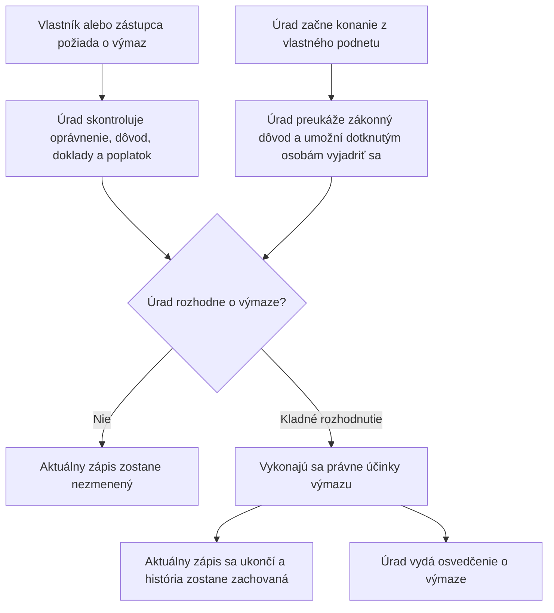

<!-- mudu-process-definition-metadata
schema: mudu-process-definition/v1
process_id: MUDU-063
catalogue_id: "063"
definition_version: 0.2.0
status: DRAFT
authority: UNCONFIRMED
language: sk
related_processes: [MUDU-060, MUDU-061, MUDU-062, MUDU-091]
-->

# MUDU-063 — Výmaz lietadla z registra lietadiel

> `DRAFT / UNCONFIRMED` — návrh na vecnú kontrolu.

## 1. Čo podľa zdrojov proces robí

Na žiadosť vlastníka alebo zo zákonného vlastného podnetu Dopravného úradu sa
ukončí aktuálny zápis lietadla. História registra zostane zachovaná a úrad vydá
osvedčenie o výmaze. Zákon pri výmaze nevyžaduje kontrolu SIS.

## 2. Hranice procesu

| Patrí do procesu | Nepatrí do procesu |
| --- | --- |
| Žiadosť vlastníka alebo preukázaného zástupcu | Zmena údajov pred výmazom — MUDU-062 |
| Výmaz z vlastného podnetu zo zákonného dôvodu | Prvý zápis — MUDU-061 |
| Ukončenie aktuálneho zápisu a zachovanie histórie | Predbežná značka — MUDU-060 |
| Osvedčenie o výmaze | Zmena Mode S alebo ELT — MUDU-091 |

## 3. Navrhovaný priebeh

## 4. Pravidlá, ktoré treba potvrdiť

| ID | Navrhované pravidlo | Podklad |
| --- | --- | --- |
| REQ-063-002 | Žiadosť môže podať vlastník alebo jeho preukázaný zástupca. | Letecký zákon a postup DÚ |
| RULE-063-003 | Úrad môže začať výmaz bez žiadosti iba zo zákonného dôvodu. | § 26 leteckého zákona |
| RULE-063-004 | Výmaz ukončí aktuálny zápis, ale nevymaže historické údaje. | § 26 leteckého zákona |
| REQ-063-001 | Dopravný úrad vydá osvedčenie o výmaze. | § 26 leteckého zákona |
| RULE-063-006 | Hlukové osvedčenie sa vracia iba vtedy, ak bolo vydané. | Vyhláška č. 274/2024 Z. z. |
| REQ-063-010 | Pri výmaze sa nevykonáva kontrola SIS. | § 26 leteckého zákona |

## 5. Rozpory a otázky

| ID | Čo sme našli | Otázka pre gestora |
| --- | --- | --- |
| GAP-063-001 | Formulár F472 a konfigurácia zužujú dôvod výmazu a plošne vyžadujú hlukové osvedčenie. | Aký úplný zoznam dôvodov a príloh má platiť? |
| GAP-063-007 | Štyri zákonné dôvody výmazu z vlastného podnetu nemajú preukázanú internú cestu. | Aké kroky, účastníci a rozhodnutia má táto vetva obsahovať? |
| GAP-063-005 | Dve technické cesty môžu zapísať dátum výmazu odlišne. | Aký je presný okamih právneho účinku výmazu? |
| GAP-063-006 | Nie je preukázané uzavretie značky, vlastníka, prevádzkovateľa a záložných vzťahov pri zachovaní histórie. | Ktoré aktívne väzby sa pri výmaze uzatvárajú a ako? |
| Q-063-003 | Nie je jasné poradie právoplatnosti, zmeny registra a vydania osvedčenia. | Aké presné poradie má proces dodržať? |
| GAP-063-009, GAP-063-010, GAP-063-011 | Viaceré dnešné výstupné šablóny obsahujú nesprávny proces alebo pevné vzorové údaje. | Ktoré výstupy sa majú používať pre kladný výsledok, prerušenie a zastavenie? |

## 6. Čo potrebujeme potvrdiť

- [ ] Účel a hranice MUDU-063 sú správne.
- [ ] Navrhovaný priebeh správne spája žiadateľskú a internú vetvu.
- [ ] Uvedené pravidlá sú správne.
- [ ] Uvedené otázky majú odpoveď alebo určeného rozhodovateľa.
- [ ] V procese nechýba ďalší podstatný dôvod, krok alebo výsledok.

## 7. Zdroje použité pre návrh

- [Zákon č. 143/1998 Z. z.](https://static.slov-lex.sk/pdf/SK/ZZ/1998/143/ZZ_1998_143_20260101.pdf), najmä § 26 a § 55.
- [Vyhláška č. 274/2024 Z. z.](https://static.slov-lex.sk/static/SK/ZZ/2024/274/20241115.html), najmä § 3 a § 5 až § 7.
- [Formulár Dopravného úradu F472](https://letectvo.nsat.sk/wp-content/uploads/sites/2/2023/03/F472_B_v1_V%C3%9DMAZ-LIETADLA_FINAL.pdf).
- Katalóg služieb, EA, konfigurácia, výstupné šablóny a existujúce Petriflow modely — interné podklady, nezverejnené v tomto repozitári.

## 8. Detailná štruktúrovaná vrstva

Otvoriť úplnú vrstvu pre LLM, Petriflow, dopadovú analýzu a testy

> Túto vrstvu generuje a udržiava LLM z dostupných zdrojov. Ľudská kontrolná
> vrstva vyššie určuje prijatý vecný význam; detailná vrstva ho nesmie potichu
> meniť a každá zmena významu sa musí premietnuť späť do otázok a prijatia.

### D1. Identita a stav

| Pole | Hodnota |
| --- | --- |
| Katalógové ID | 063 |
| Katalógový názov | Výmaz lietadla z registra lietadiel Slovenskej republiky. |
| Kanonický názov | Výmaz lietadla z registra lietadiel Slovenskej republiky |
| Vecný gestor | Dopravný úrad, Divízia civilného letectva, register lietadiel |
| Typ procesu | REGISTRY_MUTATION |
| Definičný stav | DRAFT |
| Autorita | UNCONFIRMED |
| Jazyk | sk |

### D2. Účel, spúšťač a hranice

| ID | Typ | Tvrdenie | Vrstva | Stav | Zdroje |
| --- | --- | --- | --- | --- | --- |
| SCP-063-001 | PURPOSE | Ukončiť aktuálny zápis konkrétneho lietadla v registri a jeho štátnu príslušnosť viazanú na zápis, vydať osvedčenie o výmaze a zachovať auditovateľnú registračnú históriu. | LAW | CONFIRMED | SRC-063-001 |
| SCP-063-002 | TRIGGER | Vlastník lietadla alebo jeho riadne splnomocnený zástupca podá žiadosť o výmaz. | LAW | CONFIRMED | SRC-063-001, SRC-063-004, SRC-063-006 |
| SCP-063-003 | TRIGGER | Dopravný úrad môže začať výmaz bez žiadosti, ak prestali byť splnené podmienky § 25 ods. 3, bolo preukázané zničenie lietadla, lietadlo je nezvestné viac ako 12 mesiacov alebo osvedčenie o letovej spôsobilosti je neplatné viac ako 24 mesiacov. | LAW | CONFIRMED | SRC-063-001 |
| SCP-063-004 | IN_SCOPE | Identifikácia aktuálneho zápisu, oprávnenie účastníkov, dôvod a jeho dôkaz, vrátenie určených osvedčení, rozhodnutie, právoplatný registerový účinok, historická projekcia a osvedčenie o výmaze. | LAW | CONFIRMED | SRC-063-001, SRC-063-002 |
| SCP-063-005 | IN_SCOPE | Žiadateľská vetva a vetva z vlastného podnetu sú dve zákonné cesty jedného výmazu MUDU-063; elektronický portál je preukázaný iba pre žiadateľskú vetvu. | LAW | CONFIRMED | SRC-063-001, SRC-063-008 |
| SCP-063-006 | OUT_OF_SCOPE | Predbežné pridelenie značky je MUDU-060, prvý zápis je MUDU-061 a zmena údajov pred výmazom je MUDU-062. Výmaz nesmie tieto procesy spätne nahrádzať. | LAW | CONFIRMED | SRC-063-001, SRC-063-008 |
| SCP-063-007 | OUT_OF_SCOPE | Pridelenie alebo zmena kódu módu S alebo ELT je samostatný MUDU-091; výmaz môže vytvoriť dopad, ale nevykonáva túto službu. | OBSERVATION | CONFIRMED | SRC-063-008, SRC-063-028 |
| SCP-063-008 | OUT_OF_SCOPE | Záložný veriteľ môže žiadať zápis alebo zmenu záložných údajov, nie výmaz lietadla namiesto vlastníka. Existujúce záložné vzťahy však musia byť pri výmaze riadne vyporiadané. | LAW | CONFIRMED | SRC-063-001, SRC-063-002 |
| SCP-063-009 | OUT_OF_SCOPE | Výmaz certifikovaného bezpilotného lietadla z osobitného registra podľa § 45b nie je týmto procesom registra lietadiel. | LAW | CONFIRMED | SRC-063-001 |
| SCP-063-010 | IN_SCOPE | § 26 ods. 13 prikazuje SIS kontrolu iba pri zápise a zmene údajov; neprítomnosť SIS vetvy pri MUDU-063 preto nie je sama osebe chyba. | LAW | CONFIRMED | SRC-063-001, SRC-063-017 |

### D3. Autorita a právny základ

| ID | Modalita | Normatívne pravidlo | Vrstva | Stav | Zdroje |
| --- | --- | --- | --- | --- | --- |
| REQ-063-001 | MUST | Dopravný úrad vydá o výmaze lietadla z registra osvedčenie. | LAW | CONFIRMED | SRC-063-001 |
| REQ-063-002 | MUST | Žiadateľská vetva sa vykoná iba na základe žiadosti vlastníka lietadla alebo jeho oprávneného zástupcu. | LAW | CONFIRMED | SRC-063-001, SRC-063-004 |
| REQ-063-003 | MAY | Dopravný úrad môže vykonať výmaz bez žiadosti iba pri jednom zo štyroch dôvodov SCP-063-003. | LAW | CONFIRMED | SRC-063-001 |
| REQ-063-004 | MUST | Žiadosť obsahuje údaje a prílohy podľa § 3 a spĺňa formu podľa § 5 až 7 vyhlášky č. 274/2024 Z. z. | LAW | CONFIRMED | SRC-063-002 |
| REQ-063-005 | MUST | Právoplatný výmaz uzavrie aktuálny zápis, ale zachová predchádzajúce verejné údaje pre zákonný prehľad a neverejnú históriu v povolenom rozsahu. | LAW | CONFIRMED | SRC-063-001 |
| REQ-063-006 | MUST_NOT | Výmaz nesmie byť implementovaný ako fyzické zmazanie lietadla, vlastníckych, prevádzkovateľských, záložných, značkových alebo technických historických údajov. | LAW | CONFIRMED | SRC-063-001 |
| REQ-063-007 | MUST | Verejná a neverejná časť registra sa po výmaze sprístupňujú iba v rozsahu § 26 ods. 6 až 8. | LAW | CONFIRMED | SRC-063-001 |
| REQ-063-008 | MUST | Na rozhodovanie sa vzťahuje správny poriadok a proti rozhodnutiu možno podať rozklad, o ktorom rozhoduje predseda Dopravného úradu na návrh osobitnej komisie. | LAW | CONFIRMED | SRC-063-001, SRC-063-004 |
| REQ-063-009 | MUST | Základný správny poplatok za výmaz na žiadosť je 20 EUR; elektronické zníženie sa uplatní iba za podmienok § 6 ods. 2 zákona o správnych poplatkoch. | LAW | CONFIRMED | SRC-063-003 |
| REQ-063-010 | MUST_NOT | SIS kontrola sa nesmie bez prijatého právneho alebo vecného dôvodu pridať ako povinná podmienka výmazu. | LAW | CONFIRMED | SRC-063-001 |
| REQ-063-011 | MUST | Účinok výmazu, dátum výmazu, právoplatnosť rozhodnutia a dátum vydania osvedčenia musia zostať rozlíšené a preukázateľne previazané. | LAW | CONFIRMED | SRC-063-001, SRC-063-004 |

### D4. Aktéri a oprávnenia

| ID | Aktér | Typ | Oprávnenie a zodpovednosť | Vrstva | Stav | Zdroje |
| --- | --- | --- | --- | --- | --- | --- |
| ACT-063-001 | Vlastník lietadla | Externý žiadateľ a účastník | Žiada o výmaz, uvádza presný dôvod, predkladá dôkaz a odovzdáva určené osvedčenia. | LAW | CONFIRMED | SRC-063-001, SRC-063-002 |
| ACT-063-002 | Spoluvlastníci | Externí účastníci | Ich identita a oprávnenie konať musia zodpovedať vlastníckemu usporiadaniu; formulár zachytáva každého spoluvlastníka. | LAW | CONFIRMED | SRC-063-001, SRC-063-002, SRC-063-007 |
| ACT-063-003 | Splnomocnený zástupca vlastníka | Externý zástupca | Koná iba v preukázanom rozsahu plnomocenstva. | LAW | CONFIRMED | SRC-063-004, SRC-063-006 |
| ACT-063-004 | Prevádzkovateľ | Dotknutá osoba | Jeho údaje sú súčasťou žiadosti a registra, ale zákon ho neurčuje ako všeobecného žiadateľa o výmaz namiesto vlastníka. | LAW | CONFIRMED | SRC-063-001, SRC-063-002 |
| ACT-063-005 | Záložný veriteľ | Dotknutá osoba | Jeho záložné údaje sa musia zachovať a časovo uzavrieť; samotné postavenie záložného veriteľa mu nedáva právo podať žiadosť o výmaz. | LAW | CONFIRMED | SRC-063-001, SRC-063-002 |
| ACT-063-006 | Dopravný úrad | Orgán verejnej moci | Overuje zákonnú cestu, dôvod, doklady a účastníkov, rozhoduje, vykoná registerový účinok a vydá osvedčenie. | LAW | CONFIRMED | SRC-063-001 |
| ACT-063-007 | Referent registra lietadiel | Interná rola | Aktuálne spracúva podanie, vyberá výstup a manuálne potvrdzuje právoplatnosť; presné kompetencie nie sú prijato definované. | CURRENT_IMPLEMENTATION | UNKNOWN | SRC-063-010, SRC-063-015, SRC-063-021 |
| ACT-063-008 | Predseda Dopravného úradu a osobitná komisia | Odvolací orgán | Predseda rozhoduje o rozklade na návrh komisie. | LAW | CONFIRMED | SRC-063-001, SRC-063-004 |
| ACT-063-009 | Vlastník alebo iná dotknutá osoba v z vlastného podnetu vetve | Externý účastník | Musí dostať možnosť chrániť svoje procesné práva pred rozhodnutím o výmaze bez žiadosti. | LAW | CONFIRMED | SRC-063-004 |

### D5. Vstupy a predpoklady

| ID | Podmienka alebo vstup | Povinnosť | Vrstva | Stav | Zdroje |
| --- | --- | --- | --- | --- | --- |
| PRE-063-001 | Existujúci aktuálny zápis konkrétneho lietadla MUDU-061, identifikovaný registrovou značkou a výrobným číslom. | REQUIRED | LAW | CONFIRMED | SRC-063-001, SRC-063-002 |
| PRE-063-002 | Žiadosť vlastníka alebo presne identifikovaný z vlastného podnetu dôvod podľa RULE-063-003. | REQUIRED | LAW | CONFIRMED | SRC-063-001 |
| PRE-063-003 | Doklad preukazujúci konkrétny dôvod výmazu. | REQUIRED | LAW | CONFIRMED | SRC-063-002 |
| PRE-063-004 | Hlukové osvedčenie, iba ak bolo vydané, osvedčenie o letovej spôsobilosti a osvedčenie o zápise. | REQUIRED | LAW | CONFIRMED | SRC-063-002 |
| PRE-063-005 | Oprávnenie žiadateľa alebo účastnícke postavenie v z vlastného podnetu vetve je preukázané. | REQUIRED | LAW | CONFIRMED | SRC-063-001, SRC-063-004 |
| PRE-063-006 | Pri žiadateľskej vetve je správny poplatok zaplatený v zákonnej lehote. | REQUIRED | LAW | CONFIRMED | SRC-063-003 |
| PRE-063-007 | Pri elektronickom podaní je podanie autorizované a prílohy majú elektronickú formu alebo sú výsledkom zaručenej konverzie. | CONDITIONAL | LAW | CONFIRMED | SRC-063-002, SRC-063-003 |
| PRE-063-008 | Registerový zápis sa od zobrazenia do právoplatného účinku nezmenil alebo bol konflikt výslovne znovu zosúladený. | REQUIRED | PROPOSAL | PROPOSED | SRC-063-011, SRC-063-028 |
| PRE-063-009 | Vlastnícke, prevádzkovateľské, záložné, značkové, motorové a vrtuľové väzby sú načítané ako presná aktuálna verzia a historické vzťahy ostávajú dostupné. | REQUIRED | PROPOSAL | PROPOSED | SRC-063-011, SRC-063-014 |

### D6. Údaje formulára

| ID | Údaj | Typ | Kardinalita | Zdroj/hodnota | Validácia | Vrstva | Stav | Zdroje |
| --- | --- | --- | --- | --- | --- | --- | --- | --- |
| FLD-063-001 | Vlastník alebo spoluvlastníci | Štruktúrovaná identita | 1..* | Rozsah § 26 ods. 5 písm. a) | Zodpovedá aktuálnemu zápisu a oprávneniu podať žiadosť | LAW | CONFIRMED | SRC-063-001, SRC-063-002 |
| FLD-063-002 | Prevádzkovateľ | Štruktúrovaná identita | 1 | Rozsah § 26 ods. 5 písm. a) | Zodpovedá aktuálnemu zápisu | LAW | CONFIRMED | SRC-063-001, SRC-063-002 |
| FLD-063-003 | Záložný veriteľ, záložné právo a zabezpečená pohľadávka | Štruktúrované údaje | 0..* | Ak je lietadlo, motor alebo vrtuľa predmetom záložného práva | Zachovať identitu a históriu; ACT-063-005 | LAW | CONFIRMED | SRC-063-001, SRC-063-002 |
| FLD-063-004 | Typ a výrobné číslo motora | Opakovateľná štruktúra | 0..* | Každý aktuálny motor | Musí odkazovať na súčasť vymazávaného lietadla | LAW | CONFIRMED | SRC-063-002 |
| FLD-063-005 | Typ a výrobné číslo vrtule | Opakovateľná štruktúra | 0..* | Každá aktuálna vrtuľa | Musí odkazovať na súčasť vymazávaného lietadla | LAW | CONFIRMED | SRC-063-002 |
| FLD-063-006 | Registrová značka | Text alebo referencia | 1 | Aktuálna značka vymazávaného lietadla | Jednoznačne identifikuje aktuálny zápis | LAW | CONFIRMED | SRC-063-001, SRC-063-002 |
| FLD-063-007 | Dôvod výmazu | Enumerácia plus opis a dôkaz | 1 | Žiadateľský dôvod alebo jeden z vlastného podnetu dôvod | Nesmie sa obmedziť na predaj, nehodu a iné bez úplného významu | LAW | CONFIRMED | SRC-063-001, SRC-063-002 |
| FLD-063-008 | Dátum a miesto vyhotovenia žiadosti | Dátum a text | 1 | Žiadateľ | Platný dátum a neprázdne miesto | LAW | CONFIRMED | SRC-063-002 |
| FLD-063-009 | Podpis žiadateľa | Podpis alebo elektronická autorizácia | 1 | Listinný podpis alebo autorizované elektronické podanie | Povinný podľa cesty podania | LAW | CONFIRMED | SRC-063-002 |
| FLD-063-010 | Typ, rok výroby, výrobca, výrobné číslo, MTOW a počet sedadiel | Technické údaje | 0..* | F472 a aktuálny Petriflow | Vyhláška § 3 ich ako samostatnú obsahovú povinnosť neuvádza; môžu slúžiť na identifikáciu, nie na vytvorenie novej technickej zmeny | OFFICIAL_PROCEDURE | CONFLICT | SRC-063-002, SRC-063-007, SRC-063-013 |
| FLD-063-011 | Výrobca a rok motorov a vrtúľ | Technické údaje súčastí | 0..* | F472 a aktuálny Petriflow | Vyhláška vyžaduje iba typ a výrobné číslo; širší rozsah potrebuje prijatý účel | OFFICIAL_PROCEDURE | CONFLICT | SRC-063-002, SRC-063-007, SRC-063-013 |
| FLD-063-012 | Číslo a dátum výnimočného zápisu | Text a dátum | 0..1 | F472 | Vyhláška § 3 ich medzi údajmi žiadosti o výmaz neuvádza; sú iba existujúcim registračným kontextom | OFFICIAL_PROCEDURE | CONFLICT | SRC-063-002, SRC-063-007 |
| FLD-063-013 | `reason_delete` | Výber z možností | 1 | `predaj`, `letecka-nehoda`, `ine` | Tri implementačné hodnoty nepokrývajú štyri dôvody výmazu z vlastného podnetu a F472 obsahuje dve poškodené voľby | CURRENT_IMPLEMENTATION | CONFLICT | SRC-063-007, SRC-063-013, SRC-063-020 |
| FLD-063-014 | Dátum právoplatného výmazu | Dátum | 1 | Výsledok konania, nie vstup žiadateľa | Musí sa zapísať raz a zhodovať s účinkom a osvedčením | LAW | CONFIRMED | SRC-063-001, SRC-063-004 |

### D7. Dokumenty a prílohy

| ID | Dokument/príloha | Povinnosť | Forma | Vrstva | Stav | Zdroje |
| --- | --- | --- | --- | --- | --- | --- |
| DOC-063-001 | Doklad preukazujúci dôvod výmazu | REQUIRED | Listinne originál alebo úradne osvedčená kópia; elektronicky podľa § 5 ods. 2; pri inom jazyku úradný preklad okrem češtiny | LAW | CONFIRMED | SRC-063-002 |
| DOC-063-002 | Hlukové osvedčenie | CONDITIONAL | Originál pri listinnej ceste; iba ak bolo vydané | LAW | CONFIRMED | SRC-063-002 |
| DOC-063-003 | Osvedčenie o letovej spôsobilosti | REQUIRED | Originál pri listinnej ceste | LAW | CONFIRMED | SRC-063-002 |
| DOC-063-004 | Osvedčenie o zápise lietadla | REQUIRED | Originál vydaný Dopravným úradom pri listinnej ceste | LAW | CONFIRMED | SRC-063-002 |
| DOC-063-005 | Plná moc | CONDITIONAL | Forma preukazujúca rozsah zastúpenia | LAW | CONFIRMED | SRC-063-004, SRC-063-006 |
| DOC-063-006 | Doklad o zaplatení správneho poplatku | NOT_APPLICABLE | Platba sa preukazuje v platobnom procese; § 3 ho neurčuje ako povinnú prílohu | LAW | CONFLICT | SRC-063-002, SRC-063-007, SRC-063-018 |
| DOC-063-007 | Štyri nakonfigurované prílohy MUDU-063 | REQUIRED | Dôvod zúžený na zánik vlastníctva, hlukové osvedčenie plošne a obe osvedčenia | CURRENT_IMPLEMENTATION | CONFLICT | SRC-063-002, SRC-063-018 |
| DOC-063-008 | Výpis z obchodného, živnostenského alebo registra združení | NOT_APPLICABLE | Verejná stránka DÚ uvádza, že ho netreba prikladať | OFFICIAL_PROCEDURE | CONFIRMED | SRC-063-006 |

### D8. Poplatky, lehoty a časové pravidlá

| ID | Typ pravidla | Hodnota | Spúšťač/začiatok | Vrstva | Stav | Zdroje |
| --- | --- | --- | --- | --- | --- | --- |
| FEE-063-001 | Základný správny poplatok | 20 EUR | Podanie žiadosti o výmaz | LAW | CONFIRMED | SRC-063-003 |
| FEE-063-002 | Elektronické zníženie | 10 EUR, ak je podanie aj každá príloha elektronická; zníženie je 50 %, najviac 50 EUR | Elektronické podanie spĺňajúce § 6 ods. 2 | LAW | CONFIRMED | SRC-063-003 |
| TIM-063-001 | Splatnosť pevného poplatku | Pri podaní; ak nebol zaplatený, do 15 dní od doručenia písomnej výzvy | Podanie alebo doručenie výzvy | LAW | CONFIRMED | SRC-063-003 |
| TIM-063-002 | Rozhodnutie správneho orgánu | Bezodkladne v jednoduchej veci, inak 30 dní; vo zvlášť zložitej veci 60 dní, ak osobitný predpis neurčí inak | Úplné a rozhodnuteľné podanie; lehoty neplynú počas zákonného prerušenia | LAW | CONFIRMED | SRC-063-004 |
| TIM-063-003 | Rozklad | 15 dní | Oznámenie rozhodnutia | LAW | CONFIRMED | SRC-063-001, SRC-063-004 |
| TIM-063-004 | Nezvestnosť | Viac ako 12 mesiacov | Preukázaný začiatok nezvestnosti | LAW | CONFIRMED | SRC-063-001 |
| TIM-063-005 | Neplatnosť osvedčenia o letovej spôsobilosti | Viac ako 24 mesiacov | Začiatok neplatnosti osvedčenia | LAW | CONFIRMED | SRC-063-001 |
| TIM-063-006 | Aktuálne znenie účinku v šablóne | Rozhodovacia šablóna uvádza výmaz ku dňu právoplatnosti; nejde o prijaté všeobecné pravidlo a presný účinný okamih zostáva otvorený v Q-063-003 | Technické spracovanie právoplatnosti | CURRENT_IMPLEMENTATION | CONFLICT | SRC-063-023 |
| TIM-063-007 | Aktuálne technické správoplatnenie | Dve implementačné cesty zapisujú dnešný dátum pri manuálnom alebo systémovom potvrdení | Technické potvrdenie právoplatnosti | CURRENT_IMPLEMENTATION | CONFLICT | SRC-063-013, SRC-063-015 |

### D9. Rozhodovacie pravidlá a invarianty

| ID | Modalita | Pravidlo/invariant | Vrstva | Stav | Zdroje |
| --- | --- | --- | --- | --- | --- |
| RULE-063-001 | MUST | Výmaz sa týka presne jedného aktuálne zapísaného lietadla a nesmie vytvoriť ďalšiu registračnú identitu. | LAW | CONFIRMED | SRC-063-001 |
| RULE-063-002 | MUST | Žiadateľská vetva je oprávnená iba vlastníkom alebo zástupcom; záložný veriteľ a prevádzkovateľ nie sú všeobecnými žiadateľmi. | LAW | CONFIRMED | SRC-063-001 |
| RULE-063-003 | MUST | Výmaz z vlastného podnetu má presne jeden preukázaný zákonný dôvod: strata podmienok zápisu, zničenie, nezvestnosť nad 12 mesiacov alebo neplatnosť osvedčenia nad 24 mesiacov. | LAW | CONFIRMED | SRC-063-001 |
| RULE-063-004 | MUST | Aktuálny zápis, štátna príslušnosť viazaná na zápis a aktuálna verejná projekcia sa ukončia v jednom právne účinnom kroku; historické údaje ostanú zachované. | LAW | CONFIRMED | SRC-063-001 |
| RULE-063-005 | MUST | Osvedčenie o výmaze identifikuje rovnaké lietadlo, posledného vlastníka a rovnaký účinný dátum ako register. | LAW | CONFIRMED | SRC-063-001 |
| RULE-063-006 | MUST | Hlukové osvedčenie je povinné iba ak bolo vydané; ostatné dve osvedčenia a dôkaz dôvodu sú povinné. | LAW | CONFIRMED | SRC-063-002 |
| RULE-063-007 | MUST_NOT | Právoplatný výmaz nesmie prepísať minulé vlastnícke, prevádzkovateľské, záložné, značkové ani technické hodnoty novými nulovými hodnotami bez zachovania časovej histórie. | LAW | CONFIRMED | SRC-063-001 |
| RULE-063-008 | MUST | Opakované technické potvrdenie toho istého právoplatného výmazu je idempotentné a nesmie meniť už určený účinný dátum. | PROPOSAL | PROPOSED | SRC-063-013, SRC-063-015 |
| RULE-063-009 | MUST | Súbežná zmena MUDU-062 a výmaz MUDU-063 sa musia serializovať alebo znovu zosúladiť proti presnej verzii zápisu. | PROPOSAL | PROPOSED | SRC-063-011, SRC-063-028 |
| RULE-063-010 | MUST_NOT | Nevykonaná, zamietnutá, prerušená alebo zastavená žiadosť nesmie zmeniť aktuálny register. | LAW | CONFIRMED | SRC-063-004 |
| RULE-063-011 | DESCRIPTIVE | Výmaz automaticky nemení samostatné údaje MUDU-091 bez výslovného dopadu a samostatného procesu. | OBSERVATION | CONFIRMED | SRC-063-008, SRC-063-028 |
| RULE-063-012 | MUST | Vrátené osvedčenia sa evidujú ako neplatné alebo odovzdané bez odstránenia ich historickej identity. | PROPOSAL | PROPOSED | SRC-063-002, SRC-063-011 |

### D10. Procesný tok

| ID | Poradie | Stav pred | Činnosť | Aktér | Podmienka | Stav po | Vrstva | Stav | Zdroje |
| --- | --- | --- | --- | --- | --- | --- | --- | --- | --- |
| STEP-063-001 | 1A | Aktuálne zapísané | Podať a autorizovať žiadosť o výmaz s dôvodom a prílohami. | ACT-063-001 alebo ACT-063-003 | Žiadateľská vetva | Podané | LAW | CONFIRMED | SRC-063-001, SRC-063-002 |
| STEP-063-002 | 1B | Aktuálne zapísané | Zaznamenať vlastný podnet a konkrétny zákonný dôvod. | ACT-063-006 | RULE-063-003 | Konanie z vlastného podnetu začaté | LAW | CONFIRMED | SRC-063-001 |
| STEP-063-003 | 2 | Podané alebo z vlastného podnetu začaté | Overiť identitu lietadla, aktuálny zápis, oprávnenie účastníkov a úplnosť dôkazov. | ACT-063-006 | PRE-063-001 až PRE-063-005 | Rozhodnuteľné alebo nedostatok | LAW | CONFIRMED | SRC-063-001, SRC-063-002, SRC-063-004 |
| STEP-063-004 | 3 | Podané | Určiť a overiť správny poplatok; pri nedostatku vyzvať na zaplatenie. | ACT-063-006 | Žiadateľská vetva | Poplatok vyrovnaný alebo nezaplatený | LAW | CONFIRMED | SRC-063-003 |
| STEP-063-005 | 4 | Nedostatok | Pomôcť odstrániť vady alebo vyzvať na doplnenie s poučením; podľa potreby prerušiť konanie. | ACT-063-006 | Odstrániteľný nedostatok | Prerušené alebo doplnené | LAW | CONFIRMED | SRC-063-004 |
| STEP-063-006 | 5 | Rozhodnuteľné | V z vlastného podnetu vetve umožniť účastníkom vyjadriť sa k podkladom a v oboch vetvách posúdiť zákonnosť dôvodu. | ACT-063-006 | Úplné podklady | Posúdené | LAW | CONFIRMED | SRC-063-004 |
| STEP-063-007 | 6 | Posúdené | Vydať rozhodnutie o výmaze, zamietnutí alebo inom procesnom výsledku. | ACT-063-006 | Výsledok posúdenia | Rozhodnuté | LAW | CONFIRMED | SRC-063-001, SRC-063-004 |
| STEP-063-008 | 7 | Rozhodnuté | Oznámiť rozhodnutie a umožniť rozklad. | ACT-063-006 | Rozhodnutie vydané | Oznámené, napadnuté alebo právoplatné | LAW | CONFIRMED | SRC-063-001, SRC-063-004 |
| STEP-063-009 | 8 | Právoplatné rozhodnutie o výmaze | Atómovo uzavrieť aktuálny zápis, zapísať dátum výmazu a zachovať všetky historické vzťahy a projekcie. | ACT-063-006 | RULE-063-004, RULE-063-008, RULE-063-009 | Vymazané z aktuálneho registra | LAW | CONFIRMED | SRC-063-001 |
| STEP-063-010 | 9 | Vymazané z aktuálneho registra | Vyznačiť vrátenie osvedčení a vydať osvedčenie o výmaze s rovnakým účinným dátumom. | ACT-063-006 | REQ-063-001, RULE-063-005 | Osvedčenie vydané | LAW | CONFIRMED | SRC-063-001, SRC-063-002 |
| STEP-063-011 | 10 | Osvedčenie vydané | Aktualizovať verejnú projekciu, zachovať zákonný historický prehľad a uzavrieť spis. | ACT-063-006 | REQ-063-005 až REQ-063-007 | Ukončené | LAW | CONFIRMED | SRC-063-001 |

### D11. Výstupy, právne účinky a koncové stavy

| ID | Typ | Výstup/účinok | Právoplatnosť/platnosť | Vrstva | Stav | Zdroje |
| --- | --- | --- | --- | --- | --- | --- |
| OUT-063-001 | DECISION | Rozhodnutie o výmaze na žiadosť alebo z vlastného podnetu. | Účinok podľa právoplatnosti a RULE-063-004 | LAW | CONFIRMED | SRC-063-001, SRC-063-004 |
| OUT-063-002 | CERTIFICATE | Osvedčenie o výmaze identifikujúce lietadlo, posledného vlastníka a účinný dátum. | Vydané v nadväznosti na právoplatný výmaz | LAW | CONFIRMED | SRC-063-001, SRC-063-022 |
| OUT-063-003 | REGISTER_MUTATION | Ukončený aktuálny zápis a zapísaný dátum výmazu pri zachovaní histórie. | Atómovo ku dňu účinku | LAW | CONFIRMED | SRC-063-001 |
| OUT-063-004 | PUBLICATION | Aktuálna verejná projekcia už neprezentuje lietadlo ako aktuálne zapísané; zákonný historický prehľad ostáva dostupný. | Po účinnom výmaze | LAW | CONFIRMED | SRC-063-001 |
| OUT-063-005 | DECISION | Rozhodnutie o zamietnutí, ak dôvod alebo oprávnenie nie sú preukázané. | Bez registerového účinku, podlieha rozkladu | LAW | CONFIRMED | SRC-063-004 |
| OUT-063-006 | DECISION | Rozhodnutie o prerušení a výzva na odstránenie nedostatkov. | Počas prerušenia procesné lehoty neplynú; bez registerového účinku | LAW | CONFIRMED | SRC-063-004 |
| OUT-063-007 | DECISION | Zastavenie konania pri zákonnom dôvode, najmä neodstránení vád alebo nezaplatení. | Bez registerového účinku | LAW | CONFIRMED | SRC-063-003, SRC-063-004 |
| OUT-063-008 | Technický výstup | Štyri konfigurované výstupy: osvedčenie, prerušenie, rozhodnutie o výmaze a zastavenie. | Obsah a technické správoplatnenie sú čiastočne konfliktné | CURRENT_IMPLEMENTATION | CONFLICT | SRC-063-021 až SRC-063-025 |

### D12. Integrácie a notifikácie

| ID | Typ | Systém/príjemca | Účel/obsah | Kritickosť | Vrstva | Stav | Zdroje |
| --- | --- | --- | --- | --- | --- | --- | --- |
| INT-063-001 | INTEGRATION | Portál MUDU a ÚPVS | Prijať autorizovanú žiadosť, údaje a prílohy a doručiť stav alebo výsledok. | CRITICAL | CURRENT_IMPLEMENTATION | CONFIRMED | SRC-063-010, SRC-063-014 |
| INT-063-002 | INTEGRATION | MEP/PEP platobná integrácia | Vytvoriť a spárovať predpis poplatku kódom 3040. | CRITICAL | CURRENT_IMPLEMENTATION | CONFIRMED | SRC-063-019, SRC-063-029 |
| INT-063-003 | INTEGRATION | BackOffice MUDU | Spracovať podanie, rozhodnutie, právoplatnosť a registerový účinok. | CRITICAL | CURRENT_IMPLEMENTATION | CONFIRMED | SRC-063-015, SRC-063-016 |
| INT-063-004 | INTEGRATION | Fabasoft | Evidovať spis, výstupy a dokumentový obeh; úspech adaptéra nepreukazuje správnosť registerového účinku. | CRITICAL | CURRENT_IMPLEMENTATION | CONFIRMED | SRC-063-010, SRC-063-029 |
| INT-063-005 | INTEGRATION | Register lietadiel a verejná projekcia | Uzavrieť aktuálny zápis, zachovať históriu a publikovať zákonný rozsah. | CRITICAL | LAW | CONFIRMED | SRC-063-001 |
| INT-063-006 | INTEGRATION | Generovanie dokumentov | Vytvoriť rozhodnutie, osvedčenie, prerušenie alebo zastavenie z presných údajov prípadu. | CRITICAL | CURRENT_IMPLEMENTATION | CONFLICT | SRC-063-021 až SRC-063-025 |
| NOT-063-001 | NOTIFICATION | Vlastník alebo zástupca | Výzva, rozhodnutie, informácia o právoplatnosti a osvedčenie podľa priebehu. | CRITICAL | LAW | CONFIRMED | SRC-063-003, SRC-063-004 |
| NOT-063-002 | NOTIFICATION | Dotknutí účastníci z vlastného podnetu konania | Oznámenie začatia, možnosť vyjadrenia a rozhodnutie. | CRITICAL | LAW | CONFIRMED | SRC-063-004 |
| INT-063-007 | NOT_APPLICABLE | SIS/CLK | § 26 ods. 13 sa na výmaz nevzťahuje; ID 63 je správne nakonfigurované bez lustrácie. | N/A | LAW | NOT_APPLICABLE | SRC-063-001, SRC-063-017 |

### D13. Alternatívne, chybové a opravné scenáre

| ID | Spúšťač | Očakávané správanie | Koncový stav | Vrstva | Stav | Zdroje |
| --- | --- | --- | --- | --- | --- | --- |
| ALT-063-001 | Chýbajúca alebo vadná žiadosť/príloha | Pomôcť odstrániť vady alebo vyzvať na doplnenie; podľa potreby prerušiť. | Prerušené alebo doplnené | LAW | CONFIRMED | SRC-063-004 |
| ALT-063-002 | Vady neodstránené v určenej lehote | Zastaviť konanie po predchádzajúcom poučení. | Zastavené bez výmazu | LAW | CONFIRMED | SRC-063-004 |
| ALT-063-003 | Poplatok nezaplatený ani po výzve | Úkon nevykonať a konanie zastaviť; proti zastaveniu pre nezaplatenie sa nemožno odvolať. | Zastavené bez výmazu | LAW | CONFIRMED | SRC-063-003 |
| ALT-063-004 | Dôvod výmazu alebo oprávnenie žiadateľa nepreukázané | Žiadosť zamietnuť rozhodnutím. | Zamietnuté bez výmazu | LAW | CONFIRMED | SRC-063-001, SRC-063-004 |
| ALT-063-005 | Prestali byť splnené podmienky § 25 ods. 3 | Viesť z vlastného podnetu konanie a umožniť účastníkom procesnú obranu. | Výmaz alebo nevykonanie podľa dôkazu | LAW | CONFIRMED | SRC-063-001, SRC-063-004 |
| ALT-063-006 | Preukázané zničenie lietadla | Viesť z vlastného podnetu konanie podľa RULE-063-003. | Výmaz alebo nevykonanie podľa dôkazu | LAW | CONFIRMED | SRC-063-001 |
| ALT-063-007 | Lietadlo nezvestné viac ako 12 mesiacov | Viesť z vlastného podnetu konanie s preukázaným začiatkom lehoty. | Výmaz alebo nevykonanie podľa dôkazu | LAW | CONFIRMED | SRC-063-001 |
| ALT-063-008 | Osvedčenie o letovej spôsobilosti neplatné viac ako 24 mesiacov | Viesť z vlastného podnetu konanie s preukázanou neplatnosťou a začiatkom lehoty. | Výmaz alebo nevykonanie podľa dôkazu | LAW | CONFIRMED | SRC-063-001 |
| ALT-063-009 | Podaný rozklad | Nevytvoriť právoplatný registerový účinok, kým nie je výsledok opravného prostriedku rozhodnutý. | Napadnuté rozhodnutie | LAW | CONFIRMED | SRC-063-001, SRC-063-004 |
| ALT-063-010 | Súbežná MUDU-062 zmena alebo iný výmaz | Odmietnuť tichý prepis, znovu načítať presnú verziu a vyriešiť konflikt. | Konflikt alebo znovu zosúladené | PROPOSAL | PROPOSED | SRC-063-011, SRC-063-028 |
| ALT-063-011 | Zlyhanie platby, Fabasoftu, dokumentu alebo registra | Zachovať opakovateľnú technickú chybu bez čiastočného právneho účinku; pokračovať až po obnove z presného checkpointu. | Technická chyba bez výmazu alebo bezpečné dokončenie | PROPOSAL | PROPOSED | SRC-063-010, SRC-063-029 |
| ALT-063-012 | Opakované potvrdenie už právoplatného výmazu | Vrátiť existujúci účinok bez zmeny dátumu alebo duplikácie osvedčenia. | Idempotentne ukončené | PROPOSAL | PROPOSED | SRC-063-013, SRC-063-015 |
| ALT-063-013 | Hlukové osvedčenie nebolo nikdy vydané | Nepožadovať ho a pokračovať s ostatnými povinnými prílohami. | Rozhodnuteľné | LAW | CONFIRMED | SRC-063-002 |

### D14. Väzby na iné procesy a dopad zmien

| ID | Smer | Proces/artefakt | Typ väzby | Dopad | Vrstva | Stav | Zdroje |
| --- | --- | --- | --- | --- | --- | --- | --- |
| DEP-063-001 | IN | MUDU-061 | PREDECESSOR | MUDU-063 smie ukončiť iba existujúci aktuálny zápis a musí zachovať jeho identitu a históriu. | LAW | CONFIRMED | SRC-063-001 |
| DEP-063-002 | IN | MUDU-062 | PREDECESSOR | Nevybavená alebo súbežná zmena údajov môže meniť vstupný stav a musí sa serializovať s výmazom. | PROPOSAL | PROPOSED | SRC-063-011, SRC-063-028 |
| DEP-063-003 | OUT | MUDU-060 | OUT_OF_SCOPE | Predbežná značka je predregistračný proces a výmaz ju spätne nenahrádza. | LAW | CONFIRMED | SRC-063-001 |
| DEP-063-004 | OUT | MUDU-091 | OUT_OF_SCOPE | Dopad na mód S alebo ELT sa rieši samostatným procesom, nie tichou súčasťou výmazu. | OBSERVATION | CONFIRMED | SRC-063-008, SRC-063-028 |
| DEP-063-005 | BOTH | Vehicle a Aircraft EA entity | SHARED_ENTITY | Dátum výmazu, stav, verejná projekcia a technická identita musia zostať konzistentné. | CURRENT_IMPLEMENTATION | CONFIRMED | SRC-063-011 |
| DEP-063-006 | BOTH | Owner, Operator a Lien EA entity | SHARED_ENTITY | Výmaz uzatvára aktuálny registerový kontext, ale nesmie vymazať historické osoby, roly alebo záložné údaje. | LAW | CONFIRMED | SRC-063-001, SRC-063-011 |
| DEP-063-007 | BOTH | RegistrationMark a RegistrationMarkInTime | SHARED_ENTITY | Aktuálna väzba značky sa musí časovo uzavrieť; pravidlo opätovného použitia značky nebolo v zdrojoch určené. | PROPOSAL | UNKNOWN | SRC-063-011 |
| DEP-063-008 | BOTH | `Engine` a `Propeller` | SHARED_ENTITY | Identita súčastí sa používa v žiadosti a histórii; výmaz nesmie fyzicky odstrániť spoločné komponenty. | LAW | CONFIRMED | SRC-063-001, SRC-063-002, SRC-063-011 |
| DEP-063-009 | IN | Správne poplatky a MEP/PEP | SHARED_INTEGRATION | Zmena sadzby alebo elektronického pravidla mení prijatie žiadateľskej vetvy. | LAW | CONFIRMED | SRC-063-003, SRC-063-019 |
| DEP-063-010 | OUT | Osvedčenie o výmaze | SHARED_OUTPUT | Dátum, lietadlo, značka a posledný vlastník musia byť odvodené z rovnakého právoplatného stavu. | LAW | CONFIRMED | SRC-063-001, SRC-063-022 |

### D15. Akceptačné scenáre

| ID | Given | When | Then | Pokrýva | Stav |
| --- | --- | --- | --- | --- | --- |
| AC-063-001 | Aktuálne zapísané lietadlo, oprávnený vlastník, predaj a úplné dôkazy | Žiadosť je schválená a rozhodnutie nadobudne právoplatnosť | Aktuálny zápis sa uzavrie, história ostane a vydá sa zhodné osvedčenie o výmaze | REQ-063-001, REQ-063-002, RULE-063-004, OUT-063-002 | DRAFT |
| AC-063-002 | Hlukové osvedčenie nebolo vydané | Úplnosť príloh sa kontroluje | Hlukové osvedčenie sa nevyžiada | RULE-063-006, ALT-063-013 | DRAFT |
| AC-063-003 | Hlukové osvedčenie bolo vydané | Žiadosť neobsahuje originál alebo platnú elektronickú formu | Podanie sa dopĺňa a register sa nemení | DOC-063-002, ALT-063-001 | DRAFT |
| AC-063-004 | Lietadlo je nezvestné presne 12 mesiacov | DÚ posudzuje z vlastného podnetu dôvod | Prah „viac ako 12 mesiacov“ ešte nie je splnený | RULE-063-003, TIM-063-004 | DRAFT |
| AC-063-005 | Lietadlo je nezvestné viac ako 12 mesiacov a účastníci sa vyjadrili | Rozhodnutie nadobudne právoplatnosť | Výmaz sa vykoná bez žiadosti a história ostane | REQ-063-003, ALT-063-007, RULE-063-004 | DRAFT |
| AC-063-006 | Osvedčenie o letovej spôsobilosti je neplatné presne 24 mesiacov | DÚ posudzuje z vlastného podnetu dôvod | Prah „viac ako 24 mesiacov“ ešte nie je splnený | RULE-063-003, TIM-063-005 | DRAFT |
| AC-063-007 | Preukázané zničenie lietadla | DÚ začne z vlastného podnetu konanie | Účastníci dostanú procesné práva a výmaz nastane až po právoplatnosti | ALT-063-006, STEP-063-006, STEP-063-009 | DRAFT |
| AC-063-008 | Vlastník podá úplnú elektronickú žiadosť so všetkými elektronickými prílohami | Poplatok sa vyrubí | Výsledná sadzba je 10 EUR | FEE-063-001, FEE-063-002 | DRAFT |
| AC-063-009 | Aspoň jedna príloha nie je elektronická | Elektronická žiadosť sa spoplatní | Elektronické zníženie sa neuplatní | FEE-063-002 | DRAFT |
| AC-063-010 | Poplatok nebol zaplatený ani 15 dní po výzve | Lehota uplynie | Konanie sa zastaví bez výmazu | TIM-063-001, ALT-063-003 | DRAFT |
| AC-063-011 | Rozhodnutie o výmaze bolo napadnuté včasným rozkladom | Spustí sa technický krok právoplatnosti | Účinok v registri sa nevykoná pred výsledkom rozkladu | TIM-063-003, ALT-063-009, RULE-063-010 | DRAFT |
| AC-063-012 | MUDU-062 zmenila zápis po načítaní MUDU-063 | Výmaz sa má správoplatniť | Systém odmietne zápis zo zastaranej východiskovej verzie a vyžiada nové zosúladenie | RULE-063-009, ALT-063-010 | DRAFT |
| AC-063-013 | Výmaz bol právoplatne vykonaný | Rovnaký technický krok sa zopakuje | Dátum výmazu a osvedčenie sa neduplikujú ani neposunú | RULE-063-008, ALT-063-012 | DRAFT |
| AC-063-014 | Záložný veriteľ bez plnomocenstva podá žiadosť o výmaz | Oprávnenie sa overí | Žiadosť sa nepovažuje za oprávnenú žiadosť vlastníka | RULE-063-002, ACT-063-005 | DRAFT |
| AC-063-015 | Úplná žiadosť o výmaz bez SIS kontroly | DÚ rozhoduje | Neprítomnosť SIS vetvy neblokuje výmaz | REQ-063-010, INT-063-007 | DRAFT |
| AC-063-016 | Právoplatný výmaz | Verejný prehľad minulých údajov sa vyžiada | Historicky platné verejné údaje ostanú dostupné podľa § 26 ods. 7 | REQ-063-005, OUT-063-004 | DRAFT |
| AC-063-017 | Zlyhá Fabasoft alebo generovanie osvedčenia pred právnym účinkom | Spracovanie sa opakuje | Nevznikne čiastočný registerový účinok ani nezhodné osvedčenie | ALT-063-011, RULE-063-005 | DRAFT |

### D16. Mapovanie na EA, Petriflow a kód

| ID | Vrstva implementácie | Artefakt | Presná väzba | Stav | Zdroje |
| --- | --- | --- | --- | --- | --- |
| MAP-063-001 | Katalóg | `katalog_sluzieb.csv` | ID 63, úloha `portal_aircraft_delete_aircraft_complete`, elektronicky poskytovaný formulár žiadosti o výmaz. | CONFIRMED | SRC-063-008 |
| MAP-063-002 | Pracovný postup | `katalog_workflow.csv` | ID 63 používa vetvu `Iba poplatok`. | CONFIRMED | SRC-063-016 |
| MAP-063-003 | Lustrácie | `lustracie_a_sluzby.csv` | ID 63 je `NIE`; to zodpovedá tomu, že § 26 ods. 13 sa na výmaz nevzťahuje. | CONFIRMED | SRC-063-001, SRC-063-017 |
| MAP-063-004 | Prílohy | prilohy_formularov.csv | Štyri prílohy sú označené ako povinné, vrátane zúženého dôvodu zániku vlastníctva a plošného hlukového osvedčenia. | CONFLICT | SRC-063-002, SRC-063-018 |
| MAP-063-005 | Petriflow | `vehicle.xml` | Nadradený prechod `portal_aircraft_delete_aircraft_complete`; značka je skrytá, ale formuláre entít `Aircraft`, `Owner`, `Operator`, `Lien` a komponentov sú editovateľné. | CONFLICT | SRC-063-012 |
| MAP-063-006 | Petriflow | `aircraft.xml` | Časť 1 sprístupňuje technické polia a `reason_delete`; časť 2 sprístupňuje motory a vrtule. | CONFLICT | SRC-063-013 |
| MAP-063-007 | Petriflow | `ziadost_sluzby.xml` | Obnovuje existujúce entity `Aircraft`, `Engine`, `Propeller` a rolové podprípady pre žiadosť o výmaz. | CONFIRMED | SRC-063-014 |
| MAP-063-008 | Implementačný účinok | `backoffice_workflow_submission.xml` | Pri stave `decision_valid` nastaví `register_delete_date` na dnešný deň a volá `makeEntityValid`. | CONFLICT | SRC-063-015 |
| MAP-063-009 | Implementačný účinok | aircraft.xml `confirm_validation` | Samostatné manuálne potvrdenie opäť nastaví `register_delete_date` na dnešný deň a volá `makeEntityValid`. | CONFLICT | SRC-063-013 |
| MAP-063-010 | Stav návrhu | Inicializácia portálu v `vehicle.xml` | Návrh výmazu dostane stav `inactive`; rozdiel medzi návrhom a aktuálnou entitou nie je v pravidlách používateľského rozhrania vysvetlený. | UNKNOWN | SRC-063-012 |
| MAP-063-011 | Výber z možností | `enum-definitions.json`, `reason_delete` | Presná revízia obsahuje iba `predaj`, `letecka-nehoda`, `ine`; F472 má navyše dve poškodené voľby. | CONFLICT | SRC-063-007, SRC-063-020 |
| MAP-063-012 | Poplatok | `portal_spravne_poplatky.csv` | ID 63 používa PEP kód 3040 a jeden základný poplatok. | CONFIRMED | SRC-063-019 |
| MAP-063-013 | Výstupy | word_templates.json | Štyri výstupy: osvedčenie, prerušenie, rozhodnutie o výmaze a zastavenie. | CONFIRMED | SRC-063-021 |
| MAP-063-014 | Výstup | Osvedcenie_o_vymaze_z_RL.docx | Bilingválne osvedčenie s dátumom `delete_date`, značkou, typom, výrobným číslom a posledným vlastníkom. | CONFIRMED | SRC-063-022 |
| MAP-063-015 | Výstup | Prerusenie_konania_DCL_vymaz_z_RL.docx | Obsahuje neúplnú preambulu, pevné evidenčné číslo a tvrdí elektronický poplatok 20 EUR pri zastaranom strope 70 EUR. | CONFLICT | SRC-063-023 |
| MAP-063-016 | Výstup | `Rozhodnutie_vymaz_lietadla.docx` | Správne viaže výmaz a osvedčenie na právoplatnosť, ale obsahuje pevný dátum platby a historickú hlavičku. | CONFLICT | SRC-063-024 |
| MAP-063-017 | Výstup | Zastavenie_konania_DCL_vymaz_z_RL.docx | Výrok je o výmaze, ale odôvodnenie hovorí o pridelení značky a obsahuje zastaranú refundáciu. | CONFLICT | SRC-063-025 |
| MAP-063-018 | EA | `Vehicle` 9482, `Aircraft` 9923, `Engine` 9925, `Propeller` 9929, `Owner` 13387, `Operator` 13406, `Lien` 16820, `RegistrationMark` 20919 a `RegistrationMarkInTime` 20926 | Zdieľané entity a časové atribúty podporujú zachovanie histórie; presné uzatváracie akcie všetkých vzťahov neboli nájdené. | UNKNOWN | SRC-063-011 |
| MAP-063-019 | Testy a náhrady tretích strán | Zachytené lokálne kópie 17 repozitárov | Pre úlohu, dôvod a kód 3040 nebol nájdený žiadny test špecifický pre tento proces; relevantné integračné moduly sú iba Fabasoft a MEP/PEP. | UNKNOWN | SRC-063-029 |

### D17. Medzery, konflikty a otvorené rozhodnutia

| ID | Typ | Otázka/konflikt | Potrebné rozhodnutie | Vlastník | Stav | Zdroje |
| --- | --- | --- | --- | --- | --- | --- |
| GAP-063-001 | SOURCE_CONFLICT | F472 a SharePoint zužujú dôkaz na zánik vlastníctva a vyžadujú hlukové osvedčenie plošne; aktuálna vyhláška vyžaduje všeobecný dôkaz dôvodu a hlukové osvedčenie iba ak bolo vydané. | Aktualizovať formulár a prílohovú konfiguráciu podľa § 3 vyhlášky. | Vecný gestor + Netgrif | CONFLICT | SRC-063-002, SRC-063-007, SRC-063-018, SRC-063-026 |
| GAP-063-002 | SOURCE_CONFLICT | F472 obsahuje dve doslovné voľby `xxxxxxxx`, kým kód má len predaj, leteckú nehodu a iné; ani jeden zoznam nemodeluje dôvody výmazu z vlastného podnetu úradu. | Prijať úplný typovaný zoznam dôvodov pre žiadateľskú vetvu aj vetvu z vlastného podnetu. | Vecný gestor + Netgrif | CONFLICT | SRC-063-001, SRC-063-007, SRC-063-020 |
| GAP-063-003 | SOURCE_CONFLICT | F472 a Petriflow zbierajú široké technické údaje, ktoré § 3 neuvádza ako samostatné povinné polia žiadosti. | Určiť, ktoré údaje sú iba na čítanie a identifikáciu a ktoré majú prijatý účel; zakázať tichú technickú zmenu. | Vecný gestor + Netgrif | CONFLICT | SRC-063-002, SRC-063-007, SRC-063-012, SRC-063-013 |
| GAP-063-004 | IMPLEMENTATION_GAP | Žiadateľský formulár sprístupňuje údaje entít `Owner`, `Operator`, `Lien`, `Aircraft`, `Engine` a `Propeller` na úpravu namiesto presne určenej žiadosti o výmaz. | Existujúci stav sprístupniť iba na čítanie okrem výslovných údajov § 3 a dôkazu dôvodu. | Netgrif | CONFLICT | SRC-063-012, SRC-063-013 |
| GAP-063-005 | IMPLEMENTATION_GAP | Dve cesty nastavujú dátum výmazu na aktuálny deň; opakované alebo oneskorené potvrdenie môže posunúť právny účinok. | Zaviesť jednu opakovateľne bezpečnú transakciu právoplatnosti viazanú na presný účinný dátum rozhodnutia. | Vecný gestor + Netgrif | CONFLICT | SRC-063-013, SRC-063-015 |
| GAP-063-006 | IMPLEMENTATION_GAP | Nebolo preukázané časové uzavretie aktuálnej značky, vlastníka, prevádzkovateľa, záložných vzťahov, motorov a vrtúľ pri zachovaní histórie. | Definovať a realizovať atómovú zmluvu účinku pre všetky zdieľané entity. | Vecný gestor + Netgrif | UNKNOWN | SRC-063-011, SRC-063-013, SRC-063-015 |
| GAP-063-007 | IMPLEMENTATION_GAP | Vetva z vlastného podnetu so štyrmi dôvodmi nemá preukázanú samostatnú internú cestu, účastnícke kroky ani testy. | Navrhnúť a prijať internú vetvu z vlastného podnetu bez predstierania portálovej žiadosti. | Vecný gestor + Netgrif | UNKNOWN | SRC-063-001, SRC-063-029 |
| GAP-063-008 | IMPLEMENTATION_GAP | Osvedčenie prikazuje odstrániť značky a identifikačný štítok; presný normatívny základ a pravidlá opätovného použitia značky neboli v zdrojoch vybrané. | Doplniť presné právne/ICAO pravidlo a dopad na RegistrationMarkInTime. | Vecný gestor + legislatíva | UNKNOWN | SRC-063-022 |
| GAP-063-009 | IMPLEMENTATION_GAP | Šablóna prerušenia má poškodenú preambulu, pevné číslo, nesprávny elektronický poplatok 20 EUR a zastaraný strop 70 EUR. | Opraviť obsah podľa aktuálneho prípadu a zákona. | Netgrif + vecný gestor | CONFLICT | SRC-063-003, SRC-063-023 |
| GAP-063-010 | IMPLEMENTATION_GAP | Rozhodnutie o výmaze obsahuje pevný dátum platby 27.09.2023 a historické záhlavie Leteckého úradu. | Odstrániť konštanty a overiť každé pole proti spisu. | Netgrif + vecný gestor | CONFLICT | SRC-063-024 |
| GAP-063-011 | IMPLEMENTATION_GAP | Zastavovacia šablóna odôvodňuje pridelenie poznávacej značky a obsahuje zastarané pravidlo vrátenia poplatku. | Nahradiť text s chybným rozsahom a zosúladiť ho s aktuálnym § 9 a § 10. | Netgrif + vecný gestor | CONFLICT | SRC-063-003, SRC-063-025 |
| GAP-063-012 | EVIDENCE_GAP | Nebol nájdený test špecifický pre úlohu procesu, zoznam dôvodov, poplatok 3040, vetvy z vlastného podnetu, právoplatnosť ani účinok v registri. | Odvodiť testy z AC-063-* a spustiť ich proti presnej navrhovanej verzii. | Netgrif | UNKNOWN | SRC-063-029 |
| GAP-063-013 | IMPLEMENTATION_GAP | Nebola preukázaná atómová ochrana proti súbežnej zmene MUDU-062, dvom výmazom alebo opakovanému kroku právoplatnosti. | Zaviesť kontrolu verzie predchodcu a opakovateľne bezpečné vykonanie. | Netgrif | UNKNOWN | SRC-063-011, SRC-063-013, SRC-063-015 |
| GAP-063-014 | EVIDENCE_GAP | Verejná historická projekcia po výmaze a neverejná história neboli preukázané runtime testom. | Overiť aktuálnu aj historickú projekciu bez úniku neverejných údajov. | Netgrif | UNKNOWN | SRC-063-001, SRC-063-029 |
| Q-063-001 | INTENT_QUESTION | Aký je presný poplatkový postup a oslobodenie pri výmaze z vlastného podnetu, keď položka 92 písm. b) pomenúva výmaz a zvolená implementácia pozná len platenú službu? | Prijať zákonom podloženú poplatkovú vetvu pre výmaz z vlastného podnetu. | Vecný gestor + legislatíva | UNKNOWN | SRC-063-003, SRC-063-016 |
| Q-063-002 | INTENT_QUESTION | Ako sa právne a dátovo uzavrie aktívne záložné právo pri výmaze bez toho, aby sa vymazala jeho história alebo sa deklaratórny register zamieňal za vznik alebo zánik práva? | Prijať typované pravidlo uzavretia záložného vzťahu a notifikácie účastníkov. | Vecný gestor + legislatíva | UNKNOWN | SRC-063-001, SRC-063-011 |
| Q-063-003 | INTENT_QUESTION | Má osvedčenie o výmaze vzniknúť pred právoplatnosťou ako návrh alebo až po právoplatnom registerovom účinku? | Prijať jednoznačné poradie a zhodný effective date. | Vecný gestor | UNKNOWN | SRC-063-001, SRC-063-021, SRC-063-023, SRC-063-024 |

### D18. Schválenie a história zmien

| Verzia | Dátum | Zmena | Autorita | Stav |
| --- | --- | --- | --- | --- |
| 0.1.0 | 2026-09-01 | Prvý manuálny zdrojovo uzavretý návrh MUDU-063; oddelená žiadateľská vetva a vetva z vlastného podnetu, história registra, prílohy podľa § 3, poplatok, hranica bez SIS, F472, SharePoint, EA, Petriflow, štyri výstupy a chýbajúce testy; hranice MUDU-060/061/062/091 sú výslovné. | UNCONFIRMED | DRAFT |
| 0.1.1 | 2026-09-01 | Opravená autorita TIM-063-006:šablóna preukazuje iba aktuálne implementačné znenie, nie potvrdené všeobecné pravidlo účinku; Q-063-003 zostáva otvorené. | UNCONFIRMED | DRAFT |
| 0.1.2 | 2026-09-01 | Doplnený ľudský rýchly prehľad a jazykové spresnenia bez zmeny vecných pravidiel procesu. | UNCONFIRMED | DRAFT |
| 0.1.3 | 2026-09-01 | Strojové metadáta presunuté do neviditeľného komentára, aby sa pri otvorení dokumentu zobrazil najprv ľudský obsah; vecné pravidlá sa nezmenili. | UNCONFIRMED | DRAFT |

| 0.2.0 | 2026-09-01 | Ľudská kontrolná vrstva a úplná štruktúrovaná vrstva zlúčené do jedného Markdown súboru; vecné tvrdenia zostávajú DRAFT/UNCONFIRMED. | UNCONFIRMED | DRAFT |

### D19. Register zdrojov

| ID | Typ | Názov/verzia | Lokátor | Ustanovenie/rozsah | Účinnosť/pozorovanie |
| --- | --- | --- | --- | --- | --- |
| SRC-063-001 | LAW | Zákon č. 143/1998 Z. z., časová verzia | https://static.slov-lex.sk/pdf/SK/ZZ/1998/143/ZZ_1998_143_20260101.pdf | § 25; § 26 ods. 1 a 5-15; § 45b; § 55 | účinné od 2026-01-01; overené 2026-09-01 |
| SRC-063-002 | LAW | Vyhláška č. 274/2024 Z. z. | https://static.slov-lex.sk/static/SK/ZZ/2024/274/20241115.html | § 3; § 5-7; úplný text § 1-8 | účinné od 2024-11-15; overené 2026-09-01 |
| SRC-063-003 | LAW | Zákon č. 145/1995 Z. z., časová verzia | https://static.slov-lex.sk/static/SK/ZZ/1995/145/20260901.html | § 6 ods. 2; § 8 až 10; sadzobník, položka 92 písm. b) | účinné od 2026-09-01; text HTML zachytený 2026-09-01 |
| SRC-063-004 | LAW | Zákon č. 71/1967 Zb., časová verzia | https://static.slov-lex.sk/pdf/SK/ZZ/1967/71/ZZ_1967_71_20180901.pdf | § 3; § 14; § 16-19; § 23-24; § 27-33; § 46-52; § 54-61 | účinné od 2018-09-01; história skontrolovaná 2026-08-31 |
| SRC-063-005 | OFFICIAL_PROCEDURE | DÚ — Register lietadiel SR | https://letectvo.nsat.sk/letova-sposobilost/register-lietadiel-slovenskej-republiky/ | verejný opis registra a legislatívy | pozorované 2026-09-01 |
| SRC-063-006 | OFFICIAL_PROCEDURE | DÚ — Formuláre registra lietadiel | https://letectvo.nsat.sk/letova-sposobilost/register-lietadiel-slovenskej-republiky/formulare/ | žiadateľ, pravidlá príloh a odkaz na F472 | pozorované 2026-09-01 |
| SRC-063-007 | OFFICIAL_FORM | DÚ F472-B/v1/OSL | https://letectvo.nsat.sk/wp-content/uploads/sites/2/2023/03/F472_B_v1_V%C3%9DMAZ-LIETADLA_FINAL.pdf | všetkých 8 strán | aktuálne prepojené DÚ; dokument 2023; prečítané 2026-09-01 |
| SRC-063-008 | CONFIGURATION | Katalóg služieb IS CRDÚ | nezverejnené v tomto repozitári | ID 63 a susedné ID 60/61/62/91 | zachytená lokálna revízia |
| SRC-063-009 | CONFIGURATION | Kontext registra lietadiel v EA a kóde v2 | nezverejnené v tomto repozitári | ID 60 až 63, EA, CSV, XML, SharePoint, výstupy a CLK | zachytené 2026-08-31 |
| SRC-063-010 | KNOWLEDGE_TRANSFER | Odovzdanie znalostí MUDU | nezverejnené v tomto repozitári | kanály podaní, strom entít, prílohy, Fabasoft, výstupy, správoplatnenie a CLK | lokálny zdroj prečítaný 2026-09-01 |
| SRC-063-011 | EA | Objekty, atribúty a vzťahy EA pre MUDU-063 | nezverejnené v tomto repozitári | 14 objektov, 108 atribútov a 13 vzťahov | offline snímka 2026-08-20; výber 2026-09-01 |
| SRC-063-012 | PETRIFLOW | `vehicle.xml` | nezverejnené v tomto repozitári | nadradený prechod ID 63, stav návrhu a kompozícia | zachytená lokálna revízia |
| SRC-063-013 | PETRIFLOW | `aircraft.xml` | nezverejnené v tomto repozitári | ID 63, časti 1 a 2, `reason_delete`, kompozícia komponentov a `confirm_validation` | zachytená lokálna revízia |
| SRC-063-014 | PETRIFLOW | `ziadost_sluzby.xml` | nezverejnené v tomto repozitári | portálové obnovenie ID 63 a existujúce komponenty | zachytená lokálna revízia |
| SRC-063-015 | PETRIFLOW | `backoffice_workflow_submission.xml` | nezverejnené v tomto repozitári | `vehicleDeleteDateSet` a účinok stavu `decision_valid` na register | zachytená lokálna revízia |
| SRC-063-016 | CONFIGURATION | `katalog_workflow.csv` | nezverejnené v tomto repozitári | ID 63, `Iba poplatok` | zachytená lokálna revízia |
| SRC-063-017 | CONFIGURATION | `lustracie_a_sluzby.csv` | nezverejnené v tomto repozitári | ID 63, `NIE` | zachytená lokálna revízia |
| SRC-063-018 | CONFIGURATION | `prilohy_formularov.csv` | nezverejnené v tomto repozitári | štyri povinné riadky ID 63 | zachytená lokálna revízia |
| SRC-063-019 | CONFIGURATION | `portal_spravne_poplatky.csv` | nezverejnené v tomto repozitári | ID 63, PEP kód 3040 | zachytená lokálna revízia |
| SRC-063-020 | CONFIGURATION | enum-definitions.json | nezverejnené v tomto repozitári | reason_delete: predaj, letecka-nehoda, ine | verzia konfigurácie prečítaná 2026-09-01 |
| SRC-063-021 | CONFIGURATION | `word_templates.json` | nezverejnené v tomto repozitári | štyri výstupy ID 63 | zachytená lokálna revízia |
| SRC-063-022 | OUTPUT_TEMPLATE | Osvedcenie_o_vymaze_z_RL.docx | nezverejnené v tomto repozitári | celý dokument | zachytená lokálna revízia |
| SRC-063-023 | OUTPUT_TEMPLATE | `Prerusenie_konania_DCL_vymaz_z_RL.docx` | nezverejnené v tomto repozitári | celý dokument, hlavička a päta | zachytená lokálna revízia |
| SRC-063-024 | OUTPUT_TEMPLATE | `Rozhodnutie_vymaz_lietadla.docx` | nezverejnené v tomto repozitári | celý dokument, hlavička a päta | zachytená lokálna revízia |
| SRC-063-025 | OUTPUT_TEMPLATE | `Zastavenie_konania_DCL_vymaz_z_RL.docx` | nezverejnené v tomto repozitári | celý dokument, hlavička a päta | zachytená lokálna revízia |
| SRC-063-026 | SHAREPOINT | Historická žiadosť o výmaz lietadla | nezverejnené v tomto repozitári | celý historický vstup | zachytené 2026-08-31; historický vstup |
| SRC-063-027 | SHAREPOINT | Vzor osvedčenia o výmaze | nezverejnené v tomto repozitári | presný záznam v súbore podkladov | zachytené 2026-08-31; historický výstup |
| SRC-063-028 | SOURCE_DRAFT | Prehľad grafového okolia MUDU-063 | nezverejnené v tomto repozitári | 48 priamych vzťahov a spätní konzumenti; navigácia, nie autorita | manuálne skontrolované 2026-09-01 |
| SRC-063-029 | SOURCE_DRAFT | Inventár testov a náhrad pre MUDU-063 | nezverejnené v tomto repozitári | úloha, `reason_delete`, kód 3040 a integračné moduly | zachytené kópie repozitárov; skontrolované 2026-09-01 |

