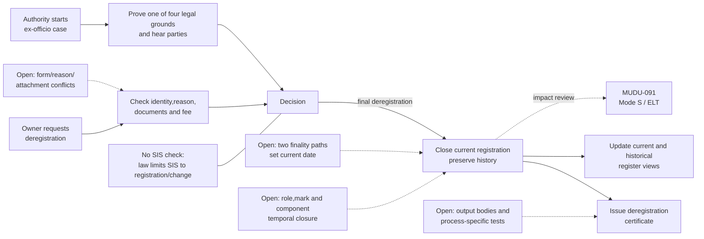

# MUDU-063 graph — aircraft deregistration

`DRAFT / UNCONFIRMED`. This graph is a reading aid,not authority.

```mermaid
flowchart LR
    A1[Owner requests<br/>deregistration] --> B[Check identity,reason,<br/>documents and fee]
    A2[Authority starts<br/>ex-officio case] --> B2[Prove one of four legal grounds<br/>and hear parties]
    B --> C[Decision]
    B2 --> C
    C -->|final deregistration| D[Close current registration<br/>preserve history]
    D --> E[Issue deregistration<br/>certificate]
    D --> F[Update current and historical<br/>register views]
    D -. impact review .-> M91[MUDU-091<br/>Mode S / ELT]

    N[No SIS check:<br/>law limits SIS to registration/change] --- C
    G1[Open: form/reason/<br/>attachment conflicts] -.-> B
    G2[Open: two finality paths<br/>set current date] -.-> D
    G3[Open: role,mark and component<br/>temporal closure] -.-> D
    G4[Open: output bodies and<br/>process-specific tests] -.-> E
```
