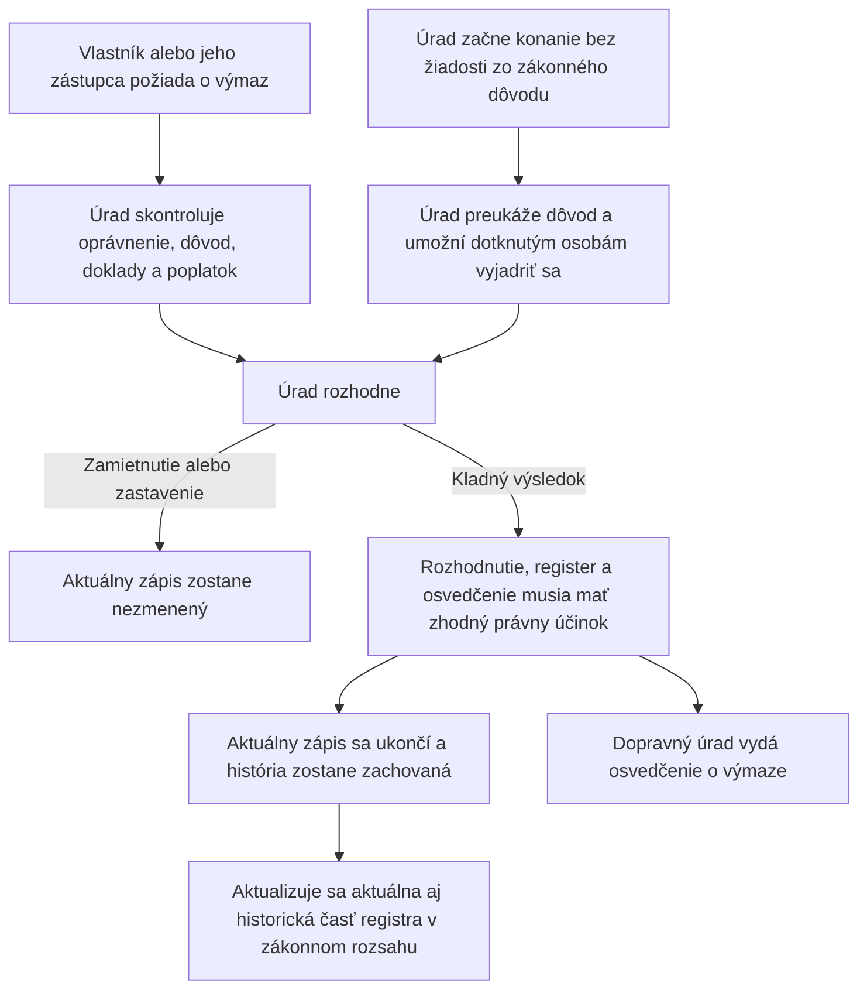

# MUDU-063 — výmaz lietadla z registra

`DRAFT / UNCONFIRMED` — pracovný návrh bez schválenia vecným gestorom.

Diagram ukazuje dve zákonné cesty k rovnakému výsledku. Úplné pravidlá sú v
[`definition.md`](definition.md), najmä v sekciách 10 a 17.

Pri výmaze sa podľa aktuálneho práva nevykonáva kontrola SIS. Predchodcom je
MUDU-061 — zápis. MUDU-062 je samostatná zmena, ktorá môže nastať pred výmazom,
ale nie je jeho povinným krokom. MUDU-091 používa spoločné údaje, no nie je
súčasťou výmazu.

## Najdôležitejšie otvorené otázky — nie sú súčasťou toku

- `GAP-063-001` až `GAP-063-003`: formulár, dôvody a prílohy nezodpovedajú presne aktuálnemu právu;
- `GAP-063-005`: dve technické cesty môžu zapísať rozdielny dátum účinku;
- `GAP-063-006` a `Q-063-002`: treba určiť, ako sa uzavrú všetky aktívne väzby bez straty histórie;
- `Q-063-003`: treba určiť presné poradie právneho účinku, zmeny registra a vydania osvedčenia;
- `GAP-063-009` až `GAP-063-012`: treba opraviť výstupné šablóny a doplniť procesné testy.

Úplný zoznam je v sekcii 17 súboru [`definition.md`](definition.md).
