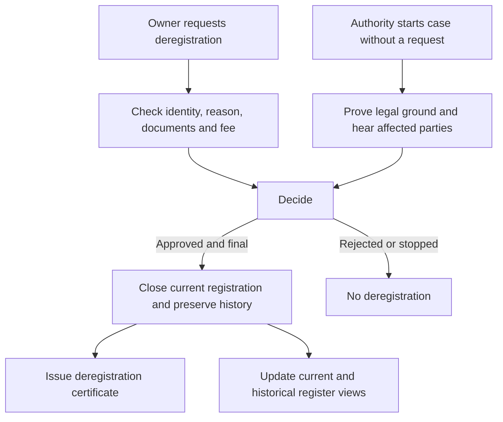

# MUDU-063 graph — aircraft deregistration

`DRAFT / UNCONFIRMED`. This graph is a reading aid,not authority.

No SIS check applies to deregistration. Related processes:`MUDU-061`
registration,`MUDU-062` change and `MUDU-091` Mode S/ELT impact review.

## Open issues — not part of the process flow

- `GAP-063-001` and `GAP-063-002`:reconcile the form,reason choices and attachment rules with current law.
- `GAP-063-005`:replace the two competing finality paths with one idempotent effect.
- `GAP-063-006` and `Q-063-002`:define how owner,operator,lien,mark and component histories close.
- `GAP-063-009` to `GAP-063-012`:correct output templates and add process-specific tests.
